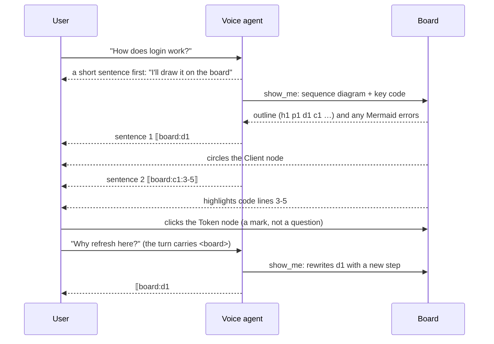

# Blackboard

The voice agent teaches like a teacher at a blackboard: it writes documents, code and Mermaid diagrams on a board in the main editor area, and while it talks it points at a passage, a few lines of code or a diagram node. The user points back at the board and asks about "this". This doc is the agreed behavior; the voice agent itself is in [voice-agent.md](./voice-agent.md), the editor cursor its board pointer mirrors in [voice-pair-agent-cursor.md](./voice-pair-agent-cursor.md).

## Loop



Write → point while talking → the user points and asks → change or add → talk again.

## show_me

`show_me` replaces `show_text`: whatever the user should see rather than hear.

- **Short** (no Mermaid or web page, at most 5 lines not counting fences, e.g. one command, and no `board` or `mode` given: `showMeIsCard`): no board. A card in the Bot view history, as `show_text` had. Naming a board (`board: "b1"` or `"new"`) or a mode puts even one line on a board.
- **Everything else** goes on a board, one Markdown document: text, tables, lists, code blocks (syntax highlighted), ` ```mermaid ` blocks drawn as diagrams, and ` ```html ` blocks run as live web pages (see [Web pages](#web-pages)).
- **Which board.** Same topic: add to the current board, or replace one of its blocks. New topic: a new board with its own title. The user may say "new board" or "back on the earlier board".
- **Result.** The board's outline: each block's id and a short excerpt. Ids are per kind in document order: `h` heading, `p` paragraph, `l` list, `t` table, `q` quote, `c` code, `d` diagram, `w` web page (`x` is raw HTML in the Markdown, shown as text). Mermaid errors come back in the result, so the agent fixes and rewrites the block; the board shows the source and the error in place of the diagram. A web page's script errors come back the same way.
- **Pacing.** By default the whole content first, then the explanation, a marker per sentence. When the user asks for a step-by-step walk-through: write a part, explain it, append the next.
- Works in every permission mode, Plan included (it changes no workspace file); not in proactive turns.

## Web pages

A ` ```html ` block (`w1`, `w2`…; outlined as `w1 web page "<title>", N lines`, the title from its `<title>` or first `h1`–`h3`, with its design size when it declares one: `w1 web page "Wall", 3840×2160, 40 lines` or `…, 1280 wide, …`) is a live web page: UI prototypes the user clicks through, interactive or animated demos such as an algorithm visualization (a stack with Push and Pop animating each step). ` ```xml ` shows HTML as code to read instead. `src/webview/board/web.ts`, styles in `styles/board/web.css`.

- **Sandboxed.** The page runs in an `<iframe sandbox="allow-scripts">` (no `allow-same-origin`, so an opaque origin) with its document as `srcdoc`: its scripts run, but cannot reach the board page, the VS Code API or the extension. No popups, forms or top navigation.
- **CSP.** A srcdoc document inherits the board page's CSP (checked in Chromium: with `script-src 'nonce-…'` alone, every script in the frame was blocked), and srcdoc is not checked against `frame-src`, so the CSP needs no frame source. The board page's CSP allows a second nonce, the frame nonce (`data-frame-nonce` on `#board-app`, new per page), and the board stamps it on the page's own inline `<script>` elements before it runs. So in a page: inline `<script>` and `<style>` run; inline event handlers (`onclick="…"`), scripts added at run time, `eval`, external scripts, stylesheets, images and fonts (except `data:` / `blob:` URLs), and every network request are blocked. The board page's own script policy is unchanged (no `'unsafe-inline'`).
- **What the agent hears.** Inline event handlers in the source, and errors the page reports while it loads (uncaught errors, unhandled rejections, what the CSP blocked), come back in the `show_me` result as `w1 reported: …`, so the agent rewrites the block; the render waits up to 2 s for the page to load. Errors after that (a click that throws) come with the next `show_me` result.
- **Talking to the board.** A script the board puts first in the page sends its content's height, its errors and `loaded` through a `MessagePort` handed to it on each load of the frame. Events inside a frame never reach the board page, so the same script also forwards a press (selects the block), Escape (leaves it expanded), Ctrl/Cmd + `+` / `=`, `−`, `0` and Ctrl/Cmd + wheel (zoom the selected block; kept from the page, which would zoom the window), a pan drag, and an Alt + click (the element it picks) with, while Alt is held, the box of the element under the pointer (see [Events in a page](#events-in-a-page)): only trusted events (`isTrusted`: what the user did, not what the page's scripts dispatch). The script takes the port in a capturing `message` listener added before any of the page's scripts run, only from its parent window, stops the event there, and calls the browser's own `postMessage` and `MessageEvent` getters taken at its start, so the page's scripts never see the port or post on it. This is the check the frame nonce could not be: the page's own scripts carry that nonce too. The board takes only a height, a bounded error text, a hovered box or one of those inputs, checked and bounded, and its window `message` listener drops anything from origin `"null"`, so a page cannot pose as the host. What a pick describes comes from the page's DOM, which the page's scripts could alter: it is bounded, never trusted.
- **Natural size.** A page is shown like a picture of itself, as a diagram is, never reflowed. Its frame is always laid out at the page's natural size and only scaled (`transform: scale(--ws)`, from its top left) to the size it is shown at; the board's width, the page zoom, a block zoom or expanding never change the page's layout. The width is its design width when it declares one, `<meta name="viewport" content="width=3840">` (240–7680 px; `device-width` declares nothing), else the block's width when the page is first shown (its column; a page shown again after an edit of its block is measured again, Reload keeps it). The height is the declared one (`content="width=3840, height=2160"`, at most 8 times the width), else the page's content height at that width, as its script reports it: a page starts 16:9 and then follows its content, growing and shrinking (at least 40 px, at most 8 times its width). `100vh` in a page is that natural height. A page as tall as its frame plus something (`100vh` and the body's margin) reports a little more each time its frame grows; once a report grows it by as much as the last one did, that is taken as this feedback and the height stays (a later, different growth is still taken). The user cannot resize the view by its corner any more: its size follows from the page's and the zoom, as a diagram's does.
- **Zoom and expand.** Like a diagram's (see [Zoom](#zoom)): `−` / percent / `+` / `⤢` in its header after Source, the same 1.1× steps and wheel zoom, kept per board by block id. At 100% the whole page shows: a 3840-wide page is scaled down to the column, its height in proportion.
- **Header.** The page's title, **Reload** (runs it again from the start, its errors cleared), **Source** (the HTML as a highlighted code block with Copy, in place of the page; pressed again, back to the page, which kept running), and its zoom tools.
- **Look.** The page is light (`color-scheme: light`, `Canvas` / `CanvasText`, system font) like a page in a browser, whatever VS Code's theme; its own styles come after these.
- **Pointing.** Pi points at and marks a web page only as a whole block (`⟦board:w1⟧`, highlighted); lines and passages in it are refused, since the board cannot see into the frame. The user marks an element in it with **Alt + click** (see [The user points](#the-user-points)); plain clicks inside the page are the page's and mark nothing; a selection in its Source view marks that text.

### Events in a page

Everything a user does inside a page is the page's, except an Alt + click: clicks, hover, keys, text selection, drags and the plain wheel go to it, and the browser maps the pointer through the frame's scale, so a click lands on what is painted under it at any block zoom, page zoom and expanded (checked in Chrome on a 3840 × 2160 page of buttons at 50%, 100%, 150% and 200%, under page zoom 75% and 150%, and expanded at 100% and 150%). A plain left-button drag never pans. The board only hears what the page's script forwards:

- **Pan** a zoomed-in page with the view's scrollbars, a middle-button drag, or Space + left-button drag (Space held while the page has the keyboard focus, i.e. after a click in it). The page's script swallows a pan drag (no click, no text selection, no middle-button autoscroll; the page's own listeners never see it) and forwards how far the pointer is from the point it grabbed, in the page's own px; the board scrolls the view that far times the frame's on-screen scale, so the grabbed point stays under the pointer whatever the screen's and VS Code's zoom (measured on the page, not in screen px, it corrects itself). Space on the page itself (not in a field or on a button) has its default withheld, since it would scroll the board. The plain wheel over a page that cannot scroll scrolls (pans) the view, then the board, as the browser chains it.
- **Zoom:** Ctrl/Cmd + wheel and Ctrl/Cmd + `+` / `=`, `−`, `0` inside the page zoom the selected block (a press in the page selects it), never the page itself.
- **Escape** inside the page leaves the expanded block, else clears the user's mark, as Escape on the board does; the page sees it too.
- **Alt + click** picks the element under the pointer for the user's mark. The page's script swallows the whole press in the capture phase (its pointerdown's default withheld, so no mousedown or mouseup follows; the pointerup and the click stopped), so the page never reacts, a link is not followed, and sends through the port the element's CSS selector (from the nearest ancestor, or itself, whose id is unique in the page, else from `body`: tag, its first three classes, and `:nth-of-type` where siblings share the tag; `describeElement` in `src/webview/board/webElement.ts`, put into the page as source), its tag, id, classes, text (whitespace collapsed, at most 160 characters), its outerHTML cut to 400 characters, and its box in the page's own px. The board checks and cuts all of it again (`parseWebElement`, `WEB_ELEMENT_LIMITS` in `src/shared/board.ts`). While Alt is held, the element an Alt + click would pick is outlined in the user's color (`.board-web-hover` in the frame's stage, scaled as the frame is); it goes when Alt is released, the pointer leaves the page, or the page loses the focus.

## Boards

- **One editor tab per board**, titled `Board · <title>`. A new board opens as a tab in the active editor group, the group of the user's code (`ViewColumn.Active`), in front of the code, which stays open behind it; it does not take the keyboard focus, and it never opens a new editor group by itself. The user asks to have it elsewhere (see [Placement](#placement-and-maximize)).
- **Temporary files.** Each board is a Markdown file next to the voice context's omp session file, `voice-sessions/boards/<session>/<id>.md`, with `index.json` holding titles, which board is current and which are open: with a workspace folder it is kept (workspace storage) until its session is pruned, without one it goes when the voice agent stops, like the session files.
- **History.** Each `show_me` that wrote a board is a "Board" card in the Bot view history (title and blocks); clicking it opens that board.
- **Resume.** When the task's voice conversation comes back, boards that were open when it stopped (and not closed by the user) reopen, and the agent gets the task's board list (`<boards>`), so "the diagram from before" still resolves. Shutting VS Code down is not closing them.

## The agent points

- A sentence starts with a board marker, like the code markers: `⟦board:<block>⟧` a whole block, `⟦board:<block>:3-5⟧` code lines, `⟦board:<block>#<text>⟧` a passage in a block or, in a diagram, a node (by node id or label) or else an arrow by its label: a sequence message (`⟦board:d1#show_me 写内容⟧`) or a flowchart edge label (`⟦board:d2#sends token⟧`); a node wins over an arrow with the same label, an exact label over one containing the text. The board is chosen by the latest board written or shown; `⟦board:<board>/<block>…⟧` names another.
- **Steps.** In a sequence diagram the line numbers are message steps: `⟦board:d1:2⟧` is its second message, `⟦board:d1:2-4⟧` the second to the fourth. Steps count the messages (arrows) in the order written, 1-based; notes, loops and other boxes do not count, so they match what `autonumber` shows. Steps on any other diagram are refused.
- The mark shows as the sentence is spoken: a whole block is highlighted, a passage underlined, code lines highlighted, a diagram node circled, an arrow's line and its label circled together (highlighted, each on its own, for steps). Each carries a small "Pi" tag, replaces Pi's previous point, and stays until the next point.
- **Follow Pi** decides whether pointing brings the board into view (without the focus): on, the board is revealed; off, only the mark is drawn.
- `board_point` points without speaking, with an explicit style: `highlight`, `underline` or `box`; `startLine`/`endLine` are code lines or message steps. Its result says what the target turned out to be (a block, lines, a passage, a node, a message or an edge). A web page takes only the whole block.

## The user points

- Selecting text, clicking a code line, clicking a diagram node, clicking an arrow (its label, or within a few pixels of its line: a sequence message or a labeled flowchart edge), or Alt + clicking an element in a web page marks it on the board in the user's color ("You"). A mark only: it asks nothing. Unlabeled flowchart edges cannot be named, so they cannot be marked or pointed at.
- A web page element's mark is a box around where it was when picked, measured in the page and drawn through the frame's scale, so it follows a block zoom, the page zoom, panning and expanding (`markWebElement` in `src/webview/board/userMarks.ts`); it does not follow the element if the page itself moves it later. Alt + clicking the marked element again clears it; Alt + clicking another moves the mark there. With the page's Source shown, the mark stays but is not drawn.
- The next user turn carries `<board>`: which board, which block, and the selected text, lines, node, or arrow (`message="…"`, with `step="…"` for a sequence message), or for a web page element `kind="web"` with `selector`, `tag`, `id`, `class` and `text`, its HTML snippet as the body (`<board board="b1" title="Stack" block="w1" kind="web" selector="#app > button.push:nth-of-type(1)" tag="button" class="push" text="Push"><button class="push">Push</button></board>`). It comes once; the mark stays on the board until the user clears it (click it again, or Escape) or its block goes. "This", "here" and "this step" mean the user's mark first, before Pi's point and the editor selection; `latest="true"` says it was made after the user's last editor selection. `board_view looking` names a marked element by its selector.

## Voice control (`board_view`)

Open, close, switch to a board, focus, move, maximize and restore, expand a diagram or web page to fill the board and collapse it (`block`: the diagram or web page; see [Zoom](#zoom)), scroll (up, down, top, bottom, to a block; it collapses an expanded diagram first), and which board and block the user is looking at (with Pi's point, the user's mark, the zoom and an expanded diagram or web page). "Save it as a file" goes through `create_file`.

### Placement and maximize

- Where a board opens: in the active editor group (see [Boards](#boards)). `move` (or `open` with `to`) puts it elsewhere: `main` in the editor group of the user's code (the active text editor's, else a visible one's, else the first group), in front of the code, which stays open behind it; `left` / `right` the neighboring group (right of the last one opens a new group); `beside` a group next to the active one (a new one when there is none); `window` a new window. Nothing takes the focus except `window`.
- VS Code moves a webview into another group as a preview tab, which would replace the preview tab there and later be replaced by the next file opened with a single click. So the target group's preview text tab is pinned first, and the board is pinned after the move when it is the active editor of the active group (moved into the group with the focus, or its old group closed).
- `maximize`: the board's editor group fills the editor area, the other groups hidden (VS Code's `workbench.action.toggleMaximizeEditorGroup`, which acts on the active group, so the board takes the focus; activating it also restores any other maximized group). The side bars stay, so the chat and the Bot view remain in sight. With a single editor group the board already fills the area and nothing changes. `restore` undoes it.
- **The Maximize button.** The board's header has a Maximize button next to Edit source, an icon (codicon-style `screen-full`, drawn inline as SVG in the button's color from `tokens.css`) with the tooltip and accessible name "Maximize: …": it does exactly what `maximize` does (double-clicking the tab only enlarges the group, which is not this). While the board is maximized it shows the `screen-normal` icon, pressed, titled "Restore: …", and does what `restore` does. The page posts `toggleMaximize`; the host maximizes or restores and tells every affected page `maximized` (true / false), so the icon follows whoever acted: the button, `board_view maximize` / `restore`, a move of the board, or VS Code itself restoring the group when the user activates another one (`onDidChangeTabGroups`). With a single editor group a click only says so in the status bar.
- What is maximized is known only for the maximize done by `board_view` or the button (VS Code offers no way to ask): moving or closing the board forgets it. A group the user maximized with VS Code's own tab-bar button is restored there; pressing the board's Maximize then would toggle it back, since the command is a toggle and nothing tells the extension about it.

## Links

Links on a board work when the user clicks them; the page never follows a link itself (`initLinks` in `src/webview/board/links.ts` stops every click and sends the href to the host as `openLink`; the href shows as the link's tooltip). What they open (`parseBoardLink`):

- `http:` / `https:`: the browser, through `vscode.env.openExternal`.
- A path, workspace-relative (`src/shared/board.ts`, resolved against each workspace folder in turn) or absolute, or a `file:` URL: the file in a text editor, in the group of the code next to the board (else beside it). `#L12`, `#L12-L20`, `:12`, `:12-20` or `:12:5` select those lines; any other `#anchor` opens the file at its top. A folder is revealed in the Explorer; a path that does not exist shows a warning and opens nothing.
- Anything else (`#heading` in the page, `mailto:`, `command:`, `javascript:`, `vscode:`, …): nothing, logged.

## Zoom

The user zooms a board by hand, mainly to read Mermaid diagrams and to give web pages room (`src/webview/board/zoom.ts`, sizes in `styles/board/diagram.css` and `web.css`). The voice agent does not zoom; `board_view looking` tells it what the user zoomed and which block fills the board. It can expand a diagram or a web page (`board_view expand`), like the user's ⤢ button.

- **The whole page.** Only the header's zoom control, before Edit source: `−`, the current percent (a click resets to 100%), `+`. Neither Ctrl/Cmd + mouse wheel nor Ctrl/Cmd + `+` / `−` / `0` zoom the page (see the next items). Each `−` / `+` multiplies or divides the zoom by 1.1 (`ZOOM_STEP`), from 30% to 300% (`PAGE_ZOOM_RANGE`); the percent shows rounded to a whole number. It is a `transform: scale()` on the document column (`--board-zoom`, from its top left), laid out 1/zoom of the window's width, so text reflows like the browser's zoom and the header stays as it is; the content at the middle of the window stays put. Zoomed out, a negative bottom margin gives back the layout's height below the scaled drawing.
- **Why not CSS `zoom`.** In the Chromium VS Code 1.140 ships, `getBoundingClientRect` of anything under a CSS-zoomed ancestor comes out divided by the zoom: at 150%, a paragraph painted at (48, 199)–(486, 236) reported (32, 133)–(324, 157). Marks drawn from those rects landed up and to the left of their content, farther off the farther down and right it was, and a click at the mark hit whatever was painted there instead. Under a transform, client rects are where the content is painted.
- **A diagram's size.** At 100% a diagram shows whole: as wide as Mermaid drew it, at most the text column (it is fitted, never clipped), and as tall as that makes it; content Mermaid draws past its viewBox shows too. Its view (`.board-diagram-view`) is sized in CSS from the drawing's width (`--natural`) and proportions (`--ratio`), the column's width (`100cqw` of its `.board-diagram`, a size container) and its zoom (`--dz`).
- **One diagram's zoom.** Each drawn Mermaid diagram (d1, d2…) has its own `−` / percent (a click fits it back to its block, 100%) / `+` / `⤢` over its top right corner, shown while the pointer is on it, it is selected, or they have the focus. Each `−` / `+` multiplies or divides its zoom by 1.1 (`ZOOM_STEP`), from 10% to 800% of its fitted size (`BLOCK_ZOOM_RANGE`), around the middle of what is shown, nothing else on the page changing. Zoomed out, the diagram shrinks in its block. Zoomed in, its view grows with it, past the text column and still centered, up to the board's width and the window's height below the header (less a 16 px margin: `--board-width`, `--board-height`, set by `zoom.ts` on resize and page zoom, in the column's own px), and beyond that the user pans the drawing by dragging (or with the view's scrollbars and wheel); a view that can pan is framed and shows a grab cursor. A press that moves more than 4 px is a pan: it does not mark; a click still marks a node or an arrow. A failed diagram has no zoom.
- **A web page's zoom.** Each web page (w1, w2…) has the same `−` / percent (a click fits it back to its block, 100%) / `+` / `⤢`, in its header after Source (not over the page, whose own controls would be covered), shown as a diagram's are, and the same 1.1× steps and 10%–800% range of its fitted size. It zooms like a picture, as a diagram does, never like a browser zoom: the page keeps its natural layout (see [Web pages](#web-pages)) and only its scale changes. At 100% it shows whole: as wide as its natural width, at most the block's (it is fitted, never clipped), and as tall as that makes it (`--fit`, `--ratio`, `--dz` in `web.css`, sized as `diagram.css` sizes a diagram; the frame's scale `--ws` is its stage's width over its natural width, kept by a ResizeObserver). Zoomed out it shrinks, centered in its block. Zoomed in, around the middle of what is shown, its view stays as wide as the block, grows up to the window's height below the header and pans beyond that (scrollbars, middle-button drag, Space + drag, the plain wheel: see [Events in a page](#events-in-a-page)).
- **Steps and percent.** Zoom is geometric. A press of `−` / `+` (and Ctrl/Cmd + `+` / `−`) goes to the next power of 1.1 that way (`zoomStep`): from one it multiplies or divides by 1.1, so pressing back and forth returns to exactly 100%, and from a zoom the wheel left between them it lands on the next one. Ctrl/Cmd + `0` and a click on the percent reset to 100%. Zooms are kept to 6 decimals; the percent shown is rounded to a whole number. A stored zoom (`index.json`, the host's `zoom`) is clamped to the ranges when read (`parseBoardZoom`), with no table to match, so a zoom kept by the earlier fixed steps (50%–400%) is taken as it is.
- **Selecting a diagram or web page for the wheel.** A press on a drawn diagram or a web page (anywhere on it, its tools included; inside a web page's frame through what its script forwards) selects it: its block gets an outline in the focus color (`.is-selected`, `--focus-border`) and its tools stay shown. Then Ctrl/Cmd + mouse wheel zooms that block only (inside a web page too, forwarded), continuously, in proportion to the wheel's travel: by 1.1^(−travel / 100 px) (`zoomByWheel`), so a 100 px mouse notch is one 1.1× step and a trackpad pinch's small deltas zoom a little each, smoothly (lines count three to a notch, pages a notch each: `wheelPx`; a web page's frame forwards the travel the same way, at most 1000 px per event), wherever the pointer is; Ctrl/Cmd + `+` / `=`, `−`, `0` step it in, out and back to 100%. A press anywhere else (another block, the header, the page around) ends the selection, and so does a render that rebuilds or removes the diagram. With no diagram selected, Ctrl/Cmd + wheel and those keys do nothing. Either way they are stopped at the page: VS Code's webview frame would otherwise pass them on and zoom the whole window.
- **Expanded.** The `⤢` button shows that diagram or web page alone, filling the board below the header (full width and height, a fixed layer over the document; the window's scroll is kept and the board behind does not scroll). A web page's header stays at its top and the page shows in the rest: at 100% whole and as large as fits there (as wide as the board, or as tall, whichever comes first, centered), zoomed in its view fills that area and pans; its layout does not change, so `100vh` in it is still its natural height. At 100% a diagram is as large as fits the board; its zoom and `+` / `−` work as usual, and it pans beyond the board. `⤡` (the same button, pressed), Escape, or `board_view collapse` go back to the whole board at the scroll it had. Escape also puts the block back to 100% (a diagram fitted to its block), whatever it was zoomed to, and the host keeps that; `⤡` and `board_view collapse` keep its zoom. Escape only collapses then; the user's mark stays. Escape pressed inside a web page's frame (which has the keyboard focus after a click in it) does the same, forwarded by its script; the page sees it too. A render that rebuilds or removes the block collapses it. While expanded, marks of other blocks are not drawn (they are under it); the user marks inside it as usual.
- **Pointing and expanded.** Pi's point into the expanded diagram (a marker or `board_point`: a node, an arrow, a step) keeps it expanded and at its zoom: the view pans so the target is centered, and the mark sits on it. A point at the expanded web page (as a whole) keeps it too, and the mark covers it. A point at anything else (another block or diagram) collapses it first, then the board scrolls to the target as always.
- **Marks follow.** The mark overlay lies outside the zoomed column, and marks are drawn from the content's client rects, found again on every layout: a zoom (the page's or a diagram's), a pan or any scroll inside a block, a resize, a render; a ResizeObserver on the blocks, on every diagram's view and drawing and on every web page's view catches a size change from any cause, so a mark on a web page follows its zoom, its natural height and its expanding. They are clipped to the diagram's view, so a node panned out of it shows no mark; code-line marks, scroll offsets and pans convert between an element's own px and window px by its on-screen scale (`screenScale`: client width over layout width). While a diagram is expanded the column is not scaled (a transform would make it the containing block of the fixed, expanded diagram). When Pi points at a node, arrow or step outside a diagram's view, the view scrolls (at once, not smoothly) so it is centered in it, then the window scrolls it into sight.
- **Kept per board.** The page tells the host its zoom once the zooming pauses (`zoomed`, 300 ms); the host keeps it for the board, in `index.json` too, and gives it to the next page that shows the board (`zoom`, after its first render): after closing and reopening the tab, a reload of the webview, a move to another window, a window reload or a resumed conversation. A diagram's or web page's zoom is kept by block id (`BoardZoom.blocks`) and dropped when that block leaves the board; 100% everywhere keeps nothing.

## Editing the source

- The board's "Edit source" button opens its `.md` file in a text editor beside it.
- On save the board redraws, Pi's point is cleared (block ids may have moved), and the next user turn carries `<board-edited>` with a summary of the change and the new outline. Nothing speaks up on its own.
- While the source has unsaved changes, the agent's writes to that board are refused ("the user is editing it"), so neither overwrites the other.

## Implementation

| Piece | Where |
|---|---|
| Blocks and ids, outline, edits, `showMeIsCard`, the host ↔ webview protocol and the contracts below | `src/shared/board.ts` (pure) |
| `show_me`, `board_point`, `board_view` | `src/voiceAgent/hostTools.ts` (`HostToolRouter`, through `BoardHands`) |
| Board tabs, files and index, pointing, source edits, the user's mark, resume | `src/voiceAgent/blackboard.ts` (`Blackboards`: `BoardHands`, `BoardContextSource`) |
| Markers to boards, contexts binding their boards | `src/voiceAgent/boardWiring.ts` (`routeAnchors`, `withBoards`), `boardTarget` in `codeAnchors.ts` |
| `<board>` (once per mark), `<board-edited>`, `<boards>` | `VoiceAgent._userTurn`, `buildTurnMessage` in `voicePrompt.ts` |
| The board page: Markdown, highlight.js, Mermaid, web pages, marks, the user's mark, zoom | `src/webview/board/` → `out/webview/board.js` (one bundle), `src/webview/styles/board.css` + `board/*.css` |
| Bot view cards | `showMeRenderer` in `src/webview/toolCards/voice.ts`, `openBoard` in the voice view protocol |

- The webview answers every request (`rendered`, `pointed` with what it found, `scrolled`, `expanded`, `clicked`, `status`); `status` also reports the marks as drawn (`point`: what it found and its on-screen rectangle count; `userMark`; `marks`: for each of Pi's and the user's, the box around the drawn pieces and the box around its target), the page width, what the Maximize button shows (`maximized`), the zoom (`zoom`), the expanded diagram or web page (`expanded`), the window's scroll (`scrollY`), every drawn diagram's view and drawing boxes (`diagrams`) and every web page's view and frame boxes (`webPages`), which `board_view looking` and the end-to-end tests read through `Blackboards.shown` (the width is how a test sees a maximized group; the boxes show a mark on its target, a diagram not clipped and a frame filling its view). `clickAt` (tests only) presses on a target as a user would: scrolled into sight, then pointer and mouse events at the middle of its first box on whatever the browser hits there, with an optional drag; so a test checks the measured boxes against the browser's own hit test.
- Arrows in Mermaid 12's SVG (`diagramArrows` in `src/webview/board/locate.ts`): a sequence message is its `[data-et="message"]` line or path with the `text.messageText` elements drawn just before it; a flowchart edge is its `[data-et="edge"][data-id]` path with the `.label` of the same `data-id`. A mark covers the label and the line, widened to 6 px.
- Tests: `src/test/unit/shared/board.test.ts` (ids, web page kind, outline and declared viewport size, edits, card rule, links, zoom steps, wheel zoom and parsing, a picked web page element checked and cut), `voiceAgent/blackboard.test.ts` (files, index, refusals, a web page pointed at only as a whole, reopen, the button and `board_view` maximize in step, zoom kept for the next page, expand only a diagram or a web page, `looking` naming an expanded web page, zoomed blocks and a marked web page element), `voiceAgent/voicePrompt.test.ts` (`<board>` for each kind of mark, a web page element's included), `webview/board/board.test.ts` (text lookup, keyed update, a web page's frame document, sandbox and handler report, its natural size (declared, or the block's width and its content's height, bounded, the frame-height feedback loop stopped), the frame script taking its port only from its parent and before the page's listeners, and forwarding no synthetic events, a fake Alt + click included; a pick and a hovered box taken from the port, checked; `describeElement`'s selectors finding the element again, its parts cut), `webview/board/webPageMarks.test.ts` (a pick marks the element and posts it, another moves the mark, picking it again or Escape in the page clears it), `webview/board/arrowsAndLinks.test.ts` (message and edge pairing, node before arrow, link clicks), `webview/board/maximizeButton.test.ts` (the page's icon button: what it posts, its icon, tooltip and pressed state), `webview/board/zoom.test.ts` (header and diagram zoom, Ctrl/Cmd + wheel and keys zooming only the selected diagram and never the page, kept from VS Code, a pan is no mark, the host's zoom taken on, expand and Escape, a point inside or outside an expanded diagram; a web page's header tools, zoom, and what its frame forwards: a press, zoom keys and wheel, a pan scaled from page px, Escape leaving it expanded at 100%), and `src/test/integration/suite/blackboard.test.ts`, which runs the real voice agent, boards and board page in VS Code with a scripted voice model (`src/test/integration/fakes/voiceLlm.ts`, swapped in by `node esbuild.js --integration`) and a fixture workspace folder made by `runTest.ts` (for links); its first suite also runs a web page in the real webview (its script runs, sizes the block and reports its error) and shows a 3840 × 2160 page whole in its block, zoomed 200% (drawn twice as large, its view clipped to the column, still 16:9) and expanded at 200% and 100%, with Pi's mark on it; its second suite checks diagram sizes, marks through zoom and expanding in the real page's layout; its third, on a long board with a sequence diagram and a wide class diagram, clicks a participant, message 4 and a class (`clickAt`) at page zoom 100%, 150% and 75% and diagram zoom 100% and 250%, normal and expanded, and checks that the click named them and that Pi's and the user's marks sit on them within 3 px, after scrolling the page and panning the diagram. `MOCHA_GREP="marks sit" npm run test:integration` runs only the tests matching it.
