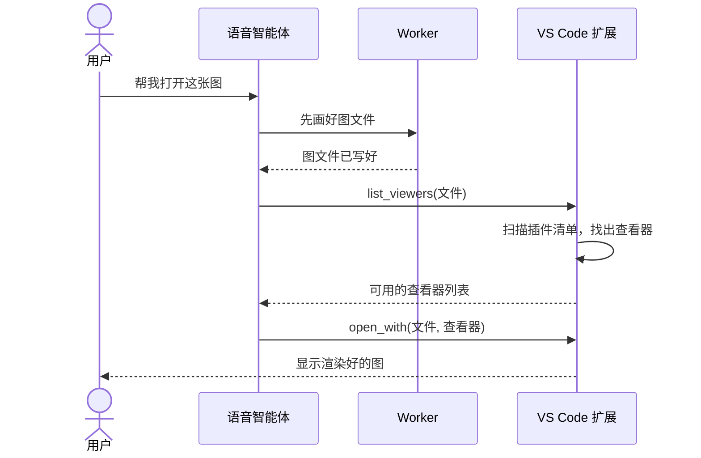

# 实时画图演示

```mermaid
flowchart LR
    A[语音智能体] --> B[list_viewers]
    B --> C[open_with]
    C --> D[Draw.io / Mermaid 预览]
```

## 时序图

```mermaid
sequenceDiagram
    actor 用户
    participant 语音 as 语音智能体
    participant 工人 as Worker
    participant 扩展 as VS Code 扩展
    用户->>语音: 帮我打开这张图
    语音->>工人: 先画好图文件
    工人-->>语音: 图文件已写好
    语音->>扩展: list_viewers(文件)
    扩展->>扩展: 扫描插件清单，找出查看器
    扩展-->>语音: 可用的查看器列表
    语音->>扩展: open_with(文件, 查看器)
    扩展-->>用户: 显示渲染好的图
```
