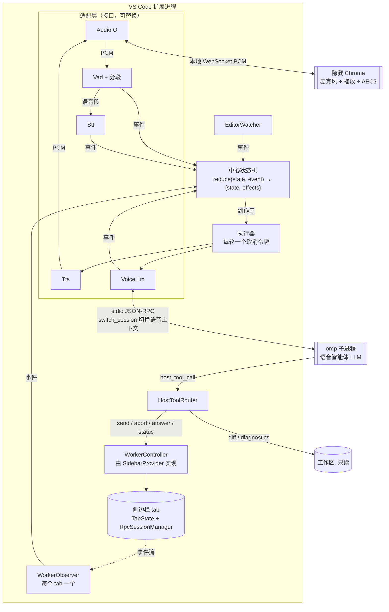
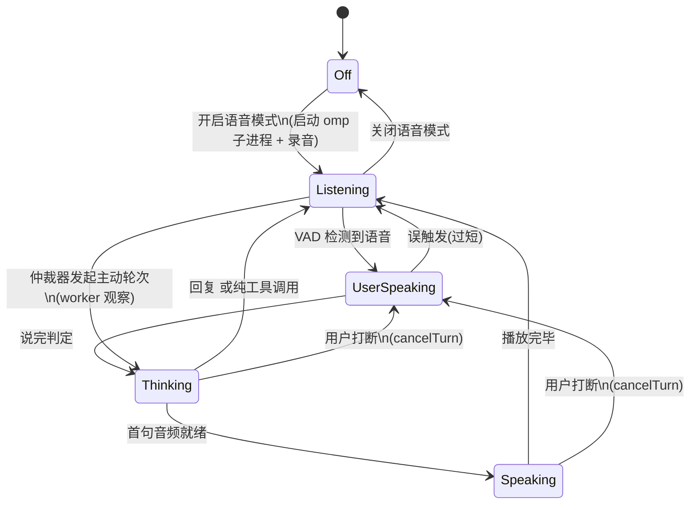

# 语音结对智能体（Voice Agent）设计文档

状态：P1（指挥 worker）、主动播报、音频环路和语音视图已在扩展里实现并实测（2026-09-25）；进度见 §14.1，交接说明见 [`voice-agent-handoff.md`](./voice-agent-handoff.md)

原型：已验证的语音环路在独立项目 `voice-loop-prototype` 里（本机 `~/source/ai/voice-loop-prototype`，从本仓库 f8d8f06 抽出）。下文的"原型文档"指该项目的 `docs/voice-loop-prototype.md`。

## 1. 目标

在 VS Code 扩展中提供一个**实时语音聊天机器人**。它和用户持续对话，同时指挥 omp/pi 干活。

两个智能体，职责严格分开：

| | 语音智能体（Voice Agent） | 工作智能体（Worker） |
|---|---|---|
| 身份 | 坐在旁边的搭档，"看着 omp 干活并和你聊" | 真正写代码的 omp/pi 会话（即现有侧边栏会话） |
| 上下文 | 独立：与用户的对话 + 注入的观察（worker 进展、编辑器状态） | 自己的编程上下文，不感知语音 |
| 能力 | 理解意图、给 worker 派指令/纠偏/叫停、播报进展、完成后总结、就当前代码和文档讨论 | 读写代码、运行命令 |
| 写代码 | **不写**，只读 | 写 |
| 发声 | 是 | 否 |

### 1.1 功能

1. 语音闲聊与讨论，可随时打断机器人（barge-in）。
2. 理解意图后给 worker 派任务；干活途中可插话纠偏、排队追加、叫停。
3. worker 干活时，简要说明它正在做什么；不刷屏，不念代码。
4. worker 完成时做一次总结：做了什么、改了哪些文件、测试结果、遗留问题。
5. worker 需要确认/选择/输入时，由语音智能体转述并收集用户回答。
6. 结对编程：基于用户当前打开的文件、选区、可见范围讨论代码和文档，需要时自行读取文件。

### 1.2 非目标（首版）

- worker 不直接发声。
- 在委派模式（默认）下，语音智能体不直接修改文件，所有写操作都经 worker 执行。例外是结对模式：用户明确要求并确认后，它自己改文件、在终端里跑命令，这时不再指挥 worker。见 `voice-pair-agent-cursor.md` §11。界面上两个模式叫“委派”和“结对”（英文界面 Delegate / Pair）；代码、设置、`set_mode` 工具参数和每轮的 `<mode name="…"/>` 里仍是 `omp` / `pair`，不改，免得打断已保存的状态和语音模型的工具调用。
- 不做远程通话（WebRTC/电话）；只支持本机麦克风和扬声器。
- 首版不做回声消除（AEC），见 §12。

## 2. 已验证事实

本节只记录实测结果（2026-09-24，omp v18.2.11，本机）。

### 2.1 用第二个 omp RPC 进程充当语音智能体：可行

启动命令：

```
omp --mode rpc --no-tools --no-skills --no-rules --no-extensions --no-lsp \
    --no-session --no-title --thinking off --system-prompt "<语音智能体提示词>"
```

然后发送 `set_host_tools`，注册宿主侧工具 `dispatch_task`，并将 `loadMode` 设为 `essential`。

| 测量项 | 结果 |
|---|---|
| 进程启动 → `ready` 帧 | 0.28 s |
| `set_host_tools` | 成功，响应 `toolNames: ["dispatch_task"]` |
| 默认模型（`get_state`） | `anthropic/claude-opus-5-5`，即 omp 当前默认模型 |
| 纯闲聊一轮 | 首个 text_delta 0.7 s，整轮 1.78 s |
| 派活一轮（"让它把 README 版本号改成 0.3.0"） | 2.82 s 发出 `host_tool_call`；回传结果后，4.05 s 出首句 |

模型自主把口语改写成了结构化的 worker 指令，包括范围约束和自检步骤。

结论如下：

- 语音智能体的 LLM **直接复用 omp 的登录凭据、provider 和模型体系**，扩展不需要自己实现 LLM 客户端。
- `--no-tools` 不影响 host tools 的注册与调用。
- 流式文本来自 `message_update.assistantMessageEvent.text_delta`，一轮结束以 `agent_end` 为准。
- host tools 属于 omp 的 RPC 扩展，pi 的 RPC 没有（见 omp `rpc.md`「Pi-family adapter」一节）。因此**语音智能体进程始终用 omp**；worker 可以是 omp，也可以是 pi。

### 2.2 `omp say`：不能直接作为中文实时 TTS

| 测量项 | 结果 |
|---|---|
| 引擎 | 本地 Kokoro（首次运行下载 `model_quantized.onnx`） |
| 可用音色 | `tts.localVoice` 枚举：af_heart / af_bella / af_nicole / af_aoede / af_kore / af_sarah / am_michael / am_fenrir / am_puck / bf_emma / bm_george / bm_fable，**全部是英文音色** |
| 中文音色 `zf_xiaobei` | 拒绝，退出码 1 |
| 输出 | 24 kHz / 16 bit / 单声道 WAV，整段生成完才返回，不能流式输出 |
| 耗时（模型已缓存） | 7.21 s 生成 15.7 s 音频，含每次启动进程和加载模型的开销 |

结论：`omp say` 作为**可选 TTS 后端**保留，适合英文场景或零配置试用。中文实时对话默认应走可配置的 OpenAI 兼容 TTS 服务。另外，omp 配置里有 `modelRoles.speech`（当前值为 `deepinfra/hexgrad/Kokoro-82M`），说明 omp 自身也有云端 TTS 角色；它能否被外部调用尚未验证，见 §13。

### 2.3 一个 omp 进程承载多个任务的语音上下文：可行

实测（2026-09-25，omp 18.2.11）：启动参数把 `--no-session` 换成 `--session-dir <临时目录>`，先 `set_host_tools`，然后：

| 步骤 | 结果 |
|---|---|
| 会话 A 里说"暗号是 APPLE"，`get_state` 取 `sessionFile` | 得到 A 的会话文件路径 |
| `new_session`，在会话 B 里说"暗号是 BANANA" | `new_session` 0.02 s |
| `switch_session` 回 A，问暗号 | 切换 0.02 s；回答 APPLE，整轮 1.41 s |
| `switch_session` 到 B，问暗号并要求调用 host tool | 回答 BANANA，1.98 s 发出 `host_tool_call` |

结论：

- 上下文彼此隔离，切换耗时可以忽略。
- `set_host_tools` 注册的工具在 `new_session` / `switch_session` 之后仍然有效，不需要重新注册。
- 所以"每个任务一个语音上下文"（§5.12）只需要**一个** omp 子进程，不需要每个 tab 各起一个。

### 2.4 worker 的 `prompt` + `streamingBehavior`：pi 和 omp 都支持

实测（2026-09-25，omp 18.2.11；pi 0.87.1，模型 `openai-codex/gpt-5.5`）：worker 正在执行 `sleep 6`，此时发第二条 `prompt`。

| 发送方式 | omp | pi |
|---|---|---|
| 不带 `streamingBehavior` | 报错 "Agent is already processing" | 报错 "Specify streamingBehavior" |
| `streamingBehavior: 'followUp'` | 当前任务答完 FINISHED 后，接着答 FOLLOWUP | 同 omp |
| `streamingBehavior: 'steer'` | **正在执行的命令被立即截断**；插话那一轮结束时没有文字，约 3 s 后自动再开一轮，才答 STEERED | 等命令执行完，才处理插话，答 STEERED；插话期间有 `queue_update` |
| worker 空闲时带 `streamingBehavior` | 当作普通 prompt 执行 | 同 omp |
| omp 开启 `--approval-mode always-ask` | 工具审批以 `extension_ui_request` 的 `select` 发出：标题 `Allow tool: bash\nCommand: echo hi`，选项 `Approve` / `Deny` | — |

结论：

- `tell_worker` 发消息时总是带上 `streamingBehavior`：worker 空闲时两种后端都按普通 prompt 执行，所以不存在"刚好结束"的竞态（§6）。
- 用 omp 插话时，第一个 `agent_end` 不等于任务结束。WorkerObserver 判断 `done` 要等 worker 稳定空闲（§5.8）。
- 工具审批就是普通的 select 对话框，不需要单独的审批通道。

## 3. 总体架构



**关键点**：

- worker 就是现有侧边栏里的会话。用户在聊天面板里看到的内容和语音驱动的内容是同一个会话，两种操作方式可以混用。
- **语音附着在任务上**：用户先在某个 tab 里发起任务，再在这个任务里用语音讨论和控制。每个 worker 会话有自己的语音上下文；用户切换 tab 时，语音智能体切换到该任务的上下文。不存在一个统管所有 tab 的语音智能体（§5.12）。
- 语音 omp 子进程只有一个（一个麦克风、一个扬声器），用 `switch_session` 在各个语音上下文之间切换（§2.3）。语音会话文件跟着工作区保存，语音模式重新打开（或换了窗口）时，每个任务接着用它上一次的语音上下文（§5.12 规则 2）。
- 语音智能体只做**任务控制**，控制入口是 `WorkerController`，不直接调用 worker 的 `RpcBridge`（§5.11）。
- 麦克风和播放在扩展启动的**隐藏 Chrome** 里：webview 开不了麦克风，而且回声消除要靠 Chrome 的 AEC3，它必须同时掌握播放和录音。Chrome 通过本地 WebSocket 和扩展进程交换 PCM；VAD、STT、LLM、TTS 和所有决策都在扩展进程里。依据见原型文档 §3、§8。

## 4. 运行模型：接口 + 中心状态机 + 取消令牌

**决定（2026-09-24，原型验证后）：不实现 Pipecat 式的帧流水线（Frame / FrameProcessor / Pipeline）。** 原型已按本节结构实现（独立项目 `voice-loop-prototype`）。

### 4.1 为什么不用帧

| Pipecat 需要帧的原因 | 我们的情况 |
|---|---|
| 通用框架：上百种 STT/TTS/LLM 服务、十几种传输方式，用户可以随意拼装处理器，所以需要统一的"货币"在环节之间流动 | 具体应用：环节固定（音频、VAD、STT、LLM、TTS），拓扑不变。可替换的只有 TTS 后端和音频方式，用接口就够 |
| 决策分散在各处理器里，跨环节的规则靠帧上下传递 | 复杂度集中在**决策**：谁该说话、插嘴真假、念到哪句、worker 播报。集中在一个状态机里更容易写对、测对 |
| 打断必须穿过任意处理器，所以需要 `InterruptionFrame` | 这是帧唯一真正有价值的能力，用**每轮一个取消令牌**就能获得（§4.4） |

引入帧的代价：队列、帧类型、方向、优先级这一整层框架；所有逻辑都要拆成"帧从 A 传到 B"，排序竞态也更难排查。

**以后遇到下面的情况再考虑帧**：
- 音频路径需要可配置地串接任意处理（降噪 → 说话人分离 → 情绪分析……）；
- 需要同时处理多路音频流（多人会议）；
- 想直接复用 Pipecat 的服务实现。

### 4.2 接口（适配层）

| 接口 | 职责 | 实现 |
|---|---|---|
| `AudioIO` | 送出 16 kHz 麦克风 PCM；按顺序播放 PCM；`flush()` 丢弃所有排队的音频 | 隐藏 Chrome（默认）/ 浏览器标签页（找不到 Chrome 时）/ pulse（对照组） |
| `Vad` + 分段 | 每帧打分，产生 speechStart 和整段 PCM | `SileroVad` + `SpeechSegmenter`（正式代码） |
| `Stt` | `transcribe(pcm) → text` | `SttClient`（OpenAI 兼容） |
| `Tts` | `synthesize(text, signal) → PCM` | OpenAI 兼容 `/audio/speech` / `omp say` |
| `VoiceLlm` | `prompt(message, signal)`，产生 `llmText`、`llmEnd` 事件（P1 起还有 `host_tool_call`） | omp RPC 子进程 |

### 4.3 中心状态机

纯函数 `reduce(state, event) → { state, effects }`，不做任何 I/O；原型对应 `conversation.ts`。它做全部决策：话语权、什么时候发 prompt、打断、`<interrupted>` 补偿、切句。P1 的 FloorArbiter、观察队列和工具状态也放进这个状态机，或者作为它组合进来的子状态机，不另开决策点。

| 事件（输入） | 来源 |
|---|---|
| `userSpeechStart` / `userSpeechEnd` | VAD 分段（机器人说话时，要先经过插嘴确认） |
| `transcript` | STT |
| `llmText` / `llmEnd` | VoiceLlm |
| `sentencePlaying` / `sentencePlayed` / `audioIdle` | 执行器（播放进度） |
| `shutUp` / `toggleMute` / `toggleHalfDuplex` | 界面、快捷键 |
| P1：`workerEvent`、`hostToolCall`、`activeTaskChanged`；P2：`editorChanged` | WorkerObserver、HostToolRouter、WorkerController、EditorWatcher |

| 副作用（输出） | 执行 |
|---|---|
| `prompt { turnId, message }` | 新建本轮的取消令牌，调用 `VoiceLlm.prompt` |
| `speak { turnId, text }` | 在本轮令牌下合成并排队播放 |
| `cancelTurn { turnId }` | 中止本轮令牌 |
| P1：`hostToolResult`、`workerCommand`、`switchVoiceContext` | HostToolRouter / WorkerController / VoiceLlm（`new_session`、`switch_session`） |

### 4.4 取消令牌（替代 `InterruptionFrame`）

每一轮机器人回复对应一个 `AbortController`，由执行器在处理 `prompt` 副作用时创建。这一轮的所有异步工作都订阅它的 signal：

| 订阅者 | abort 时 |
|---|---|
| VoiceLlm | 若 omp 仍在生成这一轮，发 RPC `abort`；丢弃之后到达的 `text_delta` |
| Tts | 在途的合成请求随 `fetch` / 子进程一起取消 |
| 播放队列 | 清空排队的句子；AudioIO `flush()`；清除播放进度计时器 |

**约定**：abort 之后，这一轮不再向状态机投递任何事件，**唯一的例外是 `llmEnd`**。`llmEnd` 只表示"LLM 空闲了，可以发下一条 prompt"，因为 omp 一次只处理一条 prompt。因此状态机不需要判断事件是否过时。

原型实测：打断时由 `cancelTurn` 一处完成全部停止；扬声器录音显示输出 0.3 s 内静音，被取消那一轮之后没有任何播放事件（原型文档 §5）。它替换了原型早期分散的四处处理：播放器代次计数、`discarding` 标记、按 `turnId` 丢弃事件、单独的页面 flush。

### 4.5 与 Pipecat 概念的对照

| Pipecat | 本项目 |
|---|---|
| `Frame` / `FrameProcessor` / `Pipeline` | 接口 + 事件 / 副作用 + 中心状态机 |
| `InterruptionFrame` | `cancelTurn` → 本轮 `AbortController.abort()` |
| `UserStarted/StoppedSpeakingFrame` | 事件 `userSpeechStart` / `userSpeechEnd` |
| `TranscriptionFrame`、`LLMTextFrame` | 事件 `transcript`、`llmText` |
| `BotStarted/StoppedSpeakingFrame`（向上游） | 事件 `sentencePlaying` / `audioIdle` |
| `PipelineTask.queue_frames()`（外部注入） | 直接 `dispatch(event)` |
| 用户轮次控制器、开始/结束/静音策略 | 状态机里的规则 |
| VAD Analyzer / Smart Turn | `SileroVad`（每 5 s 重置状态，与 pipecat 一致）+ `SpeechSegmenter`；Smart Turn v3 作为后续增强 |

## 5. 组件设计

### 5.1 AudioIO（麦克风 + 播放）

- 默认：扩展找到本机的 Chrome、Edge、Chromium 或 Brave，以无界面方式启动，加载本地音频页面。页面负责 `getUserMedia`（开启回声消除、降噪、自动增益）和 WebAudio 播放，通过本地 WebSocket 与扩展交换 PCM。协议和启动参数见原型文档 §3.2。
- 找不到 Chrome 时，用 `vscode.env.openExternal` 打开同一页面，并提示用户保持标签页打开。
- 听写（会话输入框里的麦克风按钮，Ctrl+Alt+M）和语音模式互斥（2026-09-25 已实现）：
  - 语音模式从开始启动到结束，麦克风按钮都隐藏，快捷键也不生效（`when: !oh-my-pi-chater.voiceMode`）。
  - 正在听写时开启语音模式，听写会先停下，已录下的片段照常转写。
  - 从命令面板触发听写时，给出提示，不录音。
  - 实现：`VoiceInput.setBlocked`，状态同步里的 `voiceMode` 字段，`SidebarProvider.setVoiceMode`。

### 5.2 VAD 与说完判定（TurnDetector）

- 复用 `SileroVad` 和 `SpeechSegmenter`。
- 听写的结束阈值 `vadStopSecs=0.8` 对讨论场景来说太短。语音模式使用独立配置 `turnStopSecs`，默认 1.2 s（待调）。
- `userSpeechStart` 需要**持续约 200 ms 的语音**才触发，避免咳嗽、键盘声造成误打断。机器人说话时还要经过插嘴确认（STT + 回声比对，见原型文档 §4.3）。
- 增强（P3）：接入 Smart Turn v3 做语义层面的说完判定。

### 5.3 Stt

- 复用 `SttClient`（OpenAI 兼容 `/audio/transcriptions`），配置沿用 `oh-my-pi-chater.voice.sttUrl/sttModel/language`。
- 同一轮里的多个语音片段按顺序拼接；用户在 `turnStopSecs` 之内继续说话时，合并为同一轮。

### 5.4 VoiceLlm（omp 子进程）

**启动**：使用 §2.1 的命令行，额外参数如下：

- `--model <provider/id>`：配置 `voiceAgent.model` 为空时，**跟随 worker 当前模型**：启动前对 worker 执行 `getState()`，取 `model.provider/model.id`。
- `--thinking <level>`：配置项，默认 `off`，语音场景对延迟敏感。
- `--cwd <workspace>`：与 worker 保持一致。
- `--tools read,grep,glob`：替代 §2.1 的 `--no-tools`，开放 omp 自带的**只读**工具，代码库读取不需要扩展自己实现。已实测（2026-09-25）：与 host tools 可以同时启用；"看一下 calc.js 里 clamp 是干嘛的"一轮 4.2 s，没有经过 worker。
- `--session-dir <工作区 storage>/voice-sessions`：替代 §2.1 的 `--no-session`，每个语音上下文一个会话文件（§2.3、§5.12）。文件在语音模式关闭后保留，供下次续聊；关闭时删掉没有对话记录再引用的文件（被历史上限挤掉的、omp 启动时建的空会话）。没有打开文件夹的窗口没有工作区 storage，改用 `<globalStorage>/voice-sessions/<随机 id>`，关闭时整个删除，不续聊。
- `--approval-mode yolo`：语音进程的工具只有只读工具和宿主工具，宿主工具的规则由 HostToolRouter 把关。不加的话，项目或用户配置里的 `approvalMode: always-ask` 会让宿主工具也弹审批框，而语音进程不加载扩展、没人能答，工具调用一律被拒（2026-09-25 冒烟测试实测）。
- `--system-prompt`：内容见 §8。

**跟随 worker 模型**：

- 仅在语音模式启动时读取一次。
- worker 中途换模型时，**不自动跟随**，避免对话中途改变语气和能力；用户可以通过命令"语音智能体：同步 worker 模型"手动同步，底层发 `set_model`。
- 配置了固定模型时，始终使用该模型。

**一轮对话**：

1. 发送 `prompt`，内容为用户话语，外加编辑器快照和未消费的观察，格式见 §7.2。
2. 把 `text_delta` 作为 `llmText` 事件投递给状态机。
3. 收到 `host_tool_call` 时交给 HostToolRouter，由它回传 `host_tool_result`。
4. 收到 `agent_end` 时投递 `llmEnd`。

**打断**：本轮取消令牌被中止时发送 `abort`，丢弃之后到达的文字（§4.4）。

**被打断后的上下文补偿**：omp 会话里保存的是**生成的全文**，而用户实际只听到一部分。下一轮 prompt 开头附上：

```
<interrupted>你上一条回复只念到："……"，之后被用户打断，未念出的部分用户没有听到。</interrupted>
```

已念出的文字来自播放进度事件 `sentencePlayed`，精度到句子。

**进程健康**：子进程退出后，下一条用户消息会重新启动它，并对当前语音上下文执行 `switch_session`，回到原来的会话文件，上下文不会丢失。启动失败时，这一轮返回错误并写进语音输出面板。

### 5.5 切句

- 把流式文本切成适合 TTS 的片段，切分点为中英文句末标点 `。！？!?.;；\n`。
- 首句优先：第一个片段只要遇到逗号且长度达到约 8 个字就可以送出，以压低首句延迟。
- 过滤不适合朗读的内容：代码块、URL、Markdown 符号。提示词要求模型不输出这类内容，这里是兜底。

### 5.6 Tts（可配置）

统一接口：

```
synthesize(text, signal) → AsyncIterable<{ pcm: Int16Array, sampleRate }>
```

| 后端 | 配置 | 流式 | 说明 |
|---|---|---|---|
| `openai`（默认） | `ttsUrl`、`ttsModel`、`ttsVoice` | 取决于服务端；支持 `response_format: pcm` 时按块读取 | OpenAI 兼容 `/audio/speech`，适配 OpenAI、本地 Kokoro-FastAPI / CosyVoice / speaches 等服务 |
| `omp` | `ttsVoice`（omp 音色） | 否 | 调用 `omp say <text> --voice <v> -o <tmp.wav>`，再读取 WAV。仅适合英文，每句都要付出启动进程和加载模型的开销（§2.2） |

- 句子之间流水线化：第 N 句播放时，并行合成第 N+1 句，最多提前合成 2 句。
- 设置页的 STT 标签页扩展出 TTS 区块，提供"连通性测试"和"试听"两个功能，仿照现有 `testSttConnectivity`。

**实现（2026-09-25）**：`src/voiceAgent/tts.ts`，只做了 OpenAI 兼容接口（`omp say` 没有中文音色、不能流式，§2.2，暂不做）。每句一次请求，所有句子并发合成、按顺序播放（没有"最多提前 2 句"的限制）。各服务收语言的方式不同，由设置 `tts.provider` 决定：

| provider | 语言字段 | model / voice 为空时 |
|---|---|---|
| `chatterbox`（chatterbox-tts，多语言，本机 `:8881`，当前在用） | 每句一个请求，含汉字发 `language: zh`，否则 `en` | `chatterbox-multilingual` / `default` |
| `kokoro`（Kokoro-FastAPI，本机 `:8880`） | 按中文/非中文分段，中文段 `lang_code: z` | `kokoro` / `af_sarah` |
| `openai` | 不发 | `tts-1` / `alloy` |

**chatterbox-tts（实测，STT 回读检验）**：`language: zh` 时中英混排一次请求就能读对（"好的，我让它去跑 npm test" 原样识别回来，`average` 也对）；不发语言时英文读坏（"The tests passed." → "I-4 casts past"），所以英文句子必须发 `en`。它只接受加载的那个模型名，别的一律 400；Kokoro 的音色名会报 `unsupported reference-audio format`。每句合成约 0.5–1.2 s（Kokoro 约 0.1 s），端到端停嘴到听到回答 2.78 s（Kokoro 2.24 s）。它支持 `stream: true` + `response_format: pcm`，首字节约 0.46 s，还没用上。

**Kokoro 与中英混排（实测，本机 Kokoro-FastAPI，STT 回读检验）**：

- 英文音色（如用户选的 `af_sarah`）直接读中文，只会反复念 "Chinese letter"；加 `lang_code: "z"` 后中文清楚（"测试跑完了，四个全部通过，没有改动任何文件"原样识别回来）。
- 整句带 `z` 时英文单词被按中文读坏：`npm test` → "能试试"，`average` → "Avidai"。中文音色 `zf_xiaoxiao` 同样如此，这是 Kokoro 中文管线的限制。
- 所以 `kokoro` 按文字切成中文段和非中文段，中文段带 `z`，其余用音色自己的语言，各段并发合成，去掉两端的静音垫后拼接（段间 50 ms）。实测 `npm test`、`average` 能读对；已知弱点是夹在英文词之间的单个汉字（"说" → "Joy"）。数字、空格、标点跟着所在的段走。

### 5.7 播放与播放进度

- 每句合成完成后按顺序交给 AudioIO 播放，采样率以每句返回的实际值为准。
- 打断：由本轮取消令牌统一停止（§4.4）。已完整播放的句子记在状态机里，用于 `<interrupted>` 补偿。
- 播放进度由音频页面回报（2026-09-26），做法参照 Pipecat：“机器人在说话”只由输出端根据实际播出的音频判定，再往回（上游）告诉状态机，不按 TTS 请求推算。
  - 每句音频带一个 clip id（二进制头 `[u32 clipId][u32 sampleRate]` + PCM）。页面在它真正开始播放时回 `{type:'started', id, at, durationMs}`（用在同一时刻停止的静音 `ConstantSourceNode` 的 `onended` 触发，走音频时钟，后台标签页不节流；`at` 含输出延迟）；播完回 `{type:'ended', id, at}`。被 flush 的句子不回报。页面断开时，宿主把未完成的句子全部当作播完处理（没有开始播），所以一轮不会卡在“正在说”。
  - 状态机里原来的 `audioActive` 拆成两个标志，对应 Pipecat 的 `TTSStarted/Stopped` 和 `BotStarted/StoppedSpeaking`：`ttsActive`（本轮有句子在合成、排队或播放）和 `botSpeaking`（页面报了第一句开始播放）。显示状态按优先级取：待命 > 你在说 > 正在说（`botSpeaking`）> 转写中 > 合成中（`ttsActive` 且还没出声）> 思考中 > 在听。
  - 句子之间的空隙保持“正在说”。回复生成完、所有句子播完，或者播放队列空了 3 s（`BOT_STOP_FALLBACK_MS`，同 Pipecat 的 `BOT_VAD_STOP_FALLBACK_SECS`，比如中途在调工具），或者被打断，才算说完。3 s 兜底之后回到“思考中”。
  - 插嘴检查只在 `botSpeaking` 时做：只有真的在出声才会有回声。合成中用户开口，按普通打断处理。
  - 每轮结束（没被打断）时，执行器通过 `onMetrics(turnId, metrics)` 报告时间点：`silenceAt`、`endDetectedAt`、`sttDoneAt`、`promptAt`、`firstTextAt`、`firstSpeakAt`（第一句交给 TTS）、`firstAudioAt`（页面报的第一句开始播放）、`llmDoneAt`。Bot 视图每条回复下的 “Timing” 折叠项由此算出（§11.2）。

**实现（2026-09-25）**：`src/voiceAgent/voiceMode.ts`（执行器：麦克风、VAD、插嘴检查、STT、播放、效果执行）、`conversation.ts`（状态机）、`browserAudio.ts`（本地 HTTP + `ws` 服务、音频页面、隐藏 Chrome）、`sentences.ts`、`echoFilter.ts`。和原型的差别：

- 状态机不再自己发 prompt 给 omp，而是由执行器调用 `VoiceAgent.say(text, 'stt', listener, { signal, interrupted })`：轮次串行、上下文切换、工具都留在 `VoiceAgent` 里。所以去掉了 `llmBusy`；本轮取消令牌的 signal 传进 `say`，中止它就中止这一轮（还在排队的也一样：prompt 照发，让上下文里留下用户的话，然后立刻中止）。
- `<interrupted>` 说明由状态机按实际播放的句子生成，随 prompt 交给 `VoiceAgent`，替换它按生成文字写的默认说明；被中止那轮已生效的工具调用照样附在后面。
- 主动轮次：`VoiceAgent` 发 prompt 前调用 `onProactiveTurn`，执行器派发 `proactiveStart`，状态机只在没人说话、没有待识别和待发送的话、没有回复在进行时接受，返回这一轮的 signal；不接受就返回已中止的 signal。`VoiceAgent.floorBusy` 由状态机的 `floorFree` 决定；回复播完或用户的话落空时调用 `VoiceAgent.floorReleased()`，防连播间隔从这一刻算起。
- 语音模式下打字（"Type a Message"）走状态机的 `typed` 事件：和说话一样先打断回复。
- 音频页面只接受带随机 token 的连接，别的本地网页连不上麦克风数据流。
- 删掉了原型的 pulse / 文件回放方式、终端界面、`[DEBUG-mic]` 和录音转储。
- 顺带修了原型切句的一个问题：代码块内的换行会被当成句末，代码被逐行念出来；现在 ``` 围栏内不切句，整块由清理步骤去掉。

### 5.8 WorkerObserver

订阅 worker `RpcBridge` 的事件流（与侧边栏同源），维护两样东西：

1. **工作日志（digest）**：把原始事件压缩成人类可读的条目，只保留最近 N 条。

   ```
   [12:03:10] 开始任务：把 README 版本号改为 0.3.0
   [12:03:12] 读取 README.md
   [12:03:18] 编辑 README.md
   [12:03:25] 运行 grep "0.2.40" README.md → 无匹配
   [12:03:30] 完成（本轮 20 s，修改 1 个文件）
   ```

2. **观察事件**：按类别产生 `observation` 事件，投递给中心状态机。

| 类别 | 触发 | 优先级 | 默认处理 |
|---|---|---|---|
| `needs_input` | worker 发出 `extension_ui_request`（select / confirm / input / editor）；omp 的工具审批也以这种 select 发出（§2.4） | 高 | 尽快转述并询问用户 |
| `error` | 工具失败累计、轮次异常结束、进程退出 | 高 | 尽快说明 |
| `done` | worker `agent_end` 之后稳定空闲：omp 插话后会先结束一次，约 3 s 后自动再开一轮（§2.4） | 中 | 生成完成总结 |
| `progress` | 阶段变化（开始编辑、开始运行测试、切换文件组），或距上次播报 ≥ `narrationIntervalSecs` | 低 | 节流，过期即丢 |

- 事件来源：阶段和进展取 `tool_execution_start/end`、`turn_end`；出错取 `auto_retry_end{success:false}`、`compaction_end{errorMessage}`、异常结束的 `agent_end`。digest 由规则生成，不调用 LLM。
- `done` 总结的输入：本轮 digest、worker 最终 assistant 文本（`get_last_assistant_text`，截断）、改动的文件和行数（直接取 `tab.diffManager`，不从工具事件里自己统计）。
- 当前 tab 里的所有任务都要观察和播报，不区分是在面板里打字发起的，还是语音派发的：语音附着在用户已经发起的任务上（§5.12）。
- 实现：`src/voiceAgent/workerDigest.ts`。每个 tab 一份，只保留最近 60 条。omp 的 `tool_execution_start.intent` 本身就是可读描述（"Reading a.txt"），直接使用；pi 没有这个字段，按工具名和参数拼出描述。bash 结束时记录退出码和最后一行输出，跳过 omp 附加的耗时和退出码行。
- 每个语音轮次附带该语音上下文还没看过的日志行，放在 `<worker-updates>` 里，最多 20 行。新建语音上下文时，旧日志属于 `<task-history>` 或同一 tab 里的上一个任务，所以只带正在进行的那次运行的日志。实测过：不这样处理的话，`/new` 之后语音智能体会汇报上一个任务的活动。

### 5.9 FloorArbiter（话语权仲裁）

这是整个体验的核心，Pipecat 没有现成实现。它是中心状态机（§4.3）的一部分，不是独立的处理器。

**状态**：`userSpeaking`、`botSpeaking`、`llmBusy`，以及当前语音上下文的待发言观察队列。每个语音上下文各有一个队列，切换上下文时换成对应的队列（§5.12）。

**规则**：

1. **用户优先**：`userSpeechStart` 到达时，如果 bot 正在说话或 LLM 正在生成，立即 `cancelTurn`（§4.4）。
2. 用户说话期间，观察只入队，不触发 LLM。
3. 一轮用户话语结束时，把未消费的观察合并进这一轮 prompt（§7.2），由模型自己决定是否顺带提及。
4. 空闲时（用户没在说，bot 没在说，LLM 空闲），从队列里取优先级最高的观察，发一个**主动轮次** prompt：

   ```
   <worker-update priority="done">…digest…</worker-update>
   按需用一两句话告诉用户；如果不值得说，只回复 <silent/>。
   ```

   `<silent/>` 回复不送 TTS。
5. **过期丢弃**：`progress` 类观察在队列里等待超过 `narrationIntervalSecs` 就丢弃，只保留最新一条。
6. **防连播**：两次主动播报之间至少间隔 `minProactiveGapSecs`，默认 8 s。`needs_input` 和 `error` 不受此限制。

**实现（2026-09-25，打字模式）**：`src/voiceAgent/floorArbiter.ts`，纯簿记，时间由调用方传入。

- 没有入队的观察对象，而是从状态推出来：`needs_input` = 当前任务有用户还没被告知的待回答请求（webview 先回答了，请求消失，观察自然撤回）；`research` = 该语音上下文里已结束、还没展示过的调研；`progress` = worker 在忙、有没看过的日志、距上一轮已超过 `narrationIntervalSecs`。只有 `done` 和 `error` 要从事件里记下来，每个 tab 各一份。
- `done`：`agent_end`（`isTerminal !== false`、非 `willRetry`、非 `aborted`）之后 worker 保持空闲 4 s 才算。omp 插话后约 3 s 自动再开一轮、排队消息紧接着开跑，这两种情况都会先来一个 `agent_start`，清掉待报的 `done`。用户叫停（`aborted`）不播报。
- `error`：`stopReason: 'error'` 的 `agent_end`、`auto_retry_end{success:false}`、`compaction_end{errorMessage}`。worker 进程意外退出目前没有事件，不播报。
- 优先级 `needs_input` > `error` > `done` > `research` > `progress`。防连播的间隔从**任何一轮**（用户或主动）结束算起。
- 用户轮次带走当前任务的全部观察（规则 3）；同一 tab 换了会话（`/new`、恢复历史）时丢弃该 tab 记下的 `done` / `error`；切换任务时进展计时重新开始，后台积压的 `progress` 不播报（§5.12 规则 5）。
- `VoiceAgent` 每秒询问一次仲裁器，worker 请求增减时（`WorkerController.onRequestsChanged`）和调研结束时也立即询问。主动轮次和用户轮次排在同一条串行队列里；主动轮次在加载语音上下文之后、发出 prompt 之前重新选一次观察，此时如果有用户消息在排队就放弃，让用户先说。
- 主动轮次的消息以 `<worker-update kind="…">` 加一句说明结尾，代替 `<user>`。`done` 附 worker 最后一条回复（截断到 600 字）。主动轮次里宿主工具只允许 `worker_status`，其他一律返回错误：没人要求，不能替用户派活、叫停或回答。
- `<silent/>`：回复的文字在还可能是 `<silent/>` 的前缀时先不放出，确定是 `<silent/>` 就整轮不显示（将来也不送 TTS）。

### 5.10 EditorWatcher

- 监听 `window.activeTextEditor`、选区和可见范围的变化，维护当前快照：文件相对路径、可见行范围、选区（带文本，截断）、语言。
- 复用 `src/shared/editorContext.ts` 的片段格式。
- 每个用户轮次附带**当前快照**。快照没变化时，只附一个"同上"标记，节省 token。
- 语音模式下不附带文件全文，模型需要时自己调用 `read`，见 §7.4。

### 5.11 HostToolRouter 与 WorkerController

HostToolRouter 负责分发 `host_tool_call`，执行后回传 `host_tool_result`；收到 `host_tool_cancel` 时中止执行。工具清单见 §6。

HostToolRouter **不直接调用 worker 的 `RpcBridge`**，而是通过 `WorkerController`。这个接口由 `SidebarProvider` 实现，原因如下：

- `_startTurn` 负责 checkpoint 和 diff 的轮次划分，`_dispatchPrompt` 给 tab 命名，`queuedMessages` 给打字消息排队，`isStreaming` 维护上下文开关。绕过它们，回滚、diff 栏和排队就会与实际状态不一致。
- `tab.session` 会被整体替换：`resumeSessionFromPanel` 切换后端或 cwd 时会重建 session。缓存下来的 bridge 引用会失效，所以每次调用都要按 tabId 实时解析。
- 当前 tab 分 pi / omp 两个工作区：`_workspaces[backend].activeTabId`。

```ts
interface WorkerController {
  /** 当前 tab；sessionFile 是语音上下文的键（§5.12）。 */
  activeTask(): { tabId: string; sessionFile?: string; name: string; backend: AgentBackend } | undefined;
  /** 执行时读取 worker 状态再决定怎么发（§6 tell_worker），与面板打字走同一条发送路径。 */
  send(tabId: string, text: string, opts: { when: 'now' | 'after'; includeEditorContext?: boolean }): Promise<'started' | 'steered' | 'queued'>;
  abort(tabId: string): Promise<void>;
  status(tabId: string): WorkerStatus;              // idle / working / awaiting / error，本轮耗时，排队条数
  pendingRequests(tabId: string): WorkerRequest[];  // 待回答的 extension_ui_request（含 omp 工具审批）
  /** 先到先得；请求已被回答或已超时时返回 false；答案与请求类型不符时抛错。 */
  answer(tabId: string, requestId: string, answer: WorkerAnswer): boolean;
  /** 最近 count 轮的用户指令和 worker 的最终回复；用于 <task-history> 和 worker_status。 */
  recentTurns(tabId: string, count: number): WorkerTurn[];
  /** 在每次 sendStateSync 时比对：点击 tab、切换后端、tab 内换会话都会触发；新 tab 拿到会话文件不算切换。 */
  onActiveTaskChanged(listener): Disposable;
  /** 每个 tab 的原始 agent 事件，在侧边栏自己的处理之后发出，供工作日志使用。 */
  onTabEvent(listener): Disposable;
}
```

实现：`src/voiceAgent/workerController.ts`（接口），`SidebarProvider`（实现）。调试入口：命令面板 "Voice Agent — Debug Worker Control"；内部命令 `oh-my-pi-chater.voiceAgent.workerControl` 接收 `{ action, ... }` 并返回结果，供脚本测试使用。

第 2 步实现（2026-09-25）：`voiceLlm.ts`（语音 omp 进程，复用 `PiRpcBridge`，新增 `setHostTools`、`onExit`）、`hostTools.ts`（HostToolRouter 与工具定义）、`voicePrompt.ts`（系统提示词与每轮消息）、`voiceAgent.ts`（编排：串行轮次、新消息打断、按任务切换语音上下文）、`voiceAgentCommands.ts`（命令面板 "Voice Agent — Type a Message" / "Voice Agent — Stop"，内部命令 `oh-my-pi-chater.voiceAgent.say`）。还没有音频，用打字代替说话，对话记录写在输出面板 "Oh My Pi Chater: Voice Agent"。

- `send` 复用面板打字的发送路径：空闲时走 `_beginPrompt`（`_startTurn`、`_dispatchPrompt`），与面板发送共用；`after` 进 `queuedMessages`，与面板的"排队"是同一个队列，用户能看到、能编辑；`now` 发 `prompt` + `streamingBehavior: 'steer'`，并在面板上显示为插话。
- 拒绝 `/` 开头的斜杠命令和 `!` 开头的 shell 快捷方式：语音只做任务控制（§6）。
- `answer` 与 webview 共用 `RpcExtensionUiHandler` 的 `_pending`，谁先回答算谁的。语音回答后，向 webview 发 `extensionUiDismiss` 关闭对话框；请求超时时也会发，之前超时的对话框会一直留在面板上。webview 先回答时，从语音的观察队列里撤回这条请求。
- select 的答案必须是选项之一；confirm 只接受 `confirmed`，其他类型只接受 `value`，不符时抛错，让模型重新问。
- 语音侧只依赖这个接口，测试时换成假实现。

### 5.12 多会话：语音上下文绑定任务

侧边栏可以同时开多个会话（每个 tab 一个独立的 omp/pi 进程）。**决定（2026-09-25）**：语音附着在用户已经发起的任务上。每个 worker 会话有自己的语音上下文；用户切换 tab，语音上下文跟着切换。不存在一个统管所有 tab 的语音智能体。

**为什么**：

- 语音上下文里只有这一个任务的讨论和进展，A 任务里的"它""那个文件"不会被带进 B 任务。
- 工具不需要 tab 参数，也不用按名字路由；STT 的错字不可能把指令派到别的会话。
- 不需要 `<worker-switch>` 提示、后台 tab 播报规则和跨 tab 的仲裁队列。

**规则**：

1. **上下文的键是 worker 会话文件**（还没有会话文件时用 tabId）。同一个 tab 里恢复了另一个历史会话，或者执行了 `/new`，就算换了任务，语音上下文也跟着换。
2. **一个进程，多份上下文**：语音 omp 子进程只有一个（§2.3）。某个任务第一次成为语音模式下的当前任务时，执行 `new_session` 建立它的语音会话，并发送引导轮次（§7.5）。映射 `worker 会话 → 语音会话文件` 由扩展维护：记在该任务的对话记录上（`VoiceSessionRecord.voiceSessionFile`，§11.4），随 `workspaceState` 保存。

   **自动续聊（2026-09-26）**：语音智能体重新启动（语音模式关了又开、换了 VS Code 窗口）后，某个任务第一次成为当前任务时，如果它最近一次对话记录里的语音会话文件还在，就 `switch_session` 接着用，对话记录也接在那条后面；文件不在了就 `new_session`，另起一条对话记录。`switch_session` 失败时同样新建，并在原对话记录里注明"之前的对话没能恢复"。续上的上下文照样带 `<task-history>`，因为语音模式关着时 worker 做了什么它不知道；worker 日志（digest）随智能体重建，续上的上下文看到这次启动以来的全部日志。`tab:<tabId>` 键只在本次扩展运行内有效：tab 拿到会话文件后，本次运行里用 `tab:` 记下的对话连同语音会话文件改挂到会话文件上；以前窗口存下的 `tab:` 记录不再续聊。
3. **切换任务 = 切换语音上下文**（事件 `activeTaskChanged`）：
   1. `cancelTurn` 当前轮次，停止播放并中止生成；
   2. 等到 `llmEnd`（omp 空闲）后，再发 `switch_session`（或 `new_session`）；
   3. 把状态机的观察队列和待确认提案换成新上下文的。

   用户正在说的话不丢弃，说完后送进**新**上下文。
4. **轮次绑定任务**：一个语音轮次发出 prompt 时记下 tabId，这一轮的所有工具调用都作用于这个 tab。轮次进行中切换任务会取消该轮（规则 3）；已经发出的工具调用不撤销，结果回到原来的语音会话里。
5. **后台任务不发声**：每个 tab 都有一个 WorkerObserver 持续记录 digest，但只有当前任务的观察进入仲裁队列。后台任务的完成、出错和等待确认，只靠侧边栏已有的 tab 通知标记（`hasNotification`）提示。切回该任务时，积压的 `needs_input`、`error`、`done` 进入队列，按 §5.9 播报一次；积压的 `progress` 丢弃，只把 digest 附在下一轮里。
6. **不能用语音切换 tab**：语音智能体只做任务控制（§6），没有 `switch_worker` 工具；切换 tab 只能在界面上操作。
7. **tab 生命周期**：
   - 新开 tab：不做任何事；它成为当前任务时，按规则 2 建立上下文。
   - 关闭 tab：丢弃它的观察和语音会话映射；针对它的在途工具调用返回"会话已关闭"。
   - TUI 模式：待验证 TUI 模式下 RPC 会话是否仍能接收 `prompt`/`steer`。不能的话，该任务的语音只保留讨论，工具返回"当前 tab 在 TUI 模式，无法语音控制"。
8. **语音模型**：§5.4 的"跟随 worker 模型"指开启语音模式时当前 tab 的模型；之后切换任务不改变语音模型。

## 6. 语音智能体工具（host tools）

**范围（2026-09-25 决定）**：只做**任务控制**，包括派活、纠偏、排队、叫停、回答 worker 的请求、查看进展。不做会话管理：不新开或切换 tab，不换 worker 模型，不 compact，不执行斜杠命令。所有工具都作用于本轮绑定的 tab（§5.12 规则 4），没有 tab 参数。

所有工具都设为 `loadMode: 'essential'`，避免被归类为 discoverable，导致模型看不到。

| 工具 | 参数 | 行为 | 返回给模型 |
|---|---|---|---|
| `tell_worker` | `message`、`when: 'now' \| 'after'`、`includeEditorContext?` | 宿主在**执行时**读取 worker 状态后决定：空闲时作为新任务发 prompt（受确认策略约束，见下）；忙且 `now` 时插话纠偏（`prompt` + `streamingBehavior: 'steer'`）；忙且 `after` 时进入面板的排队队列，当前任务结束后作为新一轮发出 | 实际执行了什么："已作为新任务派出" / "已插话" / "已排队" / "需确认，提案 p3"。模型据此如实转述 |
| `confirm_task` | `proposalId` | 执行挂起的派活提案（见下） | "已派出" 或失败原因 |
| `stop_worker` | — | worker `abort` | "已叫停" |
| `answer_worker` | `requestId`、`answer` | 回答 worker 的 `extension_ui_request`（select / confirm / input / editor），omp 的工具审批也在其中（§2.4） | "已回复" / "该请求已被回答或已超时" |
| `worker_status` | — | worker 状态 + 当前 digest | 状态摘要文本 |
| `research` | `question` | 后台起一次性 omp（`omp -p`，只开 read、grep、glob，不保存会话，最长 5 分钟），同时最多 3 个；问题从 stdin 传入。实现：`research.ts` | "已在后台开始 r1"。之后每轮附 `<research status="running">`；做完后附一次 `<research-result>`（总结不超过 250 词），语音输出面板同时提示"r1 完成，问一下就能听到结果" |
| `read` / `grep` / `glob` | — | omp 内置只读工具（§5.4），不经过 HostToolRouter | 文件内容 / 匹配 / 路径 |
| `worker_transcript` | `turn?`（默认最近一轮）、`detail?: 'summary' \| 'full'` | 取 worker 某一轮的用户指令、工具调用和最终回复，按 `detail` 截断 | 该轮记录。**未实现**：目前由 `worker_status` 返回最近两轮的指令和结论 |
| `worker_diff` | `path?` | 本 tab `diffManager` 记录的改动统计；指定 `path` 时返回该文件 diff（截断） | diff 文本。**未实现** |
| `diagnostics` | `path?` | VS Code `languages.getDiagnostics`，默认取当前文件 | 错误/警告列表 |

**为什么合并成一个 `tell_worker`**（取代草案里的 `dispatch_task` / `steer` / `queue_followup`）：

- **竞态**：模型决定插话之后、工具执行之前，worker 可能刚好结束。omp 18.2.11 会把空闲时收到的 steer 当成新一轮执行（2026-09-24 侧边栏 steer 调试）。由宿主在执行时路由，这个窗口就不存在了。
- **延迟**：拆成三个工具时，模型判断错状态就要报错重试，而一次工具轮次约 2.8 s（§2.1）。
- **可复用**：`RpcSessionManager.submitInput` 带显式 `streamingBehavior` 时，无论 worker 是否空闲都会带上它发出；pi 和 omp 在空闲时都按普通 prompt 执行（§2.4），不需要另写路由。
- 每轮附件带 worker 状态行（§7.3），模型选 `when` 时有依据。

**派活确认：只有改文件的新任务才两阶段提交**（配置 `confirmBeforeDispatch`，默认 `true`）

`tell_worker` 带参数 `readOnly`：worker 只读、调研或跑测试这类检查时为 `true`。这类任务直接派出，宿主在指令末尾加上"只读任务：不要修改、创建或删除文件"。确认只用来防 STT 听错后误改代码，只读任务听错的代价小，每次都问反而别扭（2026-09-25 用户反馈）。

不检查"本轮话语里有没有肯定词"，因为"好像不太好"里也有"好"。改为：

1. `tell_worker` 的路由结果是"新任务"、不是只读、并且需要确认时，宿主不发送，而是保存提案 `{proposalId, instruction, turnId}`，在面板上显示待确认卡片，工具返回"需用户确认，提案 p3"。
2. 模型口头复述计划并询问。
3. 只有在提案之后**出现过新的用户轮次**时，`confirm_task(p3)` 才会成功（宿主比较 turnId）。"用户确实回应过"由结构保证；"回应算不算同意"由模型判断。
4. 出现新的提案，或者切换了语音上下文，旧提案作废。面板卡片上的"派出"按钮等价于 `confirm_task`。

`confirmBeforeDispatch = false` 时，新任务直接派出。插话、排队、叫停不需要确认：它们只在 worker 忙时发生，本身就是用户的即时指令。

**回答 worker 的请求**：`answer_worker` 只接受请求出现之后才发出的用户消息里的回答：宿主比较请求到达扩展的时间（`receivedAt`）和这条用户消息的时间，不允许模型替用户做决定。确认派活的规则按轮次序号判断：提案所在的轮次之后，必须再有一条用户消息。**工具审批允许用语音批准**（2026-09-25 决定）：转述时要说清具体执行什么（命令、要写的文件），用户明确回答后才放行。

**叫停的快路径**：语音路径要经过 STT、LLM 和工具调用，约 3–4 s。面板上的"停止 worker"按钮和快捷键直接调用 `WorkerController.abort`，立即生效。不在本地做"停"字关键词匹配：STT 一旦误识别，就会误杀正在干活的 worker。

## 7. 输入、上下文与控制循环

### 7.1 输入分层

语音智能体的输入**不只是转写文本**。按"什么时候进入、以什么方式进入"分为五层：

| 层 | 内容 | 何时进入 | 方式 | 体量 |
|---|---|---|---|---|
| L0 身份与规则 | 角色、分工、朗读风格、确认策略 | 启动 | `--system-prompt`（§8） | 固定；保持不变，以利用 prompt 缓存 |
| L1 项目卡片 | 工作区名和根路径、git 分支、主要语言/框架、`AGENT.md` / README 开头若干行 | 启动 | 首条引导消息（§7.5） | ≤ 约 1.5k token |
| L2 worker 简报 | 本任务的后端、模型、状态、todo，最近 K 轮的"用户指令 + worker 最终回复摘要" | 语音上下文建立时 | 引导消息（§7.5） | ≤ 约 2k token |
| L3 每轮附件 | ① 用户转写文本（必有）② 编辑器快照（有变化才发）③ worker 状态行（必有）④ 未消费的 worker 观察 ⑤ `<interrupted>` ⑥ 待回答的 worker 请求、待确认的提案 | 每个轮次 | user message（§7.3） | 通常 < 1k token |
| L4 按需拉取 | 文件内容、代码搜索、worker 某一轮的完整记录、git diff、诊断 | 模型自己决定 | 工具（§6） | 按需，工具侧截断 |

原则：**推送结论，按需拉取细节**。L0–L3 由扩展推送，保证语音智能体"知道现在发生了什么"；L4 由模型自己拉取，保证"想看细节时看得到"。

### 7.2 omp 的上下文要不要全部给它：不给

| 原因 | 说明 |
|---|---|
| 延迟 | 首 token 延迟随输入长度增长。worker 上下文动辄数万 token，每轮对话都背着它，语音就不"实时"了 |
| 成本 | 语音轮次多且短，每轮都重复带上 worker 上下文，费用随对话轮数成倍增长 |
| 角色污染 | 大量工具调用和代码 diff 会诱导它"像 worker 一样思考"：念代码、陷入细节、想自己动手 |
| 播报需要的是结论 | 用户要听的是"改了什么、结果如何、卡在哪"，不是逐条工具输出 |
| 同步复杂 | worker 会压缩上下文、分支、切换 tab，全量镜像需要持续对齐 |

替代方案：

- **进展**：WorkerObserver 的 digest（§5.8），按轮次推送。
- **结论**：worker 每轮结束时的最终回复（截断）随 `done` 观察推送。
- **细节**：`worker_transcript` 按需拉取某一轮，`worker_diff` 看改动。

这样语音智能体对 worker 的了解，相当于"一个在旁边看屏幕的人"：知道它在干嘛、干完得出什么结论，想细看时可以翻记录。

### 7.3 用户轮次 prompt 格式

```
<editor file="src/voice/stt.ts" visible="120-180" selection="133-150" lang="typescript">
…选区文本（截断）…
</editor>
<worker status="working" elapsed="42s" queued="1"/>
<worker-updates>
[12:03:25] 运行 npm test → 2 失败
</worker-updates>
<worker-request id="ui_7" method="confirm" timeout="60s">是否覆盖 package-lock.json？</worker-request>
<proposal id="p3">…待确认的派活指令…</proposal>
<interrupted>…（仅在上一轮被打断时出现）…</interrupted>
<user source="stt">这个 SttClient 为什么要自己拼 wav？</user>
```

- 各块只在有内容时出现。编辑器快照与上一轮相同时，只写 `<editor unchanged/>`。
- `<worker>` 状态行每轮都有，模型据此选择 `tell_worker` 的 `when`。
- `source="stt"` 提醒模型：这是语音转写，可能有错别字和同音词，要宽容理解，拿不准时追问。面板上用键盘输入的文字标为 `source="text"`（§11）。
- 附件都放在 user message 里，系统提示词保持不变，以最大化 prompt 缓存命中。

### 7.4 代码库：不预先塞入，按需读取

- **不预先塞入**代码库内容，也不做向量索引。L1 项目卡片只提供"这是什么项目"的轮廓。
- 讨论代码时，主要线索是编辑器快照（用户正在看什么），其余由模型用 `read` / `grep` / `glob` 自己去找。
- **轻量问题自己查**："这个函数谁在调用""这个配置在哪"，一两次工具调用就能回答。
- **重型阅读交给后台 research**（2026-09-25 决定，方案 C）："把整个鉴权流程讲一遍"需要读十几个文件。语音智能体调用 `research`，扩展在后台起一次性 omp 去读，只把总结交回来。这样文件内容不会进入语音上下文，也不会进入 worker 上下文，调研期间可以继续聊，而且因为是只读的，不需要用户同意。改代码仍然只交给 worker。
- 为什么不给语音智能体 edit / write / bash：会和 worker 同时写工作区；它的修改不进侧边栏的 checkpoint 和 diff；读过的文件内容会让语音上下文越来越大。方案对比见 2026-09-25 的讨论。
- 限制（未实现）：单个轮次内，内置读工具最多调用 `maxReadSteps` 次（默认 6）。超出时由扩展发 `steer`："先用已有信息回答用户"。

### 7.5 引导轮次

每个语音上下文建立时（§5.12 规则 2），先发一条**静默引导消息**，内容为 L1 项目卡片和本任务的 L2 worker 简报，并要求模型只回复 `<silent/>`。这样用户第一句话就能直接接上当前的工作。

- 引导轮次与用户第一次开口并行进行；用户先开口时，引导内容并入第一轮的附件，不单独发送。
- 切回一个已有的语音上下文时不重新引导；该任务在后台期间积压的 digest 附在下一轮里（§5.12 规则 5）。
- 重新启动后续上的语音上下文（§5.12 规则 2）当作重新加入：第一轮再带一次 `<task-history>`。

### 7.6 派活时的上下文交接

worker 看不到语音对话，所以 `tell_worker` 的 `message` **必须自成一体**：

- 讨论得出的结论和取舍（"不用 A 方案，改用 B，因为……"）；
- 涉及的文件和行号；
- 约束（不要动哪些文件、保持哪些接口不变）；
- 验收方式（跑什么命令、期望什么结果）。

`tell_worker` 的可选参数 `includeEditorContext: boolean` 为 `true` 时，扩展用 `buildEditorContextFragment` 把当前选区附在指令后面，与聊天面板手动发送时的格式一致。

### 7.7 控制循环

循环分两层：

**内层：单个轮次内的 LLM ↔ 工具循环**，由 omp 子进程自己运行（omp 的 agent loop）。扩展只需要：

- 响应 `host_tool_call`；
- 统计工具调用次数，超出限制时发 `steer`（§7.4）；
- 首句超时兜底：轮次开始 `fillerAfterSecs`（默认 3 s）内还没有任何 `text_delta` 时，播放一个短提示音，让用户知道它在想，而不是没听见。

**外层：扩展里的事件驱动编排循环（VoiceOrchestrator）**。它是一个单一事件队列，不是定时轮询：

```
on event:
  UserStartedSpeaking   → if turn 运行中 or bot 在说话: interrupt()   # abort + 停止播放
  UserTurnEnd(text)     → startTurn(kind=user, attachments = 编辑器 + 全部未消费观察 + interrupted)
  WorkerEvent(e)        → observer[tab].ingest(e)；只有当前任务产生的观察 → arbiter.enqueue(obs)
  EditorChanged         → 只更新快照，不触发轮次
  ActiveTaskChanged     → cancelTurn；等 llmEnd 后 switch_session / new_session；换观察队列（§5.12 规则 3）
  TurnEnded / BotStoppedSpeaking / Tick(1s) → maybeProactive()

maybeProactive():
  if 用户在说话 or 轮次运行中 or bot 在说话: return
  obs = arbiter.next()            # 按优先级取出；过期的 progress 丢弃；遵守 minProactiveGapSecs
  if obs: startTurn(kind=proactive, attachments = obs)
```

**轮次类型**：

| 类型 | 触发 | 允许 `<silent/>` | 可被打断 |
|---|---|---|---|
| `bootstrap` | 语音模式启动 | 必须 | 是（并入用户轮次） |
| `user` | 用户说完 | 否 | 是 |
| `proactive` | 仲裁器取出观察（needs_input / error / done / progress） | 是 | 是 |

**不变式**：

1. 同一时刻**最多一个**语音智能体轮次在运行。omp 子进程本身也是串行的，外层保证不在轮次运行中发送 `prompt`。
2. 用户开口的优先级最高：打断会取消当前轮次，丢弃待播放的音频。被打断轮次里已经发出的 host 工具调用**不撤销**，例如已经派出的任务照常执行，并记录在 `<interrupted>` 里告诉模型。
3. 轮次运行中到达的观察只入队，不 `steer` 进语音智能体，避免它话说到一半改口。
4. 用户轮次会带走队列里的全部观察；主动轮次一次只取一条（`needs_input` 例外：同一 tab 的多个请求合并成一条）。
5. `<silent/>` 的回复不送 TTS，但保留在 omp 上下文里，让模型知道自己"看过了"。
6. 关闭语音模式时：中止当前轮的取消令牌，关闭音频页面和隐藏 Chrome，关闭 omp 子进程的 stdin，保存对话记录（§11.4），再删掉没有对话记录引用的语音会话文件（§5.4）；其余留着，下次续聊（§5.12 规则 2）。

## 8. 系统提示词要点

1. 身份：你是用户的语音结对搭档，旁边有一个程序员智能体（worker）负责动手。
2. 输出适合朗读：短句、口语；不输出代码块、Markdown、URL、长列表；数字和路径用口语化表达（"stt 点 ts"）。
3. 默认一到三句话，除非用户要求详细讲解。
4. 分工：需要改代码、跑命令时交给 worker；讨论、解释、评审自己来，需要时用 `read` / `grep` / `glob` 查看代码；重型调研先征得同意再交给 worker（§7.4）。
5. 派活：用 `tell_worker` 把用户意图改写成清楚、可验证的 worker 指令，包括范围和验收方式；worker 忙时按用户的意思选择 `when`（马上插话，还是做完再做）；需要确认时先复述计划，用户回应后再 `confirm_task`（§6）。
6. 播报：收到 `<worker-update>` 时，只说用户关心的部分；不值得说就回复 `<silent/>`。
7. 被打断：遵循 `<interrupted>` 提示，不要假设用户听到了没念出的内容。
8. 调用工具前先说一句过渡语（"好，我让它去改"），以压低首句延迟（§2.1 显示，调用工具的轮次首句约 4 s）。
9. 你只负责当前这一个任务：看不到也管不了其他 tab。用户问起别的任务时，请他切到那个 tab。
10. 模式的叫法：提示词和工具里用 `omp` / `pair`，对用户说话时用界面上的名字 Delegate（委派）/ Pair（结对），用户这样说时也照此理解。

## 9. 会话状态机



## 10. 配置项（草案）

命名空间为 `oh-my-pi-chater.voiceAgent.*`。STT 继续沿用 `oh-my-pi-chater.voice.*`。

| 键 | 类型 | 默认 | 说明 |
|---|---|---|---|
| `model` | string | `""` | 空表示启动时跟随 worker 当前模型；也可填 `provider/id`（omp 支持模糊匹配） |
| `thinking` | enum | `off` | 语音智能体的思考等级 |
| `tts.provider` | `chatterbox` \| `kokoro` \| `openai` | `openai` | 服务类型，决定语言怎么发（§5.6） |
| `tts.url` | string | `""` | OpenAI 兼容 TTS 端点，本机为 `http://127.0.0.1:8881/v1`（chatterbox-tts） |
| `tts.model` | string | `""` | 空表示 provider 的默认模型 |
| `tts.voice` | string | `""` | 空表示 provider 的默认音色 |
| `tts.speed` | number | `1.0` | 语速 |
| `turnStopSecs` | number | `1.2` | 静音多久判定用户说完 |
| `narration` | `off` \| `important` \| `all` | `important` | `important` 播报 needs_input、error、done 和调研完成；`all` 同时播报 progress；`off` 不主动开口 |
| `narrationIntervalSecs` | number | `30` | progress 播报的最小间隔 |
| `minProactiveGapSecs` | number | `8` | 任何一轮结束后，至少安静这么久才播报 done、调研结果、progress；needs_input 和 error 不受限（§5.9） |
| `confirmBeforeDispatch` | boolean | `true` | 派活前口头确认 |
| `maxReadSteps` | number | `6` | 单个轮次内置读工具的调用上限（§7.4） |
| `fillerAfterSecs` | number | `3` | 轮次开始多久没有文字时播放提示音 |
| `historySessions` | number | `20` | 每个工作区保留的语音会话记录数 |
| `debugTranscript` | boolean | `false` | 语音视图显示调试信息：每轮发给语音模型的附件，以及不出声的 `<silent/>` 主动轮次（§11.2） |

## 11. 语音视图

设计稿：[`mockups/voice-panel.html`](./mockups/voice-panel.html)（早先的独立视图方案；现在的布局见 §11.1）。

### 11.1 放在哪里：输入框里的控制，底部面板的 Bot 视图（2026-09-26 改）

之前的方案（2026-09-25）是：状态栏右下的 `$(mic) Voice` 项加一个 ▴ 开关，面板盖在会话输入框的位置上，或者移到底部面板。现在改成：

| 位置 | 内容 |
|---|---|
| 输入框顶部的机器人工具条（`src/webview/voiceBar.ts`） | 输入框卡片的头部：在最上面，横跨整个卡片，带浅底色和分隔线，文件上下文、附件、编辑横幅都排在它下面；在线时底色和分隔线带状态色。语音智能体离线时只有机器人按钮和 “Voice agent” 字样，点机器人上线。离线且 STT 或 TTS 没通过检查（`GET {base}/models` 返回 200；TTS 还要求列表里有请求会用的模型）时机器人是红底，悬停显示每个服务不能用的原因，点击打开 Settings → Voice。在线时机器人和状态文字按状态着色：Listening / Hearing you / Transcribing（蓝）、Thinking（黄）、Synthesizing（语音橙）、Speaking（绿）、Standby（灰），启动中显示 “Starting…”。静音不算一种状态：机器人保持在线的颜色，旁边多一个灰色的 “Muted” 标签；静音且空闲时状态文字是 “Online”，静音时机器人照样会显示 Thinking、Speaking。点机器人下线。右边依次是模式按钮（委派模式显示委派图标：人把活交给 worker；结对模式显示握手图标，两个图标同色同大小；点击切换）、停止发言按钮（只在合成中和说话时出现）、打开 Bot 视图的按钮 |
| 输入框里的麦克风（`src/webview/dictation.ts`） | 离线时是听写：说话转成文字插入输入框，和以前一样；STT 没通过检查时是红底，悬停显示原因，点击提示原因并打开 Settings → Voice。在线时语音智能体占着麦克风，按钮显示麦克风的输入电平（5 根条，规则同听写），点击静音或取消静音（Ctrl+Alt+M 同样）；静音时显示带斜线的麦克风、不显示电平条；启动中和待命时置灰 |
| 输入框 | 在线时默认发给语音智能体，占位文字变成 “Talk to the voice agent…”，效果和说话一样（会打断正在播的回复），记录只进 Bot 视图，不进会话。页脚右侧有 “To worker” 勾选框，勾上就发给 omp worker；每次上线重置为不勾。斜杠命令和带附件的消息始终发给 omp。发给语音智能体时，Ctrl+Enter 插队按钮隐藏，发送按钮也不会打断 omp |
| 底部面板的 **Bot** 标签（`VoicePanelView`，前端 `src/webview/voiceView.ts` + `voicePanel.ts`） | 一直在，和 Terminal、Output 同一排。只显示，不能输入：上面是引擎和 token 用量，下面是卡片和对话记录（§11.2）。标题栏有历史按钮 |

实现要点：

- 状态栏项、`media/voice-level.ttf` 图标字体和生成它的脚本、播放电平都删掉了。原先会话 webview 里的面板位置（`VoicePanelPlace`、`move` / `hide` 消息、拖动调高度、`voicePanelInBottom` / `voiceViewVisible` 上下文键）也删了。
- 宿主：`registerVoiceAgentCommands` 通过 `VoiceChatControls`（`SidebarProvider` 实现）和会话通信：`setVoiceStatus({ phase, starting, muted, mode })` 发 `voiceStatus` 消息，并放进 stateSync 的 `voice` 字段，供 webview 重载时恢复；`postVoiceLevel` 发 `voiceLevel`（电平 0..1，加上这段声音的波形点：每 64 ms 96 个、-1..1，按桶取离零最远的采样；麦克风和机器人一样；状态条按每毫秒 1.5 个点滚动画出真实波形，收不到波形点时退回按电平画的正弦）；会话发回来的 `voiceAgent` 消息（`start`、`stop`、`mute`、`hush`、`mode`、`showPanel`、`send`）经 `onVoiceAction` 处理。语音模式开着或正在启动时，`SidebarProvider` 暂停听写（`voiceInput.setBlocked`）。
- `VoicePanel`（`src/voiceAgent/voicePanel.ts`）只剩 Bot 视图一个位置。视图显示时发快照（隐藏的 webview 会丢消息），消息只有 `ready` 和卡片按钮的 `proposal`。命令：`oh-my-pi-chater.voiceView.show`（打开 Bot 视图）、`history`、`state`（脚本读快照）。
- 对话用 VS Code 界面字号（`--vscode-font-size`，和会话消息差不多），行高 1.6；标签、提示、工具标签小 1.5px。每句话单独一行：左边一条颜色竖线和角色标签（你 = 蓝紫、语音 = 橙、主动汇报 = 黄、系统 = 灰），正文也按说话人上色，不用底色区分；深色主题用浅色字，浅色主题用深色字（`voice.css` 按 `body.vscode-light` / 高对比度各给一组）。时间放在标签的悬停提示里。
- 卡片区只留“待确认的任务”和“后台研究”，各占一行；worker 卡片和 worker 的请求不重复显示，会话本身就有。
- Bot 视图顶边有一条状态色细线，思考、合成、说话时流动。
- 视图用 `retainContextWhenHidden`，切走后记录和朗读进度不丢。按宽度（container query）收掉次要内容：≤360px 卡片不显示标题，≤260px 角色标签和正文改成上下排。

### 11.2 Bot 视图内容

- **引擎**（最上面，每项一行，等宽字体）：
  - `LLM`：语音模型（进程启动后是实际用的 `provider/id`；之前是配置值，或当前 tab 的模型）、thinking 级别、当前模式（Delegate / Pair）。
  - `STT`：服务地址、模型（语音模式运行时是实际用的，配置为空时取服务 `/models` 列出的第一个）、语言提示（空为 auto）。
  - `TTS`：provider、地址、模型和声音（为空时填各 provider 的默认值 `TTS_PROVIDER_DEFAULTS`）、语速、语言怎么传（`TTS_LANGUAGE_HANDLING`：chatterbox 每句按内容传 zh 或 en；Kokoro 中文段用 `lang_code z`；openai 不传）。
  - 语音模式关着时这几行变灰，悬停提示“这是它将使用的设置”。
  - `Context`：当前任务的语音上下文占了多少上下文窗口，进度条 + 百分比 + tokens / 窗口大小（omp `get_session_stats` 的 `contextUsage`）。
  - `Tokens`：这个语音上下文的累计 in / out / cache read / write / 费用（`get_session_stats`，每轮结束和切换上下文后读一次）。点开是**每次 LLM 调用的明细**（新的在上，最多 50 条）：时间、为了什么（回复 / 主动播报及类型）、in、cache read、cache write、out、费用。明细来自 omp 的 `message_end` 里助手消息的 `usage`，一轮用了工具就有几次调用；被打断的调用也算，因为 token 已经花了。明细存在对话记录里，回看过去的会话时也有。
- **待办卡片**：
  - 待确认的任务（`confirm_task`）和后台调研，各压成一行，放在对话流上方。
  - 卡片上的按钮和用语音回答效果相同，并在对话流里留一条记录。
- **对话流**：
  - 每句话单独一行，用户的话显示 STT 转写，并标注来源（说话 / 打字 / 点按钮）；插嘴的轮次加“插嘴”标记。
  - 助手的话**逐句显示朗读进度**：已念出正常显示，未念出变淡；正在念的句子里，**正在念的词**加高亮底色（英文按词，中日文按字）。时间来自页面回报的实际播放（`sentencePlaying` 的 `at` 和 `durationMs` → `VoiceSentence.playback`，只在播放中保留），面板按每个词的粗略发音长度把时长分给各词，用 CSS 动画的延迟对齐起点，所以快照晚到或重绘也不会错位。被打断时，未念出的部分以删除线显示并标注“被打断 · 未念出”。这正是模型上下文与用户实际听到内容的差别（§5.4）。
  - 工具调用显示为可展开的标签：派发内容、提案、确认、回答 worker、调研、读取了哪些文件。
  - 语音模式下每条回复还有一个默认收起的 **Timing** 标签，标题是“x.xx s to the first sound”，展开后是：Speech-to-text、LLM first text、LLM whole reply、TTS to first sound、Stopped talking → heard the reply（打字的轮次从发出 prompt 算起）。
  - 主动播报标注为“播报”，带观察类型（`needs_input` / `error` / `done` / `research` / `progress`）；`<silent/>` 轮次只在调试记录打开时显示。
- **调试记录**（设置项 `oh-my-pi-chater.voiceAgent.debugTranscript`，默认关）：
  - 打开后，每轮上方展开实际发给语音智能体的附件（L3 的编辑器快照、观察、interrupted），并显示不出声的 `<silent/>` 主动轮次。
  - 用来排查“它为什么这么说”“它为什么没提醒我”。
- 没有输入框：所有打字都在会话的输入框里（§11.1）。

### 11.3 与会话视图的关系

- 会话输入框上方的机器人状态条是语音模式的开关和状态显示；语音模式开着时，输入框里的麦克风从听写变成语音智能体麦克风的电平和静音按钮（§11.1）。
- worker 的聊天流里不混入语音对话。由语音派发的用户消息加一个小标记"🎙 来自语音"，让用户分清这条指令是谁发的。
- 语音面板里确认的提案、语音回答的 worker 请求，会话视图里的审批弹窗同步关闭（已有 `rpcExtensionUi` 的先到先得逻辑）。

### 11.4 对话记录的存储

- 面板显示的记录由扩展维护（`VoiceTranscriptStore`），按语音上下文（即 worker 会话）分组，键和语音上下文相同（`taskKey`：worker 会话文件，tab 还没有会话文件时用 `tab:<tabId>`）。一条对话记录对应一个语音上下文，记下它的 omp 语音会话文件（`voiceSessionFile`）；omp 的会话文件只是上下文载体，回看用对话记录。
- Bot 视图只显示当前 worker 任务的记录，切换 tab 或会话时跟着切换：语音模式开着时显示该任务正在进行的对话，还没说话时显示会续上的那条（没有就是空的）；关着时显示该任务最近一次记录（只读）。其他任务的记录留在历史里。tab 拿到会话文件后，本次扩展运行里以 `tab:<tabId>` 记下的记录改挂到会话文件上；以前窗口存下的 `tab:` 记录不属于任何 tab（tab id 每次启动重新编号），只在历史里能看到。
- 没有一条内容的对话记录（加载了语音上下文，主动播报最后又没说话）在语音模式关闭时丢弃，它的语音会话文件随后删除。
- 按工作区存入 `workspaceState`，保留最近 `historySessions` 次语音会话，每次记录都有条数上限。Bot 视图标题栏的“历史”按钮可以切换查看过去的会话，当前任务的排在前面。
- **续聊与只读回看**：每个任务最近一次对话在语音智能体重新启动后自动续上（§5.12 规则 2），记录接着往下写；更早的对话只读，不恢复语音上下文。
- 快捷键：Ctrl+Alt+M 在语音模式下静音 / 取消静音（关着时是听写）。

## 12. 延迟预算（估算，尚未整体实测）

| 环节 | 估计 | 依据 |
|---|---|---|
| 说完判定 | 1.2 s | `turnStopSecs` 默认值 |
| STT | 0.3–1 s | 取决于服务，未测 |
| LLM 首句 | 0.7 s（闲聊）/ ≤1 s（工具轮次，前提是提示词要求先说过渡语） | §2.1 实测 0.7 s；过渡语的效果未测 |
| TTS 首句 | 0.2–0.5 s | 取决于服务，未测 |
| **合计** | **约 2.5–3.5 s** | 讨论场景可接受；Smart Turn 可以把说完判定压到 0.3–0.5 s |

## 13. 风险与待决问题

| # | 问题 | 影响 | 当前决策 / 待办 |
|---|---|---|---|
| R1 | 回声：外放时麦克风收到 bot 自己的声音，导致误打断甚至自言自语 | 高 | **已解决**：隐藏 Chrome 的 AEC3，加上插嘴需 STT 确认 + 回声比对。原型实测外放不再被自己打断；PipeWire `echo-cancel` 效果明显更差，已放弃（原型文档 §8 P1、P10）。"按住说话"（半双工兜底）暂不做（2026-09-25）；以后如果在嘈杂环境里确实需要，做成键盘快捷键，不在视图里放按钮 |
| R2 | `omp say` 没有中文音色、不能流式输出 | 中 | 默认使用 OpenAI 兼容 TTS；`omp say` 作为可选后端。待验证：omp 的 `modelRoles.speech`（云端 Kokoro）能否被外部复用 |
| R3 | 被打断后，omp 上下文里保留了未念出的文字 | 中 | 用 `<interrupted>` 补偿（§5.4） |
| R4 | 两个 omp 进程共享同一账号的额度 | 低–中 | 语音轮次短；可以配置更便宜的模型 |
| R5 | pi 用户没有 omp | 中 | 语音模式要求安装 omp；检测不到 omp 时给出明确提示 |
| R6 | STT 转写错误导致派错活 | 中 | 默认派活前确认（§6） |
| R7 | worker 触发的 `extension_ui_request` 有超时 | 中 | 转述时说明时限；超时后告知用户"已按默认处理" |
| R8 | 录音进程冲突（听写与语音模式） | 低 | **已解决（2026-09-25）**：语音模式开着时听写停用，麦克风按钮隐藏，见 §5.1 |
| Q1 | omp 配置里的 `live.voice`（sol / arbor / …）是否对应一套现成的实时语音能力？ | — | 未调研；如果它可以通过 RPC 使用，可作为"端到端语音"路线的备选 |
| Q2 | 是否支持多个 worker（多个并行会话）？ | — | 已决定：每个 worker 会话一个语音上下文，跟随当前 tab 切换；后台任务不发声，见 §5.12 |
| R9 | 多个 VS Code 窗口同时开启语音模式，会争用同一个麦克风并同时应答 | 中 | **已解决（2026-09-25）**：同一时刻只有一个窗口的语音模式在听、在说，就是开着语音模式的窗口里最后获得焦点的那个；其余窗口待命（状态栏 "Standby"）。焦点落到没开语音模式的窗口不改变归属；在用的窗口关掉语音模式或关闭时，交给之前最近获得焦点的语音窗口。实现 `activeWindow.ts`：`globalStorage/voice-windows/` 下每个语音窗口一个 `<id>.json`（`pid`、`focusedAt`），获得焦点时重写，各窗口监视目录并重新判定；进程已不存在的条目忽略并删除。待命窗口：音频页关掉麦克风轨道，扩展侧也丢弃麦克风帧；正在说的回复被打断（`<interrupted>` 记下听到了哪些）；听到一半的话丢弃，已送去识别的话回来后不回答；主动播报等到重新获得语音再说。没有用最初设想的 `proper-lockfile` 锁加"接管"提示：切焦点就切语音，不需要确认 |
| R10 | 语音智能体在单个轮次里用读工具查太久，用户干等 | 中 | `maxReadSteps` 上限 + 过渡语 + `fillerAfterSecs` 提示音（§7.4、§7.7） |
| R11 | 派出的指令缺少讨论中的关键结论，导致 worker 做偏 | 中 | 提示词要求指令自成一体（§7.6）；面板展示派发内容，用户可以随时看到并用语音纠正 |
| R12 | 模型决定和工具执行之间 worker 状态变化；语音与打字同时发消息；语音与 webview 同时回答同一个请求 | 中 | 宿主在执行时路由（§6）；与打字共用发送路径；请求先到先得（§5.11） |
| R13 | pi 的 `prompt` + `streamingBehavior` 语义 | — | **已验证**：pi 和 omp 都支持（§2.4）。差异：omp 插话会截断正在执行的命令并多跑一轮；pi 等命令执行完再处理 |
| R14 | 语音批准工具审批时，STT 误识别导致误放行 | 中 | 转述时说清具体命令或文件；审批出现后必须有用户轮次；面板同时显示审批卡片，可点击拒绝 |

## 14. 分阶段计划与验收

| 阶段 | 内容 | 验收 |
|---|---|---|
| **P0 语音对话底座** | 接口层（AudioIO/隐藏 Chrome、Vad、Stt、Tts、VoiceLlm）；中心状态机 + 执行器 + 每轮取消令牌（§4）；TTS（openai + omp 两种后端）；VoiceLlm 子进程（只闲聊，无工具）；打断与 `<interrupted>` 补偿；语音面板（状态条 + 对话流 + 记录存储）和状态栏项 | 外放（不戴耳机）可以连续多轮中文闲聊；插嘴后 bot 在约 1 s 内停下（原型按参数推算约 0.75 s）；被打断后下一轮不会接着"刚才没说完的话"；面板正确显示已念出和被打断的部分 |
| **P1 指挥 worker** | WorkerController（SidebarProvider 实现）；HostToolRouter；`tell_worker` / `confirm_task` / `stop_worker` / `answer_worker` / `worker_status` / `worker_transcript` / `worker_diff` 工具；WorkerObserver；FloorArbiter；每个 worker 会话一个语音上下文（`switch_session`）；引导轮次；完成总结；两阶段确认；面板 worker 卡片 | 口头派一个任务，确认后 worker 在侧边栏执行；过程中听到关键进展，完成后听到总结；worker 忙时说"顺便把……也改了"，会按意思插话或排队；中途说"停"能叫停；worker 的确认框和工具审批可以用语音回答；切到另一个 tab 后，语音只谈那个任务，切回来能接上之前的讨论 |
| **P2 结对编程** | EditorWatcher；omp 内置 read / grep / glob；diagnostics 工具；重型调研转交 worker；调试记录设置项（`debugTranscript`） | 选中一段代码问"这段在干嘛"，能正确讲解；能主动去读相关文件；大问题会先征求同意再派 worker 调研 |
| **P3 体验增强** | Smart Turn v3；浏览器回报实际播放进度；延迟埋点与调优；按住说话（仅在确有需要时，做成快捷键） | 端到端延迟有埋点数据；停顿思考时不会被抢话 |

### 14.1 实施进度

| 步骤 | 内容 | 状态与验证 |
|---|---|---|
| 1 | WorkerController（侧边栏实现）+ 调试命令 | 完成。VS Code 实测（omp worker）：派活、插话、排队顺序正确；拒绝斜杠命令和空指令；叫停后 87 ms 回到空闲；代答审批框，先到先得 |
| 2 | 语音 omp 进程 + HostToolRouter + 工作日志 + 按任务切换语音上下文，用打字对话 | 完成。VS Code 实测两组脚本对话，共 19 项检查全部通过：闲聊不调用工具；worker 空闲时派活先形成提案，用户同意后才发出；worker 运行中问"它在干嘛"，能根据日志说出正在跑的命令和已用时间；worker 忙时"做完再做"进入排队，A、B 按顺序执行；新消息打断回复；`/new` 之后语音上下文不带旧任务；转述工具审批且不擅自回答，用户说"批准"后代答，并报告命令输出。单元测试 10 个（确认规则、回答时序、日志格式） |
| 2.1 | 语音智能体自己查代码（read、grep、glob）；只读任务派给 worker 时不确认 | 完成。VS Code 实测 7 项检查全部通过：问某个函数是干嘛的，由它自己读代码回答；"让 worker 跑一下测试"直接派出（`readOnly: true`），之后能说出哪个测试失败以及原因；"把 average 的问题修好"仍然先形成提案 |
| 2.2 | 后台 research（一次性只读 omp） | 完成。VS Code 实测 5 项检查全部通过："调研每个函数的测试覆盖"4.5 s 内派出，不等调研完成；马上问"调研完了吗"答"还在进行"，也没有重复派出；做完后按函数讲清了哪些情况已测、哪些没测，还指出空列表那个测试会失败；全程没有经过 worker。单元测试 11 个 |
| 3a | 主动播报（FloorArbiter，打字模式） | 完成（§5.9 "实现"）。VS Code 实测两组脚本，16 项检查全部通过：worker 弹出工具审批后约 5 s，语音智能体主动转述"Worker 想执行 npm test，在等你批准。要批准还是拒绝？"，不擅自回答；用户说"批准"后代答；worker 做完约 10 s 主动报告测试结果，只报一次，之后没有多余的主动发言；调研结果做完后主动讲出，只讲一次；调研进行中用户插话时没有主动轮次插进来；主动轮次没有调用任何派活类工具。单元测试 25 个（新增仲裁规则、主动轮次工具限制、`<silent/>` 拦截） |
| 3b | 音频环路（原型迁入 `src/voiceAgent/`） | 完成（§5.6、§5.7 "实现"）。入口：状态栏 "Voice"、命令 "Voice Agent — Start Voice Mode"（原来聊天视图标题栏的麦克风按钮已删除，见 §11.1）。VS Code 实测（隐藏 Chrome 的假麦克风播放合成的用户语音，`--mute-audio`），两组脚本 8 项检查全部通过：用户请求被识别；回复逐句合成并播出，停嘴到听到回答 2.24 s（说完判定 1.20 s、STT 0.21 s、首字 0.73 s、首句 0.10 s）；在故事念到一半时说"停一下，我换个问题，一加一等于几"，插嘴经 STT 确认、故事被打断、新问题得到回答；静音不产生多余轮次；语音模式下 worker 做完，主动播报拿到话语权、完整播出；Stop 后隐藏 Chrome 退出、临时 profile 删除。单元测试 42 个（新增状态机、切句、回声判定、TTS 分段与各 provider 的请求字段）。之后换成 chatterbox-tts（`tts.provider: chatterbox`，:8881）重跑第一组，6 项全部通过，停嘴到听到回答 2.78 s（首句 0.56 s）。**真人对着麦克风说话、外放回声下的插嘴还没验证** |
| 3b.1 | 多窗口：只有最后获得焦点的语音窗口在听、在说（§13 R9） | 完成。单元测试 6 个（多个实例共用一个目录模拟多个窗口：焦点顺序、非语音窗口不抢、退出后回落、崩溃窗口不占用；状态机的待命行为）。VS Code 实测 6 项检查全部通过：另一个语音窗口获得焦点时，正在讲的故事立即被打断、音频页麦克风关闭；这期间假麦克风里说的第二个问题没有被听到；那个窗口退出语音模式后，语音和麦克风回到本窗口；Stop 后注册条目删除 |
| 3c | 语音视图（§11） | 完成。`VoiceTranscriptStore`（按任务分组的对话记录，逐句朗读状态，存 `workspaceState`）、`VoiceViewProvider`（单独的 `WebviewView`，`voiceViewVisible` 上下文键，历史 QuickPick）、`src/webview/voiceView.ts`（2026-09-25 之后改为会话视图里盖住输入框的面板：`VoicePanel`、`src/webview/voicePanel.ts`，见 §11.1）；状态栏电平条 + ▴；静音（`VoiceMode.setMuted`）和闭嘴（状态机新增 `hush` 事件）；视图里确认提案、回答 worker 请求；会话里语音派发的消息标"From voice"；麦克风电平抽成 `MicLevelMeter`，听写共用。VS Code 实测两组脚本 15 项检查全部通过：语音问题录成 stt 条目；故事朗读时句子依次 pending → playing → played；插嘴后故事显示已念的和没念的（played ×3、cut ×3），下一句标"插嘴"；静音显示 muted、取消后回到 listening；语音模式下打字、再按闭嘴，回答被切断；停止后最近的对话保留为只读；不开语音模式时打字对话进视图（只有文字、带派活标签），派给 worker 的消息在会话里带"From voice"标记；worker 做完后的主动播报进视图；隐藏和再显示视图正常。截图确认视图在会话下方渲染正常。单元测试新增 8 个（对话记录 7 个、状态机 hush 1 个） |
| 3d | 控制挪进输入框、Bot 视图、页面回报播放、合成中状态（§5.7、§11） | 完成（2026-09-26）。状态栏项和图标字体删除；输入框上方机器人状态条、麦克风两种状态、输入框默认发给语音智能体（“To worker” 勾选框）；底部面板 Bot 视图显示引擎、上下文占比、token 明细和每轮 Timing。单元测试：`conversation.test.ts` 新增“bot status”一组（首句出声前是合成中；句间空隙保持说话；3 s 兜底后回到思考；打断清空两个标志；`lastMetrics` 带新时间点）。VS Code 实测（假麦克风、chatterbox、真实 omp）：状态依次为 listening → userSpeaking → transcribing → thinking → synthesizing（约 0.6 s）→ speaking，长回复的句子之间一直是 speaking；插嘴后同样的顺序再走一遍；在输入框打字发出的消息进了 Bot 视图（`source: text`），会话里没有；Bot 视图显示实际 STT 模型、上下文 1%（12.3k / 1.0M）、token 汇总和每轮 Timing（STT 0.19 s、首字 0.86 s、TTS 首音 0.52 s、合计 2.77 s）；静音后麦克风变成斜线图标；勾选 “To worker” 或输入斜杠命令时发送按钮恢复为发给 omp |

## 15. 现有代码的复用与改动面（预估）

| 现有模块 | 用法 |
|---|---|
| `src/voice/dictation.ts` | 拆出录音器探测和分帧，成为共享模块 |
| `src/voice/sileroVad.ts`、`speechSegmenter.ts` | 直接复用 |
| `src/voice/stt.ts` | 直接复用；TTS 客户端仿照它新建 |
| `src/voice/voiceSettings.ts` | 扩展 TTS 和语音智能体配置 |
| `src/pi/piRpcBridge.ts` | 语音智能体侧复用进程与 JSON 行协议部分，增加 host tool 处理；worker 侧不直接使用，一律经过 `WorkerController` |
| `src/pi/rpcExtensionUi.ts` | 提供按 id 回答的入口给 `WorkerController`；语音回答后通知 webview 关闭对话框 |
| `src/shared/editorContext.ts` | 复用片段格式 |
| `src/providers/sidebar.ts`、webview | 实现 `WorkerController`；语音模式开关、状态和转写条带；语音派发的消息加"来自语音"标记 |
| `package.json` | 新增 panel 视图容器、语音视图、状态栏项、`voiceAgent.*` 配置 |
| 新增 `src/providers/voice-panel.ts` + `src/webview/voicePanel.ts` | 语音面板（沿用现有 webview provider 模式） |
| `src/providers/settings-panel.ts`、`src/webview/settings.ts` | 设置页的语音标签页 |

新增目录：`src/voiceAgent/`，包含 io（AudioIO 与隐藏 Chrome）、conversation（中心状态机）、executor（取消令牌）、observer、tools。
