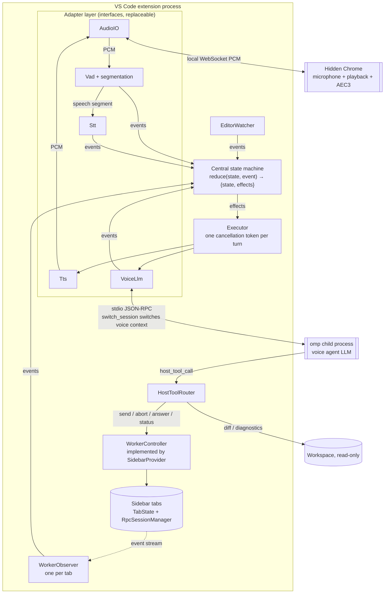
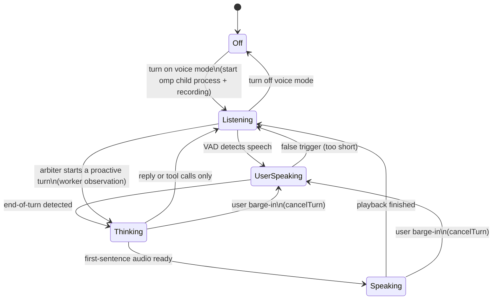

# Voice Pair Agent (Voice Agent) Design Document

Status: P1 (directing the worker), proactive narration, the audio loop, and the voice view are implemented in the extension and tested in practice (2026-09-25); see §14.1 for progress.

Prototype: the validated voice loop lives in the standalone project `voice-loop-prototype` (locally at `~/source/ai/voice-loop-prototype`, extracted from this repo at f8d8f06). "Prototype doc" below refers to that project's `docs/voice-loop-prototype.md`.

## 1. Goals

Provide a **real-time voice chatbot** inside the VS Code extension. It holds an ongoing conversation with the user while directing omp/pi to do the work.

Two agents with strictly separated responsibilities:

| | Voice agent (Voice Agent) | Worker agent (Worker) |
|---|---|---|
| Identity | A partner sitting beside you, "watching omp work and chatting with you" | The omp/pi session that actually writes code (i.e. the existing sidebar session) |
| Context | Independent: the conversation with the user + injected observations (worker progress, editor state) | Its own coding context; unaware of voice |
| Capabilities | Understand intent; edit files, run commands, and debug small jobs itself; dispatch heavy jobs to the worker, course-correct, stop it; narrate progress; summarize on completion; discuss the current code and docs | Read and write code, run commands |
| Writes code | Yes, small jobs; heavy jobs go to the worker | Yes |
| Speaks | Yes | No |

### 1.1 Features

1. Voice chat and discussion; the user can interrupt the bot at any time (barge-in).
2. Dispatch tasks to the worker once intent is understood; while it works, the user can cut in to course-correct, queue follow-ups, or stop it.
3. While the worker works, briefly explain what it is doing; no flooding, no reading code aloud.
4. When the worker finishes, give one summary: what was done, which files changed, test results, open issues.
5. When the worker needs a confirmation/choice/input, the voice agent relays it and collects the user's answer.
6. Pair programming: discuss code and docs based on the user's currently open file, selection, and visible range, reading files itself when needed.

### 1.2 Non-goals (first version)

- The worker does not speak directly.
- The voice agent edits files, runs commands in the terminal, and debugs itself, and it directs the worker; see `voice-pair-agent-cursor.md` §11. It sizes up each job: small, quick changes (one function or a few blocks of code, one or two files) it does on the spot; heavy work (many files, large refactors, long test runs, things suited to several subagents in parallel) it hands to the worker with `tell_worker`, saying so in a short sentence (the worker can spawn its own subagents).
- Worker file lock: while the worker's running task changes a file, the voice agent's file tools refuse that file until the task ends. The permission gate (`src/piExtension/permissionGate.ts`) reports each file-changing worker tool call to the host before it runs; `HostToolRouter._workerLock` checks `edit_file`, `create_file`, `delete_file`, `rename_file`, and `save_file` against it (`voice-pair-agent-cursor.md` §11). Known gaps: `rm` / `mv` / `sed -i` through bash are not reported; TUI tabs do not load the gate, so while a TUI tab's task runs, all of the voice agent's file changes are refused.
- No remote calls (WebRTC/phone); only the local microphone and speakers are supported.
- No acoustic echo cancellation (AEC) in the first version; see §12.

## 2. Verified Facts

This section records only measured results (2026-09-24, omp v18.2.11, local machine).

### 2.1 Using a second omp RPC process as the voice agent: feasible

Launch command:

```
omp --mode rpc --no-tools --no-skills --no-rules --no-extensions --no-lsp \
    --no-session --no-title --thinking off --system-prompt "<voice agent prompt>"
```

Then send `set_host_tools` to register the host-side tool `dispatch_task`, with `loadMode` set to `essential`.

| Measurement | Result |
|---|---|
| Process start → `ready` frame | 0.28 s |
| `set_host_tools` | Succeeded; response `toolNames: ["dispatch_task"]` |
| Default model (`get_state`) | `anthropic/claude-opus-5-5`, i.e. omp's current default model |
| One pure-chat turn | First text_delta 0.7 s, whole turn 1.78 s |
| One dispatch turn ("have it change the README version to 0.3.0") | `host_tool_call` emitted at 2.82 s; after returning the result, first sentence at 4.05 s |

The model on its own rewrote the spoken request into a structured worker instruction, including scope constraints and self-check steps.

Conclusions:

- The voice agent's LLM **directly reuses omp's login credentials, providers, and model system**; the extension does not need its own LLM client.
- `--no-tools` does not affect registering and calling host tools.
- Streaming text comes from `message_update.assistantMessageEvent.text_delta`; a turn ends at `agent_end`.
- Host tools are an omp RPC extension; pi's RPC does not have them (see the "Pi-family adapter" section of omp's `rpc.md`). Originally, for this reason, the voice agent process always used omp.
- **Since 2026-09-26 pi works too**: the voice process follows the current backend. When the backend is pi, `PiRpcBridge` uses `--extension` to load the Pi extension bundled with the extension (`src/piExtension/hostTools.ts`, packaged as `out/pi-extension/hostTools.js`; the user installs nothing), which emulates host tools; the protocol is in `src/pi/hostToolsProtocol.ts`:
  - Tool definitions are written to a temporary JSON file whose path is passed to the Pi extension via an environment variable; the extension registers them on load, so the tools survive `new_session` / `switch_session` rebuilding the extension runtime. When the tool set changes later, the file is rewritten and `/vscode-host-tools` is sent to make it reload (first confirming the command exists via `get_commands`, so this line is not sent to the model as a prompt).
  - Tool call = an `input` dialog titled `vscode-host-tool-call`, with arguments in `placeholder`; the bridge translates it into `host_tool_call`, and translates `host_tool_result` into `extension_ui_response`. Cancel = a `setStatus` with key `vscode-host-tool-cancel`, translated into `host_tool_cancel`. These frames never reach `RpcExtensionUiHandler`.
  - pi's `--tools` allowlist also filters extension tools, so the voice process's allowlist must include the host tool names; the read-only built-in tools are `read,grep,find` (pi has no `glob`; `--append-system-prompt` tells the model that find is glob). pi may still retry after `agent_end`; a turn ends at `agent_settled`.
  - pi's voice process and research **do not get `--no-extensions`** (omp still does): pi's model providers can come from pi packages (e.g. `pi-provider-antigravity`); without loading extensions, `--model antigravity/…` exits immediately with "Model not found" and voice cannot answer a single sentence (measured 2026-09-26). User extensions' tools are still blocked by the `--tools` allowlist, and blocking dialogs they pop up are auto-cancelled by VoiceLlm.
  - Rule files (`AGENTS.md` / `CLAUDE.md`): initially pi got `--no-context-files` and omp got `--no-rules` so they were not read, because reply-format rules in them meant for the coding agent would be followed by the voice agent and read aloud (measured 2026-09-26: a user-level rule made every reply start with a fixed prefix). On 2026-09-27 this changed so that both the voice process and research load them, in order to know the project structure; the voice prompt states that reply-format rules in them do not apply to speech.
  - When a turn cannot run (voice process failed to start, no session tab, etc.), `VoiceAgent.say` does not throw but goes through `onEnd` with a result carrying `error`: in the Bot view this reply shows a ⚠ error instead of staying stuck on "…".
  - Measured (2026-09-26, pi 0.87.1, `openai-codex/gpt-5.5`): host tool calls, error results, calls after `new_session` and `switch_session`, and `host_tool_cancel` on interrupt all work; ordinary sessions (without the hostTools option) do not load this extension.

### 2.2 `omp say`: cannot be used directly as real-time Chinese TTS

| Measurement | Result |
|---|---|
| Engine | Local Kokoro (downloads `model_quantized.onnx` on first run) |
| Available voices | `tts.localVoice` enum: af_heart / af_bella / af_nicole / af_aoede / af_kore / af_sarah / am_michael / am_fenrir / am_puck / bf_emma / bm_george / bm_fable, **all English voices** |
| Chinese voice `zf_xiaobei` | Rejected, exit code 1 |
| Output | 24 kHz / 16 bit / mono WAV, returned only after the whole clip is generated; no streaming output |
| Time (model cached) | 7.21 s to generate 15.7 s of audio, including the overhead of starting the process and loading the model each time |

Conclusion: `omp say` is kept as an **optional TTS backend**, suitable for English use or zero-config trials. Real-time Chinese conversation should default to a configurable OpenAI-compatible TTS service. Also, the omp config has `modelRoles.speech` (currently `deepinfra/hexgrad/Kokoro-82M`), indicating omp itself has a cloud TTS role; whether it can be called externally is unverified, see §13.

### 2.3 One omp process hosting voice contexts for multiple tasks: feasible

Measured (2026-09-25, omp 18.2.11): replace `--no-session` in the launch arguments with `--session-dir <temp dir>`, send `set_host_tools` first, then:

| Step | Result |
|---|---|
| In session A say "the password is APPLE", get `sessionFile` via `get_state` | Obtained A's session file path |
| `new_session`, in session B say "the password is BANANA" | `new_session` 0.02 s |
| `switch_session` back to A, ask for the password | Switch 0.02 s; answered APPLE, whole turn 1.41 s |
| `switch_session` to B, ask for the password and request a host tool call | Answered BANANA, `host_tool_call` emitted at 1.98 s |

Conclusions:

- Contexts are isolated from each other; switching time is negligible.
- Tools registered via `set_host_tools` remain valid after `new_session` / `switch_session`; no re-registration is needed.
- So "one voice context per task" (§5.12) needs only **one** omp child process, not one per tab.

### 2.4 Worker `prompt` + `streamingBehavior`: supported by both pi and omp

Measured (2026-09-25, omp 18.2.11; pi 0.87.1, model `openai-codex/gpt-5.5`): while the worker is running `sleep 6`, send a second `prompt`.

| How sent | omp | pi |
|---|---|---|
| Without `streamingBehavior` | Error "Agent is already processing" | Error "Specify streamingBehavior" |
| `streamingBehavior: 'followUp'` | After the current task answers FINISHED, it goes on to answer FOLLOWUP | Same as omp |
| `streamingBehavior: 'steer'` | **The running command is cut off immediately**; the steering turn ends with no text, and about 3 s later a new turn starts automatically and only then answers STEERED | Waits for the command to finish before handling the steer, answers STEERED; `queue_update` during the steer |
| With `streamingBehavior` while the worker is idle | Executed as an ordinary prompt | Same as omp |
| omp with `--approval-mode always-ask` | Tool approval is sent as an `extension_ui_request` `select`: title `Allow tool: bash\nCommand: echo hi`, options `Approve` / `Deny` | — |

Conclusions:

- `tell_worker` always sends messages with `streamingBehavior`: when the worker is idle, both backends execute it as an ordinary prompt, so there is no "just finished" race (§6).
- When steering with omp, the first `agent_end` does not mean the task is over. WorkerObserver waits for the worker to be stably idle before judging `done` (§5.8).
- Tool approval is just an ordinary select dialog; no separate approval channel is needed.

## 3. Overall Architecture



**Key points**:

- The worker is the existing session in the sidebar. What the user sees in the chat panel and what voice drives are the same session; the two modes of operation can be mixed.
- **Voice attaches to a task**: the user first starts a task in some tab, then discusses and controls it by voice within that task. Each worker session has its own voice context; when the user switches tabs, the voice agent switches to that task's context. There is no single voice agent overseeing all tabs (§5.12).
- There is only one voice omp child process (one microphone, one speaker), switching between voice contexts with `switch_session` (§2.3). Voice session files are saved with the workspace; when voice mode is reopened (or the window changes), each task continues with its previous voice context (§5.12 rule 2).
- The voice agent does only **task control**; its control entry point is `WorkerController`, and it does not call the worker's `RpcBridge` directly (§5.11).
- Microphone and playback live in a **hidden Chrome** launched by the extension: a webview cannot open the microphone, and echo cancellation relies on Chrome's AEC3, which must own both playback and recording. Chrome exchanges PCM with the extension process over a local WebSocket; VAD, STT, LLM, TTS, and all decisions live in the extension process. Rationale: prototype doc §3, §8.

## 4. Runtime Model: Interfaces + Central State Machine + Cancellation Tokens

**Decision (2026-09-24, after prototype validation): do not implement a Pipecat-style frame pipeline (Frame / FrameProcessor / Pipeline).** The prototype is already implemented following this section's structure (standalone project `voice-loop-prototype`).

### 4.1 Why not frames

| Why Pipecat needs frames | Our situation |
|---|---|
| General framework: hundreds of STT/TTS/LLM services, a dozen-plus transports, users can assemble processors freely, so a uniform "currency" must flow between stages | Specific application: fixed stages (audio, VAD, STT, LLM, TTS), fixed topology. Only the TTS backend and the audio method are replaceable; interfaces suffice |
| Decisions are scattered across processors; cross-stage rules rely on passing frames up and down | Complexity is concentrated in **decisions**: who should speak, whether a barge-in is real, which sentence playback is on, worker narration. Centralizing them in one state machine makes them easier to get right and test |
| Interruption must traverse arbitrary processors, hence `InterruptionFrame` | This is the only truly valuable capability frames offer, and **one cancellation token per turn** provides it (§4.4) |

Cost of introducing frames: an entire framework layer of queues, frame types, directions, and priorities; all logic has to be broken into "frame passes from A to B", and ordering races become harder to debug.

**Reconsider frames later when**:
- The audio path needs configurable chaining of arbitrary processing (denoising → speaker diarization → emotion analysis…);
- Multiple audio streams must be processed simultaneously (multi-party meetings);
- We want to reuse Pipecat's service implementations directly.

### 4.2 Interfaces (adapter layer)

| Interface | Responsibility | Implementation |
|---|---|---|
| `AudioIO` | Emit 16 kHz microphone PCM; play PCM in order; `flush()` discards all queued audio | Hidden Chrome (default) / browser tab (when Chrome is not found) / pulse (control group) |
| `Vad` + segmentation | Score each frame; produce speechStart and whole-segment PCM | `SileroVad` + `SpeechSegmenter` (production code) |
| `Stt` | `transcribe(pcm) → text` | `SttClient` (OpenAI-compatible) |
| `Tts` | `synthesize(text, signal) → PCM` | OpenAI-compatible `/audio/speech` / `omp say` |
| `VoiceLlm` | `prompt(message, signal)`, produces `llmText` and `llmEnd` events (plus `host_tool_call` from P1 on) | omp RPC child process |

### 4.3 Central state machine

A pure function `reduce(state, event) → { state, effects }` that does no I/O; the prototype's counterpart is `conversation.ts`. It makes all decisions: the floor, when to send a prompt, interruption, `<interrupted>` compensation, sentence splitting. P1's FloorArbiter, observation queue, and tool state also go into this state machine, or into sub-state machines it composes; no separate decision points.

| Event (input) | Source |
|---|---|
| `userSpeechStart` / `userSpeechEnd` | VAD segmentation (while the bot is speaking, barge-in confirmation comes first) |
| `transcript` | STT |
| `steerFailed` | Executor: a remark could not be steered into the reply (it had just ended) |
| `llmText` / `llmEnd` | VoiceLlm |
| `sentencePlaying` / `sentencePlayed` / `audioIdle` | Executor (playback progress) |
| `shutUp` / `toggleMute` / `toggleHalfDuplex` | UI, keyboard shortcuts |
| P1: `workerEvent`, `hostToolCall`, `activeTaskChanged`; P2: `editorChanged` | WorkerObserver, HostToolRouter, WorkerController, EditorWatcher |

| Effect (output) | Execution |
|---|---|
| `prompt { turnId, message }` | Create this turn's cancellation token, call `VoiceLlm.prompt` |
| `speak { turnId, text }` | Synthesize under this turn's token and queue for playback |
| `steer { turnId, text }` | `VoiceAgent.steer`: a short remark goes into the running reply at its next turn boundary (§5.14) |
| `cancelTurn { turnId }` | Abort this turn's token |
| P1: `hostToolResult`, `workerCommand`, `switchVoiceContext` | HostToolRouter / WorkerController / VoiceLlm (`new_session`, `switch_session`) |

### 4.4 Cancellation tokens (replacing `InterruptionFrame`)

Each bot reply turn has one `AbortController`, created by the executor when it handles the `prompt` effect. All async work for the turn subscribes to its signal:

| Subscriber | On abort |
|---|---|
| VoiceLlm | If omp is still generating this turn, send RPC `abort`; discard `text_delta` arriving afterward. A run that has not settled 5 s after the abort ends with an error and the process is replaced (§5.14) |
| Tts | In-flight synthesis requests are cancelled along with their `fetch` / child process |
| Playback queue | Clear queued sentences; AudioIO `flush()`; clear the playback-progress timer |

**Convention**: after abort, the turn delivers no further events to the state machine, **with the sole exception of `llmEnd`**. `llmEnd` only means "the LLM is idle and the next prompt can be sent", because omp processes only one prompt at a time. Therefore the state machine never needs to judge whether an event is stale.

Prototype measurement: on interrupt, `cancelTurn` alone performs the entire stop; a speaker recording showed output silenced within 0.3 s, with no playback events after the cancelled turn (prototype doc §5). It replaced four scattered mechanisms from the prototype's early days: a player generation counter, a `discarding` flag, discarding events by `turnId`, and a separate page flush.

### 4.5 Mapping to Pipecat concepts

| Pipecat | This project |
|---|---|
| `Frame` / `FrameProcessor` / `Pipeline` | Interfaces + events / effects + central state machine |
| `InterruptionFrame` | `cancelTurn` → this turn's `AbortController.abort()` |
| `UserStarted/StoppedSpeakingFrame` | Events `userSpeechStart` / `userSpeechEnd` |
| `TranscriptionFrame`, `LLMTextFrame` | Events `transcript`, `llmText` |
| `BotStarted/StoppedSpeakingFrame` (upstream) | Events `sentencePlaying` / `audioIdle` |
| `PipelineTask.queue_frames()` (external injection) | Direct `dispatch(event)` |
| User turn controller, start/stop/mute strategies | Rules in the state machine |
| VAD Analyzer / Smart Turn | `SileroVad` (state reset every 5 s, same as pipecat) + `SpeechSegmenter`; Smart Turn v3 as a later enhancement |
## 5. Component Design

### 5.1 AudioIO (microphone + playback)

- Default: the extension finds a local Chrome, Edge, Chromium, or Brave, launches it headless, and loads a local audio page. The page handles `getUserMedia` (with echo cancellation, noise suppression, and auto gain enabled) and WebAudio playback, and exchanges PCM with the extension over a local WebSocket. See prototype doc §3.2 for the protocol and launch arguments.
- If Chrome is not found, open the same page with `vscode.env.openExternal` and ask the user to keep the tab open.
- Dictation (the microphone button in the session composer, Ctrl+Alt+M) and voice mode are mutually exclusive (implemented 2026-09-25):
  - From the moment voice mode starts until it ends, the microphone button is hidden and the shortcut has no effect (`when: !oh-my-pi-chater.voiceMode`).
  - If voice mode is turned on while dictation is in progress, dictation stops first; the segment already recorded is transcribed as usual.
  - When dictation is triggered from the command palette, show a message and do not record.
  - Implementation: `VoiceInput.setBlocked`, the `voiceMode` field in the state sync, `SidebarProvider.setVoiceMode`.

### 5.2 VAD and end-of-turn detection (TurnDetector)

- Reuse `SileroVad` and `SpeechSegmenter`.
- Dictation's end threshold `vadStopSecs=0.8` is too short for discussion. Voice mode uses a separate setting `turnStopSecs`, default 1.2 s (to be tuned).
- `userSpeechStart` fires only after **about 200 ms of sustained speech**, so coughs and keyboard noise don't cause false interrupts. While the bot is speaking, a barge-in must also be confirmed (STT + echo comparison, see prototype doc §4.3).
- Enhancement (P3): integrate Smart Turn v3 for semantic end-of-turn detection.

### 5.3 Stt

- Reuse `SttClient` (OpenAI-compatible `/audio/transcriptions`); configuration keeps using `oh-my-pi-chater.voice.sttUrl/sttModel/language`.
- Multiple speech segments within one turn are concatenated in order; if the user keeps speaking within `turnStopSecs`, it is merged into the same turn.

### 5.4 VoiceLlm (omp subprocess)

**Launch**: uses the command line from §2.1, with these extra arguments:

- `--model <provider/id>`: when the `voiceAgent.model` setting is empty, **follow the worker's current model**: before launch, call `getState()` on the worker and take `model.provider/model.id`. A change of the setting (the Bot view's model chip, Settings → Voice, settings.json) reaches a running process without a restart: `VoiceAgent.setModel` queues an RPC `set_model` behind the reply in progress, so the next reply runs on it (empty takes the worker's model at that moment). Loading a voice context (`switch_session`) can bring back the model that session file was last on (pi's `createAgentSession` restores it); `VoiceLlm.switchSession` rereads the model, and `VoiceAgent._load` puts the process back on the chosen one before the turn.
- `--thinking <level>`: a setting, default `off`; voice is latency-sensitive.
- `--cwd <workspace>`: same as the worker.
- `--tools read,grep,glob`: replaces §2.1's `--no-tools`, enabling omp's built-in **read-only** tools so the extension doesn't have to implement codebase reading itself. Tested (2026-09-25): can be enabled together with host tools; a turn of "take a look at what clamp does in calc.js" took 4.2 s without going through the worker.
- `--session-dir <workspace storage>/voice-sessions`: replaces §2.1's `--no-session`; one session file per voice context (§2.3, §5.12). Files are kept after voice mode is turned off so the conversation can resume next time; on shutdown, files no longer referenced by any transcript are deleted (those pushed out by the history cap, and empty sessions created when omp starts). A window with no folder open has no workspace storage; it uses `<globalStorage>/voice-sessions/<random id>` instead, deletes it entirely on shutdown, and does not resume.
- `--approval-mode yolo`: the voice process only has read-only tools and host tools, and host-tool rules are enforced by HostToolRouter. Without this flag, `approvalMode: always-ask` in project or user config makes host tools show approval prompts too, and since the voice process loads no extensions and nobody can answer, every tool call is rejected (observed in smoke testing, 2026-09-25).
- `--system-prompt`: content in §8.

**Following the worker model**:

- Read only once, when voice mode starts.
- If the worker switches models midway, **do not follow automatically**, to avoid changing tone and capability mid-conversation; the user can sync manually with the command "Voice Agent: Sync worker model", which sends `set_model` under the hood.
- When a fixed model is configured, always use it.

**One conversation turn**:

1. Send `prompt` containing the user's utterance plus the editor snapshot and unconsumed observations; format in §7.2.
2. Deliver `text_delta` to the state machine as `llmText` events.
3. While the model writes a host tool call, its `toolcall_delta` pieces go to HostToolRouter, which may start typing an `edit_file` or drawing a `show_me` ahead (§5.14).
4. On `host_tool_call`, hand it to HostToolRouter, which sends back `host_tool_result` (adopting the preview of that call, if any). Calls of a message cut off at the token limit never run.
5. On `agent_end`, deliver `llmEnd`.

**Interrupt**: when the turn's cancellation token is aborted, send `abort` and discard any text that arrives afterward (§4.4). A short remark while the reply is still silent is not an interrupt: it is steered in (§5.14).

**Context compensation after an interrupt**: the omp session stores the **full generated text**, but the user actually heard only part of it. Prepend to the next turn's prompt:

```
<interrupted>Your previous reply was only read aloud up to: "……", then the user interrupted; the user did not hear the unread part.</interrupted>
```

The text that was read aloud comes from the playback-progress event `sentencePlayed`, with sentence-level precision.

**Process health**: after the subprocess exits, the next user message relaunches it and runs `switch_session` for the current voice context, returning to the original session file, so no context is lost. If launch fails, that turn returns an error and writes it to the voice output panel.

### 5.5 Sentence splitting

- Split streaming text into TTS-friendly chunks at sentence-ending punctuation: the full-width Chinese marks U+3002 (full stop), U+FF01 (exclamation), U+FF1F (question), U+FF1B (semicolon), plus ASCII `!?.;` and `\n`.
- First sentence first: the first chunk can be sent as soon as it hits a comma and is about 8 characters long, to keep first-sentence latency low.
- Filter out content unsuitable for reading aloud: code blocks, URLs, Markdown symbols. The prompt tells the model not to produce such content; this is the safety net.

### 5.6 Tts (configurable)

Unified interface:

```
synthesize(text, signal) → AsyncIterable<{ pcm: Int16Array, sampleRate }>
```

| Backend | Settings | Streaming | Notes |
|---|---|---|---|
| `openai` (default) | `ttsUrl`, `ttsModel`, `ttsVoice` | Depends on the server; read in chunks when `response_format: pcm` is supported | OpenAI-compatible `/audio/speech`; works with OpenAI and local services such as Kokoro-FastAPI / CosyVoice / speaches |
| `omp` | `ttsVoice` (omp voice) | No | Calls `omp say <text> --voice <v> -o <tmp.wav>`, then reads the WAV. English only; every sentence pays the cost of starting a process and loading the model (§2.2) |

- Pipeline between sentences: while sentence N plays, synthesize sentence N+1 in parallel, at most 2 sentences ahead.
- The STT tab of the settings panel is extended with a TTS section offering "Connectivity test" and "Preview", modeled on the existing `testSttConnectivity`.

**Implementation (2026-09-25)**: `src/voiceAgent/tts.ts`, OpenAI-compatible interface only (`omp say` has no Chinese voice and can't stream, §2.2; deferred). One request per sentence; all sentences are synthesized concurrently and played in order (no "at most 2 ahead" limit). Services take the language differently, selected by the `tts.provider` setting:

| provider | Language field | When model / voice is empty |
|---|---|---|
| `chatterbox` (chatterbox-tts, multilingual, local `:8881`, currently in use) | One request per sentence; send `language: zh` if it contains Chinese characters, otherwise `en` | `chatterbox-multilingual` / `default` |
| `kokoro` (Kokoro-FastAPI, local `:8880`) | Split into Chinese / non-Chinese segments; Chinese segments get `lang_code: z` | `kokoro` / `af_sarah` |
| `openai` | Not sent | `tts-1` / `alloy` |

**chatterbox-tts (tested, verified by STT read-back)**: with `language: zh`, mixed Chinese-English text is read correctly in a single request (a Chinese sentence meaning "OK, I'll have it run npm test" was recognized back verbatim, and `average` was right too); without a language, English is mangled ("The tests passed." → "I-4 casts past"), so English sentences must send `en`. It accepts only the name of the loaded model and returns 400 for anything else; Kokoro voice names produce `unsupported reference-audio format`. Synthesis takes about 0.5–1.2 s per sentence (Kokoro about 0.1 s); end-to-end from the user stopping to hearing the answer is 2.78 s (Kokoro 2.24 s). It supports `stream: true` + `response_format: pcm` with a first byte at about 0.46 s, not yet used.

**Kokoro and mixed Chinese-English (tested, local Kokoro-FastAPI, verified by STT read-back)**:

- An English voice (such as the user's chosen `af_sarah`) reading Chinese directly just repeats "Chinese letter"; with `lang_code: "z"` the Chinese is clear (a Chinese sentence meaning "The tests finished, all four passed, no files were changed" was recognized back verbatim).
- With `z` on the whole sentence, English words are mangled by Chinese pronunciation: `npm test` → "neng shi shi" (Chinese for "can try"), `average` → "Avidai". The Chinese voice `zf_xiaoxiao` behaves the same; this is a limitation of Kokoro's Chinese pipeline.
- So `kokoro` splits the text into Chinese and non-Chinese segments; Chinese segments get `z`, the rest use the voice's own language. Segments are synthesized concurrently, leading/trailing silence padding is trimmed, and they are concatenated (50 ms between segments). Tested: `npm test` and `average` are read correctly; the known weak spot is a single Chinese character between English words ("shuo", "say", → "Joy"). Digits, spaces, and punctuation go with the segment they are in.

### 5.7 Playback and playback progress

- Each sentence is handed to AudioIO for playback in order once synthesized; the sample rate is whatever each sentence actually returns.
- Interrupt: stopped uniformly by the turn's cancellation token (§4.4). Fully played sentences are recorded in the state machine for `<interrupted>` compensation.
- Playback progress is reported by the audio page (2026-09-26), following Pipecat: "the bot is speaking" is determined only by the output side from the audio actually played, then reported back (upstream) to the state machine, not inferred from TTS requests.
  - Each sentence's audio carries a clip id (binary header `[u32 clipId][u32 sampleRate]` + PCM). When it actually starts playing, the page replies `{type:'started', id, at, durationMs}` (fired by the `onended` of a silent `ConstantSourceNode` scheduled to stop at the same moment, so it runs on the audio clock and isn't throttled in background tabs; `at` includes output latency); when finished it replies `{type:'ended', id, at}`. Flushed sentences are not reported. When the page disconnects, the host treats all unfinished sentences as played (without having started), so a turn never gets stuck in "speaking".
  - The state machine's former `audioActive` is split into two flags, matching Pipecat's `TTSStarted/Stopped` and `BotStarted/StoppedSpeaking`: `ttsActive` (this turn has sentences being synthesized, queued, or played) and `botSpeaking` (the page reported the first sentence started playing). The displayed state is chosen by priority: standby > you're speaking > speaking (`botSpeaking`) > transcribing > synthesizing (`ttsActive` but not yet audible) > thinking > listening.
  - Gaps between sentences stay "speaking". It counts as done speaking only when the reply is fully generated and all sentences have played, or the playback queue has been empty for 3 s (`BOT_STOP_FALLBACK_MS`, like Pipecat's `BOT_VAD_STOP_FALLBACK_SECS`, e.g. while calling a tool midway), or it is interrupted. After the 3 s fallback it returns to "thinking".
  - Barge-in checks happen only while `botSpeaking`: there can only be echo when audio is actually playing. If the user starts speaking during synthesis, it is handled as a normal interrupt.
  - At the end of each turn (if not interrupted), the executor reports timestamps via `onMetrics(turnId, metrics)`: `silenceAt`, `endDetectedAt`, `sttDoneAt`, `promptAt`, `firstTextAt`, `firstSpeakAt` (first sentence handed to TTS), `firstAudioAt` (page reported the first sentence started playing), `llmDoneAt`. The "Timing" collapsible under each reply in the Bot view is computed from these (§11.2).

**Implementation (2026-09-25)**: `src/voiceAgent/voiceMode.ts` (executor: microphone, VAD, barge-in check, STT, playback, effect execution), `conversation.ts` (state machine), `browserAudio.ts` (local HTTP + `ws` server, audio page, hidden Chrome), `sentences.ts`, `echoFilter.ts`. Differences from the prototype:

- The state machine no longer sends prompts to omp itself; instead the executor calls `VoiceAgent.say(text, 'stt', listener, { signal, interrupted })`: turn serialization, context switching, and tools all stay in `VoiceAgent`. So `llmBusy` is gone; the turn's cancellation-token signal is passed into `say`, and aborting it aborts the turn (including one still queued: the prompt is still sent so the user's words remain in context, then aborted immediately).
- The `<interrupted>` note is generated by the state machine from the sentences actually played and passed to `VoiceAgent` with the prompt, replacing its default note based on the generated text; tool calls that already took effect in the aborted turn are still appended.
- Proactive turns: before sending the prompt, `VoiceAgent` calls `onProactiveTurn`; the executor dispatches `proactiveStart`, and the state machine accepts only when nobody is speaking, there is no speech pending recognition or sending, and no reply is in progress, returning the turn's signal; if it doesn't accept, it returns an already-aborted signal. `VoiceAgent.floorBusy` is determined by the state machine's `floorFree`; when a reply finishes playing or the user's utterance comes to nothing, `VoiceAgent.floorReleased()` is called, and the anti-back-to-back gap is counted from that moment.
- Typing in voice mode ("Type a Message") goes through the state machine's `typed` event: like speaking, it interrupts the reply first.
- The audio page only accepts connections carrying a random token, so other local web pages can't connect to the microphone stream.
- Removed the prototype's pulse / file-playback modes, terminal UI, `[DEBUG-mic]`, and recording dumps.
- Also fixed a prototype sentence-splitting bug: newlines inside code blocks were treated as sentence ends, so code was read line by line; now no splitting happens inside ``` fences, and the whole block is removed by the cleanup step.

### 5.8 WorkerObserver

Subscribes to the worker `RpcBridge` event stream (the same source as the sidebar) and maintains two things:

1. **Work log (digest)**: compresses raw events into human-readable entries, keeping only the latest N.

   ```
   [12:03:10] Started task: change the README version to 0.3.0
   [12:03:12] Read README.md
   [12:03:18] Edited README.md
   [12:03:25] Ran grep "0.2.40" README.md → no matches
   [12:03:30] Done (this turn 20 s, 1 file changed)
   ```

2. **Observation events**: produces `observation` events by category and delivers them to the central state machine.

| Category | Trigger | Priority | Default handling |
|---|---|---|---|
| `needs_input` | Worker emits `extension_ui_request` (select / confirm / input / editor); omp tool approvals are also sent as such a select (§2.4) | High | Relay and ask the user as soon as possible |
| `error` | Accumulated tool failures, turn ended abnormally, process exited | High | Explain as soon as possible |
| `done` | Worker stays idle after `agent_end`: after an omp interjection it ends once and then automatically starts another turn about 3 s later (§2.4) | Medium | Generate a completion summary |
| `progress` | Phase change (starts editing, starts running tests, switches file group), or ≥ `narrationIntervalSecs` since the last narration | Low | Throttled; dropped when stale |

- Event sources: phase and progress come from `tool_execution_start/end` and `turn_end`; errors come from `auto_retry_end{success:false}`, `compaction_end{errorMessage}`, and abnormally ended `agent_end`. The digest is rule-generated, without calling an LLM.
- Inputs to the `done` summary: this turn's digest, the worker's final assistant text (`get_last_assistant_text`, truncated), and changed files and line counts (taken directly from `tab.diffManager`, not tallied from tool events).
- All tasks in the current tab are observed and narrated, whether started by typing in the panel or dispatched by voice: voice attaches to tasks the user has already started (§5.12).
- Implementation: `src/voiceAgent/workerDigest.ts`. One per tab, keeping only the latest 60 entries. omp's `tool_execution_start.intent` is already a readable description ("Reading a.txt") and is used directly; pi has no such field, so a description is built from the tool name and arguments. When bash finishes, record the exit code and the last output line, skipping the duration and exit-code lines omp appends.
- Each voice turn includes the log lines this voice context hasn't seen yet, in `<worker-updates>`, at most 20 lines. When a new voice context is created, old logs belong to `<task-history>` or to a previous task in the same tab, so only the log of the currently running run is included. Tested: without this, after `/new` the voice agent reports the previous task's activity.

### 5.9 FloorArbiter (floor arbitration)

This is the core of the whole experience, and Pipecat has no ready-made implementation. It is part of the central state machine (§4.3), not a separate processor.

**State**: `userSpeaking`, `botSpeaking`, `llmBusy`, plus the current voice context's queue of observations waiting to be narrated. Each voice context has its own queue; switching contexts swaps in the corresponding queue (§5.12).

**Rules**:

1. **User first**: when `userSpeechStart` arrives, if the bot is speaking or the LLM is generating, immediately `cancelTurn` (§4.4).
2. While the user is speaking, observations are only queued and don't trigger the LLM.
3. When a user utterance ends, unconsumed observations are merged into that turn's prompt (§7.2), and the model decides whether to mention them.
4. When idle (user not speaking, bot not speaking, LLM idle), take the highest-priority observation from the queue and send a **proactive turn** prompt:

   ```
   <worker-update priority="done">…digest…</worker-update>
   Tell the user in a sentence or two if needed; if it's not worth mentioning, reply only <silent/>.
   ```

   A `<silent/>` reply is not sent to TTS.
5. **Drop when stale**: `progress` observations waiting in the queue longer than `narrationIntervalSecs` are dropped; only the latest one is kept.
6. **No back-to-back narration**: at least `minProactiveGapSecs` (default 8 s) between two proactive narrations. `needs_input` and `error` are exempt.

**Implementation (2026-09-25, typing mode)**: `src/voiceAgent/floorArbiter.ts`, pure bookkeeping; time is passed in by the caller.

- There are no queued observation objects; observations are derived from state: `needs_input` = the current task has a pending request the user hasn't been told about (if the webview answers first, the request disappears and the observation is naturally withdrawn); `research` = finished research in this voice context that hasn't been shown yet; `progress` = the worker is busy, there are unseen log lines, and more than `narrationIntervalSecs` has passed since the last turn. Only `done` and `error` need to be recorded from events, one of each per tab.
- `done`: counts only after the worker stays idle for 4 s following `agent_end` (`isTerminal !== false`, not `willRetry`, not `aborted`). After an omp interjection a new turn starts automatically about 3 s later, and a queued message starts right away; both first produce an `agent_start`, which clears the pending `done`. A user stop (`aborted`) is not narrated.
- `error`: `agent_end` with `stopReason: 'error'`, `auto_retry_end{success:false}`, `compaction_end{errorMessage}`. An unexpected worker process exit currently has no event and is not narrated.
- Priority `needs_input` > `error` > `done` > `research` > `progress`. The anti-back-to-back gap is counted from the end of **any turn** (user or proactive).
- A user turn takes all observations of the current task (rule 3); when the same tab switches session (`/new`, restoring history), the `done` / `error` recorded for that tab are discarded; when switching tasks the progress timer restarts, and `progress` accumulated in the background is not narrated (§5.12 rule 5).
- `VoiceAgent` queries the arbiter once per second, and also immediately when worker requests change (`WorkerController.onRequestsChanged`) and when research finishes. Proactive turns and user turns share one serial queue; a proactive turn re-selects the observation after loading the voice context and before sending the prompt, and gives up if a user message is queued at that point, letting the user go first.
- A proactive turn's message ends with `<worker-update kind="…">` plus a one-sentence instruction, instead of `<user>`. `done` includes the worker's last reply (truncated to 600 characters). In a proactive turn the only allowed host tool is `worker_status`; all others return an error: nobody asked, so it must not dispatch tasks, stop, or answer on the user's behalf.
- `<silent/>`: reply text is held back while it could still be a prefix of `<silent/>`; once it is confirmed to be `<silent/>`, the whole turn is not displayed (and in the future not sent to TTS).
- **Opening line** (2026-09-27): when voice mode connects (`VoiceAgent.open({ reason: 'connect' })`), and when the user restores a session from the resume list while voice mode is on (`WorkerController.onSessionResumed` → `open({ reason: 'resume', tabId })`), the voice agent speaks first: if the task has prior work (voice conversation, `<task-history>`, `<worker-updates>`) or the worker is waiting for an answer, it briefly states the current progress; otherwise it says "I'm here". It goes through the proactive-turn queue and floor check; the message ends with `<voice-on reason="…" language="…"/>`, `<silent/>` is not allowed, and tool restrictions are the same as for proactive turns; like a user turn it takes all observations of the current task. If the user speaks before it does, or the restored tab is no longer the current tab, the opening line is dropped. `language` comes from `oh-my-pi-chater.voice.language` and only applies when the voice context has no user utterances yet. In the Bot view it appears as an `opening` Update.

### 5.10 EditorWatcher

- Listens for changes to `window.activeTextEditor`, the selection, and the visible range, and maintains the current snapshot: file relative path, visible line range, selection (with text, truncated), language.
- Reuses the snippet format of `src/shared/editorContext.ts`.
- Each user turn includes the **current snapshot**. When the snapshot hasn't changed, only a "same as before" marker is included, to save tokens.
- In voice mode the full file text is not included; the model calls `read` itself when needed, see §7.4.

### 5.11 HostToolRouter and WorkerController

HostToolRouter dispatches `host_tool_call`, executes it, and sends back `host_tool_result`; on `host_tool_cancel` it aborts execution. The tool list is in §6.

HostToolRouter **does not call the worker's `RpcBridge` directly**; it goes through `WorkerController`. This interface is implemented by `SidebarProvider`, for these reasons:

- `_startTurn` handles checkpoint and diff turn boundaries, `_dispatchPrompt` names the tab, `queuedMessages` queues typed messages, and `isStreaming` maintains the context switch. Bypassing them makes rollback, the diff bar, and the queue diverge from actual state.
- `tab.session` gets replaced wholesale: `resumeSessionFromPanel` rebuilds the session when switching backend or cwd. A cached bridge reference becomes stale, so every call must resolve by tabId at call time.
- The current tab is split across two workspaces, pi / omp: `_workspaces[backend].activeTabId`.

```ts
interface WorkerController {
  /** Current tab; sessionFile is the voice context key (§5.12). */
  activeTask(): { tabId: string; sessionFile?: string; name: string; backend: AgentBackend } | undefined;
  /** Reads worker state at execution time to decide how to send (§6 tell_worker); uses the same send path as typing in the panel. */
  send(tabId: string, text: string, opts: { when: 'now' | 'after'; includeEditorContext?: boolean }): Promise<'started' | 'steered' | 'queued'>;
  abort(tabId: string): Promise<void>;
  status(tabId: string): WorkerStatus;              // idle / working / awaiting / error, current turn duration, queued count
  pendingRequests(tabId: string): WorkerRequest[];  // pending extension_ui_request (including omp tool approvals)
  /** First come, first served; returns false if the request was already answered or timed out; throws if the answer doesn't match the request type. */
  answer(tabId: string, requestId: string, answer: WorkerAnswer): boolean;
  /** User instructions and worker final replies for the last count turns; used for <task-history> and worker_status. */
  recentTurns(tabId: string, count: number): WorkerTurn[];
  /** Compared on every sendStateSync: clicking a tab, switching backend, and switching session within a tab all trigger it; a new tab receiving its session file does not count as a switch. */
  onActiveTaskChanged(listener): Disposable;
  /** Raw agent events per tab, emitted after the sidebar's own handling, for the work log. */
  onTabEvent(listener): Disposable;
}
```

Implementation: `src/voiceAgent/workerController.ts` (interface), `SidebarProvider` (implementation). Debug entry: command palette "Voice Agent — Debug Worker Control"; the internal command `oh-my-pi-chater.voiceAgent.workerControl` takes `{ action, ... }` and returns the result, for scripted testing.

Step 2 implementation (2026-09-25): `voiceLlm.ts` (voice omp process, reusing `PiRpcBridge`, adding `setHostTools` and `onExit`), `hostTools.ts` (HostToolRouter and tool definitions), `voicePrompt.ts` (system prompt and per-turn messages), `voiceAgent.ts` (orchestration: serial turns, new messages interrupt, switching voice context per task), `voiceAgentCommands.ts` (command palette "Voice Agent — Type a Message" / "Voice Agent — Stop", internal command `oh-my-pi-chater.voiceAgent.say`). No audio yet; typing substitutes for speaking, and the transcript is written to the output panel "Pi Fellow: Voice Agent".

- `send` reuses the panel's typing send path: when idle it goes through `_beginPrompt` (`_startTurn`, `_dispatchPrompt`), shared with panel sends; `after` goes into `queuedMessages`, the same queue as the panel's "queue", visible and editable by the user; `now` sends `prompt` + `streamingBehavior: 'steer'` and shows it in the panel as an interjection.
- Rejects slash commands starting with `/` and shell shortcuts starting with `!`: voice only does task control (§6).
- `answer` shares `_pending` of `RpcExtensionUiHandler` with the webview; whoever answers first wins. After a voice answer, `extensionUiDismiss` is sent to the webview to close the dialog; it is also sent on request timeout, since previously a timed-out dialog stayed on the panel forever. When the webview answers first, the request is withdrawn from the voice observation queue.
- A select answer must be one of the options; confirm only accepts `confirmed`, and other types only accept `value`; mismatches throw so the model asks again.
- The voice side depends only on this interface; tests swap in a fake implementation.

### 5.12 Multiple sessions: voice context bound to the task

The sidebar can have multiple sessions open at once (each tab is an independent omp/pi process). **Decision (2026-09-25)**: voice attaches to tasks the user has already started. Each worker session has its own voice context; when the user switches tabs, the voice context switches with it. There is no single voice agent overseeing all tabs.

**Why**:

- The voice context contains only this task's discussion and progress; "it" or "that file" from task A won't carry over into task B.
- Tools need no tab parameter and no routing by name; an STT typo can't send an instruction to another session.
- No need for a `<worker-switch>` hint, background-tab narration rules, or a cross-tab arbitration queue.

**Rules**:

1. **The context key is the worker session file** (tabId when there is no session file yet). Restoring another history session in the same tab, or running `/new`, counts as a new task, and the voice context switches too.
2. **One process, multiple contexts**: there is only one voice omp subprocess (§2.3). The first time a task becomes the current task in voice mode, run `new_session` to create its voice session and send the bootstrap turn (§7.5). The extension maintains the mapping `worker session → voice session file`: it is recorded on the task's transcript (`VoiceSessionRecord.voiceSessionFile`, §11.4) and saved with `workspaceState`.

   **Automatic resume (2026-09-26)**: after the voice agent restarts (voice mode turned off and on again, or a different VS Code window), the first time a task becomes the current task, if the voice session file from its most recent transcript still exists, `switch_session` continues with it and the transcript continues from that one; if the file is gone, `new_session` starts a new transcript. If `switch_session` fails, a new one is created too, and the original transcript notes "the previous conversation could not be restored". A resumed context still gets `<task-history>`, because it doesn't know what the worker did while voice mode was off; the worker log (digest) is rebuilt with the agent, and the resumed context sees all logs since this launch. `tab:<tabId>` keys are valid only within the current extension run: once the tab gets a session file, the conversation recorded under `tab:` in this run, together with its voice session file, is re-attached to the session file; `tab:` records saved by earlier windows are not resumed.
3. **Switching tasks = switching voice context** (event `activeTaskChanged`):
   1. `cancelTurn` the current turn, stopping playback and aborting generation;
   2. wait for `llmEnd` (omp idle), then send `switch_session` (or `new_session`);
   3. swap the state machine's observation queue and pending proposals for the new context's.

   What the user is currently saying is not discarded; once finished it goes to the **new** context.
4. **Turns are bound to a task**: when a voice turn sends its prompt it records the tabId, and all tool calls in that turn act on that tab. Switching tasks mid-turn cancels the turn (rule 3); tool calls already sent are not undone, and their results return to the original voice session.
5. **Background tasks stay silent**: each tab has a WorkerObserver continuously recording the digest, but only the current task's observations enter the arbitration queue. Completion, errors, and pending confirmations of background tasks are signaled only by the sidebar's existing tab notification marker (`hasNotification`). When switching back to that task, accumulated `needs_input`, `error`, and `done` enter the queue and are narrated once per §5.9; accumulated `progress` is dropped, and only the digest is attached to the next turn.
6. **No switching tabs by voice**: the voice agent only does task control (§6); there is no `switch_worker` tool; tabs can only be switched in the UI.
7. **Tab lifecycle**:
   - New tab: do nothing; when it becomes the current task, create its context per rule 2.
   - Closed tab: discard its observations and voice session mapping; in-flight tool calls targeting it return "session closed".
   - TUI mode (per tab): the TUI and the RPC worker can't write the same session file at once, so the RPC worker is never used for that task. The voice agent drives the TUI itself through the same tools: `tell_worker` types the prompt into it, `worker_status` reads its screen, `stop_worker` presses Escape, `answer_worker` types the user's answer as text and keys; when a run stops it gets a `stopped` update with the screen's last lines (updated 2026-09-29; see [tabs-and-tui.md](./tabs-and-tui.md#tui-tabs-and-the-voice-agent)). The Bot view can cover a TUI tab's terminal (the TUI keeps running); the tab icon or the voice bar button switches back.
8. **Voice model**: "following the worker model" in §5.4 means the current tab's model when voice mode is turned on; switching tasks afterward does not change the voice model.

### 5.13 Falling back to text when voice services are unavailable (2026-09-28)

When STT, TTS, or both can't be used (not configured, check failed, built-in engine download failed), the voice agent still comes online and uses text for the missing direction:

- **Startup**: `start` in `voiceAgentCommands.ts` first re-checks services that didn't pass (`probeStt` / `probeTts`; the user may have just started the service); those still failing are not passed to `VoiceMode.start`, and the reason goes into `unavailable`. `VoiceMode.start` no longer throws for missing STT/TTS; a failed STT `/models` check also just drops STT. When both pass, behavior is unchanged.
- **No STT**: VAD is not loaded; the audio page opens with `capture=0`, playback only, without calling `getUserMedia`; the microphone stays off and the waveform doesn't react to the user's voice; mute is meaningless (`setMuted` has no effect), and the composer microphone is greyed out with the reason explained. The user types in the Bot view (`VoiceMode.type`).
- **No TTS**: the state machine's `ConvState.voiced = false`; replies are not split into sentences or sent to TTS, never enter synthesizing / speaking, and the turn ends as soon as generation finishes (`lastMetrics` and `floorReleased` as usual); code anchors point immediately; the note given to the model on interrupt becomes "the user saw the part already written".
- **Neither**: no audio page and no hidden Chrome; voice mode is just a typed conversation in the Bot view; the Bot view's read-aloud button plays inside the Bot view instead (`beginReplay` returns `undefined`).
- **Notice**: the "Can't hear" / "No voice" labels on the bot status bar (§11.1), plus a system message in the Bot view at startup, explaining what is missing and why.
- **Failure mid-session**: if an STT or TTS request fails while voice mode is running, it is only logged and recorded as a system message in the Bot view (once per run of consecutive failures; recorded again if it fails again after recovering), without stopping the conversation: typing is still sent to the voice agent, sentences whose TTS failed are not played, and the state doesn't get stuck in synthesizing.
- **Readiness follows real requests** (2026-09-28): `voiceReadiness()` originally came only from `/models` probes (on startup, settings change, and settings-panel Test), which passed even when the service was reachable but the model or voice was misconfigured. Now every real request records its outcome: `resolveSttConfig` / `resolveTtsConfig` attach `onOutcome` to the config; `SttClient.transcribe` (voice mode, dictation, settings-panel Dry run) records available on HTTP success (an empty transcription counts too, it may just be quiet), and unavailable on connection failure, 401/403, 404, other 4xx/5xx, or timeout; `TtsClient.synthesize` (voice mode, read-aloud button, Dry run) records available when a WAV is parsed, and unavailable on connection failure, HTTP error, timeout, or a response that isn't a 16-bit mono WAV. Caller-initiated cancellation (interrupt, stopping read-aloud) is not recorded; the caller's own deadline expiring (`TimeoutError`) counts as a timeout. Outcomes are recorded against the settings actually used (STT key is URL + model; TTS key is URL + model + voice + languageField), and outcomes for settings that have since changed are discarded; outcomes using a temporary, unsaved key entered in the settings panel are not recorded either. No notification if the state is unchanged; on change, `onVoiceReadinessChange` → stateSync updates the labels, and a later success clears it automatically.
  - **Failures a probe can't overturn**: a real request's 404, a response not in a voice service format, and other errors (such as 400 "unknown voice") are invisible to `/models`, so they are recorded as sticky: a later successful probe doesn't clear them; only a successful real request (such as Dry run or the read-aloud button) or a settings change (key changed) clears them. Connection failure, timeout, 401/403, 5xx, and 429 are not sticky; the next probe after the service restarts recovers them (unavailable services are re-probed once before voice mode starts and before dictation starts).
  - **Built-in engine**: counts as available when there is no outcome; a failed model download, an engine that won't start (`builtinVoiceEngineUrl` throws, except when the user cancels the download), or a failed request all record unavailable, with the message "The built-in … engine failed: …"; probes don't check the built-in engine but do forget its failure, so it is retried on next use and recovers on success.
  - **Microphone**: when `getUserMedia` fails in the audio page it sends `micError` (on success `micOk`, resent on reconnect); `VoiceMode.unavailable.stt` becomes "Can't open the microphone (…)", and `onMicStatus` updates the status bar's "Can't hear" label and records a system message in the Bot view; this is not an STT service failure and is not written to readiness. When dictation's recording program can't be opened, it still reports the error as before.
  - While online, labels = currently missing services (or an unopenable microphone) ∪ services currently unavailable per readiness.
- **Recovering and changing settings at runtime, without restart** (2026-09-28): `VoiceServiceSync` in `src/voiceAgent/serviceSync.ts`, while voice mode is on, listens to `onVoiceReadinessChange` and voice settings changes (`oh-my-pi-chater.voice.*`, `voiceAgent.tts.*`; changing the STT model now also triggers a re-probe).
  - As soon as a missing service becomes ready (settings fixed, service started, built-in engine retry succeeded), it runs `resolveSttConfig` / `resolveTtsConfig` and attaches it to the running `VoiceMode`: TTS via `useTts`, opening a playback-only page first if there is no audio page; the state machine receives a `voiced` event and reads aloud **starting from the next reply** (a reply currently shown as text isn't read from the middle; `ConvState.nextVoiced` waits for it to finish before taking effect). STT via `useStt`: first checks `/models`, then loads Silero VAD; if a playback-only page exists it sends `{"type":"capture"}` to have it open the microphone (the server resends it on reconnect), and if there is no page it opens a capturing page; the microphone switch still follows mute and standby (`ActiveVoiceWindow`). On success the corresponding reason is removed from `unavailable`, `VoiceStatus` is pushed again (the label disappears), and a system message is recorded in the Bot view.
  - A service in use becomes unavailable: it isn't torn down; it falls back to text as before (per-sentence failures, label shown); once the service recovers, the next request succeeds.
  - Settings of a service in use change (voice, model, URL, engine, speed, language): the config is fixed at resolve time (held by `TtsClient` / `SttClient`), so the sync re-resolves and swaps in the new config (`Speaker.setClient`, a new `SttClient`) regardless of the new settings' readiness; subsequent requests use the new settings, and their outcomes update readiness; sentences already sent for synthesis use the old config. The read-aloud cache key (`liveTtsKey`) is updated accordingly.
  - If attaching fails (`/models` fails, VAD fails to load, audio page can't connect), things stay as they are and `unavailable` is replaced with this attempt's reason; the failure is already recorded in readiness, and it retries on the next state or settings change. Sync runs serially; if more changes arrive meanwhile, it runs another round after finishing.

### 5.14 Talking while writing: what pi's agent loop taught (2026-10-02)

Notes: `/home/zheng/source/ai/pi/docs/core-architecture-notes.md`. Six ideas from pi's `packages/ai` and `packages/agent`, checked against this code:

1. **Streamed tool arguments** (pi-ai `toolcall_delta`). Before: ignored; an `edit_file` started typing, and a `show_me` board started loading, only once the whole call had arrived. Now `VoiceLlm` adds up each host call's `toolcall_delta` pieces (omp 18.4's partial message carries a stale parse of the arguments, so the deltas are the source) and `HostToolRouter.preview` reads them with `partialFields`. An `edit_file` whose `path`, `oldText` (and `nearLine`) are written starts typing `newText` as it streams (`PairHands.previewEdit`; the typing keeps up by typing an eighth of what waits per 40 ms step); a `show_me` past a card's size opens its board tab at once (the page bundle takes seconds to load) and draws its whole blocks (`completeBlocks`: never a half-written diagram) every 250 ms, writing nothing to the board's file or index (`Blackboards.preview`). The schemas list `newText` and `markdown` last, and their descriptions say to write them last, so the place and the board are known first. Previews start only where the finished call would run unasked (not proactive, not Plan, no approval, no worker lock) and while Pi is followed (an edit not followed goes in at once anyway). The final arguments win: `execute` adopts a preview whose typed text is a prefix of the final `newText` (same path and `oldText`) or whose board is the final write's; otherwise the preview is undone (the typed text replaced by the original, the file saved back when it was clean; the board redrawn as it was, a tab the preview opened closed quietly) and the call runs anew. A call that never comes (the turn cut off, a truncated message, a call the CLI skipped) is undone the same way. An `edit_file` arriving while a preview of the same file still streams waits for that call to say what text it leaves.
2. **Truncation guard** (pi `stopReason: "length"` fails every call of the message). Already done by the CLIs: pi 0.99.1's agent loop has `failToolCallsFromTruncatedMessage`, and omp 18.4.4 discards a non-runnable final message's calls with status `length` (checked in their bundles), so no `host_tool_call` arrives. Added on our side: the previews of such a message are undone at its `message_end` (`onToolDropped`), and a host call of a truncated message that arrives anyway (an older CLI) is answered with an error instead of running.
3. **Errors as a terminal event**. Before: `VoiceLlm.prompt` threw when busy; a listener that threw inside `_runTurn` skipped the clean-up after it (`_turn` stayed set) or, inside an RPC event handler, was swallowed by `PiRpcBridge` and could leave a host tool call unanswered forever; an aborted run whose `agent_end` never came held every later turn. Now `prompt` resolves `{ error }` for every failure, an aborted run that has not settled within 5 s ends with an error and its process is replaced, `_runTurn` ends every turn in one `finally` (turn cleared, previews undone, `onEnd` once, so voice mode's `llmEnd` releases the floor and pending anchors), and its listener callbacks are guarded and logged.
4. **Steer at turn boundaries** (pi `Agent.steer` / `followUp`). Before: any speech cut the reply off at speech start (`userSpeechStart` → `cancelTurn`), and `FloorArbiter` only decides proactive turns, not barge-in. Now the reducer tells the two apart: speech over the reply's voice is a barge-in and still cuts at once; speech while the reply is still silent holds its text and waits for the words. A short remark without a stop word (`isRemark`) is steered into the running reply (`steer` effect → `VoiceAgent.steer` → omp/pi `steer`: taken in after the tool calls of the message being written, answered in the same run as `<user during-reply="true">`), and the held text is then spoken; a longer request or a stop word cuts the reply off and becomes a new prompt. `followUp` is not used: a remark the reply ended too soon to take goes out as a new prompt (`steerFailed`), which is the same thing for a voice agent that has finished talking.
5. **Non-blocking listeners** (pi awaits each subscriber in turn). Already true: every callback on the LLM event path is synchronous and queues its slow work (the speaker queue, `AgentCursor._enqueue`, `Blackboards.pointAnchor`, `HostToolRouter.execute` promises, the transcript's save timer, the Bot view's refresh timer). The one gap was failure, not waiting: see 3.
6. **Prompt cache** (pi `diffSystemPromptSections`). Already true: the system prompt, tools and skills are fixed for the process (a changed prompt restarts it, §5.4), and every per-turn block goes in the turn's user message, after the cached history; the tone dial lives there for this reason. Measured on omp 18.4: from the second turn on, 12 436 of 12 471 input tokens were cache reads. Nothing like pi's section diff is needed, since the system prompt never changes within a process.

## 6. Voice agent tools (host tools)

**Scope (decided 2026-09-25)**: **task control** only: dispatching tasks, course-correcting, queueing, stopping, answering worker requests, and checking progress. No session management: no opening or switching tabs, no changing the worker model, no compacting, no slash commands. Every tool acts on the tab bound to the current turn (§5.12 rule 4); there is no tab parameter.

All tools are set to `loadMode: 'essential'` so they are not classified as discoverable and hidden from the model.

| Tool | Parameters | Behavior | Returned to the model |
|---|---|---|---|
| `tell_worker` | `message`, `when: 'now' \| 'after'`, `includeEditorContext?` | The host reads the worker state **at execution time** and decides: if idle, sends it as a new task via prompt (subject to the confirmation policy, see below); if busy and `now`, interjects to course-correct (`prompt` + `streamingBehavior: 'steer'`); if busy and `after`, puts it in the panel's queue, to be sent as a new turn after the current task ends | What actually happened: "dispatched as a new task" / "interjected" / "queued" / "needs confirmation, proposal p3". The model relays this truthfully |
| `confirm_task` | `proposalId` | Executes a pending dispatch proposal (see below) | "Dispatched" or the reason for failure |
| `stop_worker` | — | worker `abort` | "Stopped" |
| `answer_worker` | `requestId`, `answer` | Answers the worker's `extension_ui_request` (select / confirm / input / editor), which includes omp's tool approvals (§2.4) | "Replied" / "That request was already answered or has timed out" |
| `worker_status` | — | worker state + current digest | Status summary text |
| `research` | `question` | Starts a one-off read-only process in the background (current backends: `omp -p` with only read, grep, glob enabled; `pi -p` with only read, grep, find, ls enabled, with the timeout enforced by the extension killing the process). No session is saved, at most 5 minutes, at most 3 at once; the question is passed via stdin. Implementation: `research.ts` | "Started r1 in the background". After that every turn carries `<research status="running">`; when done, a single `<research-result>` is attached (summary no longer than 250 words), and the voice output panel also shows "r1 finished, just ask to hear the result" |
| `read` / `grep` / `glob` (`find` on pi) | — | The backend's built-in read-only tools (§5.4); they do not go through HostToolRouter | File contents / matches / paths |
| `worker_transcript` | `turn?` (defaults to the latest turn), `detail?: 'summary' \| 'full'` | Fetches the user instruction, tool calls, and final reply of one worker turn, truncated according to `detail` | That turn's record. **Not implemented**: currently `worker_status` returns the instructions and conclusions of the last two turns |
| `worker_diff` | `path?` | Change statistics recorded by this tab's `diffManager`; with `path`, returns that file's diff (truncated) | Diff text. **Not implemented** |
| `diagnostics` | `path?` | VS Code `languages.getDiagnostics`, defaults to the current file | List of errors/warnings |

**Why merge into a single `tell_worker`** (replacing `dispatch_task` / `steer` / `queue_followup` from the draft):

- **Race**: after the model decides to interject but before the tool executes, the worker may just have finished. omp 18.2.11 executes a steer received while idle as a new turn (sidebar steer debugging, 2026-09-24). With the host routing at execution time, this window no longer exists.
- **Latency**: with three separate tools, a wrong guess about the state means an error and a retry, and one tool round trip costs about 2.8 s (§2.1).
- **Reuse**: when `RpcSessionManager.submitInput` has an explicit `streamingBehavior`, it sends it whether or not the worker is idle; both pi and omp execute it as a normal prompt when idle (§2.4), so no separate routing is needed.
- Every turn's attachments include a worker status line (§7.3), so the model has a basis for choosing `when`.

**Dispatch confirmation: only new tasks that modify files use a two-phase commit** (setting `confirmBeforeDispatch`, default `true`)

`tell_worker` takes a `readOnly` parameter: `true` when the worker only reads, researches, or runs checks such as tests. Such tasks are dispatched directly, and the host appends "Read-only task: do not modify, create, or delete files" to the instruction. Confirmation exists only to prevent code changes caused by STT mishearing; a misheard read-only task costs little, and asking every time feels awkward (user feedback, 2026-09-25).

We do not check "whether this turn's utterance contains an affirmative word", because "hao xiang bu tai hao" ("doesn't seem good") also contains "hao" ("good"). Instead:

1. When `tell_worker` routes to "new task", the task is not read-only, and confirmation is required, the host does not send it; it stores a proposal `{proposalId, instruction, turnId}`, shows a pending confirmation card in the panel, and the tool returns "needs user confirmation, proposal p3".
2. The model restates the plan aloud and asks.
3. `confirm_task(p3)` succeeds only if **a new user turn has occurred** after the proposal (the host compares turnIds). "The user really did respond" is guaranteed structurally; "whether the response counts as agreement" is judged by the model.
4. A new proposal, or a switch of voice context, invalidates the old proposal. The "Dispatch" button on the panel card is equivalent to `confirm_task`; the "Cancel" button invalidates the proposal.
5. After confirming or cancelling with a button, the model's next turn (user or proactive) carries `<proposal-settled id="p3" outcome="confirmed|cancelled|failed">`, each only once, so the model stops asking. If the reply that raised the proposal is the latest turn and is still being generated or played, it is interrupted (and in voice mode also hushed), and `<interrupted>` states that a button interrupted it. Calling `confirm_task` on that proposal afterwards: if already dispatched, it returns a non-error "The user already dispatched it with the button; don't ask again"; if cancelled, it returns an error saying it was cancelled (user feedback, 2026-09-26: after confirming with the button the model still asked once more).

With `confirmBeforeDispatch = false`, new tasks are dispatched directly. Interjecting, queueing, and stopping need no confirmation: they only happen while the worker is busy and are themselves immediate user instructions.

**Answering worker requests**: `answer_worker` only accepts an answer from a user message sent after the request appeared: the host compares the time the request reached the extension (`receivedAt`) with the time of that user message, so the model cannot decide on the user's behalf. The dispatch-confirmation rule is judged by turn sequence number: after the turn containing the proposal, there must be another user message. **Tool approvals may be granted by voice** (decided 2026-09-25): when relaying, state exactly what will run (the command, the files to be written); it is let through only after the user answers explicitly.

**Fast path for stopping**: the voice path goes through STT, the LLM, and a tool call, about 3–4 s. The "Stop worker" button on the panel and the keyboard shortcut call `WorkerController.abort` directly and take effect immediately. We do not do local keyword matching on "stop": a single STT misrecognition would kill a worker in the middle of its work.

## 7. Input, context, and the control loop

### 7.1 Input layers

The voice agent's input is **not just the transcribed text**. It is split into five layers by "when it enters and how":

| Layer | Content | When it enters | How | Size |
|---|---|---|---|---|
| L0 Identity and rules | Role, division of labor, speaking style, confirmation policy | Startup | `--system-prompt` (§8) | Fixed; kept unchanged to benefit from prompt caching |
| L1 Project card | Workspace name and root path, git branch, main languages/frameworks, the first lines of `AGENT.md` / README | Startup | First bootstrap message (§7.5) | ≤ about 1.5k tokens |
| L2 Worker brief | This task's backend, model, state, todos, and "user instruction + summary of the worker's final reply" for the last K turns | When the voice context is established | Bootstrap message (§7.5) | ≤ about 2k tokens |
| L3 Per-turn attachments | ① user transcript (always) ② editor snapshot (only when changed) ③ worker status line (always) ④ unconsumed worker observations ⑤ `<interrupted>` ⑥ pending worker requests and pending proposals | Every turn | user message (§7.3) | Usually < 1k tokens |
| L4 Pulled on demand | File contents, code search, the full record of a worker turn, git diff, diagnostics | Decided by the model | Tools (§6) | On demand, truncated on the tool side |

Principle: **push conclusions, pull details on demand**. L0–L3 are pushed by the extension, so the voice agent "knows what is happening now"; L4 is pulled by the model, so it "can see details when it wants to".

### 7.2 Should it get omp's entire context? No

| Reason | Explanation |
|---|---|
| Latency | Time to first token grows with input length. The worker context easily runs to tens of thousands of tokens; carrying it every turn would make the voice no longer "real-time" |
| Cost | Voice turns are many and short; repeating the worker context each turn multiplies cost with the number of turns |
| Role contamination | Large amounts of tool calls and code diffs push it to "think like the worker": reading code aloud, getting lost in details, wanting to do the work itself |
| Narration needs conclusions | The user wants to hear "what changed, what the result is, where it is stuck", not tool output line by line |
| Synchronization complexity | The worker compacts its context, branches, and switches tabs; a full mirror would need constant realignment |

Alternatives:

- **Progress**: the WorkerObserver digest (§5.8), pushed per turn.
- **Conclusions**: the worker's final reply at the end of each turn (truncated) is pushed with the `done` observation.
- **Details**: `worker_transcript` pulls a given turn on demand; `worker_diff` shows the changes.

This way the voice agent knows about the worker roughly what "a person watching the screen from the side" would: what it is doing and what it concluded when done, and it can flip through the record for a closer look.

### 7.3 User turn prompt format

```
<editor file="src/voice/stt.ts" visible="120-180" selection="133-150" lang="typescript">
…selected text (truncated)…
</editor>
<worker status="working" elapsed="42s" queued="1"/>
<worker-updates>
[12:03:25] ran npm test → 2 failed
</worker-updates>
<worker-request id="ui_7" method="confirm" timeout="60s">Overwrite package-lock.json?</worker-request>
<proposal id="p3">…dispatch instruction pending confirmation…</proposal>
<interrupted>…(only present when the previous turn was interrupted)…</interrupted>
<user source="stt">Why does this SttClient build the wav itself?</user>
Reply in the language of <user>, in one to three short spoken sentences.
```

- Each block appears only when it has content. When the editor snapshot is the same as the previous turn, only `<editor unchanged/>` is written.
- The `<worker>` status line is present every turn; the model uses it to choose `when` for `tell_worker`.
- The last line closes every user turn (`USER_TURN_REMINDER`): the system prompt says the same, but it sits far above the English context blocks and tool results, and in the evals (2026-09-28, `npm run eval:voice`) the model opened in English before a `read` or `grep` in about a quarter of the runs and answered "what does this do" in five or six sentences without it. Proactive and voice-on turns end with their own line the same way.
- `source="stt"` reminds the model that this is a speech transcript that may contain typos and homophones; interpret it generously and ask when unsure. Text typed on the panel with the keyboard is marked `source="text"` (§11).
- Attachments all go in the user message, and the system prompt stays unchanged, to maximize prompt cache hits.

### 7.4 Codebase: no preloading, read on demand

- **No preloading** of codebase content, and no vector index. The L1 project card only gives an outline of "what this project is".
- When discussing code, the main clue is the editor snapshot (what the user is looking at); the model finds the rest itself with `read` / `grep` / `glob`.
- **Light questions it looks up itself**: "who calls this function", "where is this setting" can be answered with one or two tool calls.
- **Heavy reading goes to background research** (decided 2026-09-25, option C): "walk me through the whole auth flow" requires reading a dozen files. The voice agent calls `research`, the extension starts a one-off omp in the background to read, and only the summary comes back. File contents therefore enter neither the voice context nor the worker context, the conversation can continue during research, and because it is read-only it needs no user consent. Code changes are still left only to the worker.
- Why the voice agent gets no edit / write / bash: it would write to the workspace at the same time as the worker; its changes would not appear in the sidebar's checkpoints and diffs; file contents it reads would keep growing the voice context. See the 2026-09-25 discussion for the comparison of options.
- Limit (not implemented): within a single turn, built-in read tools may be called at most `maxReadSteps` times (default 6). When exceeded, the extension sends a `steer`: "Answer the user with what you have first".

### 7.5 Bootstrap turn

Whenever a voice context is established (§5.12 rule 2), a **silent bootstrap message** is sent first, containing the L1 project card and this task's L2 worker brief, and asking the model to reply only `<silent/>`. That way the user's first sentence can pick up the current work directly.

- The bootstrap turn runs in parallel with the user first speaking; if the user speaks first, the bootstrap content is merged into the first turn's attachments instead of being sent separately.
- Switching back to an existing voice context does not re-bootstrap; the digest accumulated while that task was in the background is attached to the next turn (§5.12 rule 5).
- A voice context resumed after a restart (§5.12 rule 2) is treated as rejoining: the first turn carries `<task-history>` once more.

### 7.6 Context handoff when dispatching

The worker cannot see the voice conversation, so the `message` of `tell_worker` **must be self-contained**:

- the conclusions and trade-offs reached in discussion ("don't use approach A, use B instead, because…");
- the files and line numbers involved;
- constraints (which files not to touch, which interfaces to keep unchanged);
- how to verify (which command to run, what result to expect).

When the optional `tell_worker` parameter `includeEditorContext: boolean` is `true`, the extension uses `buildEditorContextFragment` to append the current selection to the instruction, in the same format as a manual send from the chat panel.

### 7.7 Control loop

The loop has two layers:

**Inner layer: the LLM ↔ tool loop within a single turn**, run by the omp child process itself (omp's agent loop). The extension only needs to:

- respond to `host_tool_call`;
- count tool calls and send a `steer` when the limit is exceeded (§7.4);
- provide a first-sentence timeout fallback: if there is no `text_delta` within `fillerAfterSecs` (default 3 s) of the turn starting, play a short cue so the user knows it is thinking rather than that it did not hear.

**Outer layer: the event-driven orchestration loop in the extension (VoiceOrchestrator)**. It is a single event queue, not a timer poll:

```
on event:
  UserStartedSpeaking   → if turn running or bot speaking: interrupt()   # abort + stop playback
  UserTurnEnd(text)     → startTurn(kind=user, attachments = editor + all unconsumed observations + interrupted)
  WorkerEvent(e)        → observer[tab].ingest(e); only observations from the current task → arbiter.enqueue(obs)
  EditorChanged         → only update the snapshot, do not trigger a turn
  ActiveTaskChanged     → cancelTurn; after llmEnd, switch_session / new_session; swap observation queue (§5.12 rule 3)
  TurnEnded / BotStoppedSpeaking / Tick(1s) → maybeProactive()

maybeProactive():
  if user speaking or turn running or bot speaking: return
  obs = arbiter.next()            # take by priority; drop stale progress; respect minProactiveGapSecs
  if obs: startTurn(kind=proactive, attachments = obs)
```

**Turn types**:

| Type | Trigger | `<silent/>` allowed | Interruptible |
|---|---|---|---|
| `bootstrap` | Voice mode starts | Required | Yes (merged into the user turn) |
| `user` | The user finishes speaking | No | Yes |
| `proactive` | The arbiter takes an observation (needs_input / error / done / progress) | Yes | Yes |

**Invariants**:

1. **At most one** voice agent turn runs at any time. The omp child process is itself serial; the outer layer guarantees no `prompt` is sent while a turn is running.
2. The user speaking has the highest priority: a barge-in cancels the current turn and discards audio waiting to be played. Host tool calls already issued in the interrupted turn are **not undone**; for example, an already dispatched task proceeds as usual and is recorded in `<interrupted>` to tell the model.
3. Observations arriving while a turn is running are only queued, not `steer`ed into the voice agent, so it does not change course mid-sentence.
4. A user turn takes all observations in the queue; a proactive turn takes only one at a time (exception: `needs_input` — multiple requests from the same tab are merged into one).
5. `<silent/>` replies are not sent to TTS but remain in the omp context, so the model knows it "has seen it".
6. When voice mode is turned off: cancel the current turn's cancellation token, close the audio page and the hidden Chrome, close the omp child process's stdin, save the transcript (§11.4), then delete voice session files not referenced by any transcript (§5.4); the rest are kept for resuming next time (§5.12 rule 2).

## 8. System prompt essentials

1. Identity: you are the user's voice pairing partner at the keyboard; beside you is a programmer agent (the worker) working on the same task, to which you hand heavy jobs.
2. Output suitable for reading aloud: short sentences, conversational; no code blocks, Markdown, URLs, or long lists; say numbers and paths conversationally ("stt dot ts").
   Language: answer in the language of the user's most recent utterance (`<user>`). If the user switches language (e.g. from Chinese to English), switch with them and stay in the new language until the user switches again. Only the user's own words count: turns with no one speaking (`<worker-update>`), research results, the worker's English reports, and tool results do not change the language; keep using the user's last language. A very short or ambiguous utterance (for example, one where speech recognition may have mis-transcribed a word into another language) does not by itself trigger a switch; go by the language the user is clearly speaking.
3. Default to one to three sentences, unless the user asks for a detailed explanation.
4. Division of labor: work hands-on yourself; size up each task first — do small changes yourself, and hand heavy work to the worker with `tell_worker` (§1.2); the files the worker's running task is changing are its own until the task ends. Handle discussion, explanation, and review yourself, using `read` / `grep` / `glob` to look at code when needed; for heavy research, get consent first and then hand it to the worker (§7.4).
5. Dispatching: use `tell_worker` to rewrite the user's intent into a clear, verifiable worker instruction, including scope and how to verify; when the worker is busy, choose `when` according to what the user means (interject now, or after it finishes); when confirmation is needed, restate the plan first and call `confirm_task` after the user responds (§6).
6. Narration: on receiving `<worker-update>`, say only what the user cares about; if it is not worth saying, reply `<silent/>`.
7. Interruption: follow the `<interrupted>` hint; do not assume the user heard content that was not spoken.
8. Before calling a tool, say a transition phrase first ("OK, I'll have it make the change") to reduce first-sentence latency (§2.1 shows the first sentence of a tool-calling turn takes about 4 s).
9. You are responsible only for the current task: you cannot see or manage other tabs. When the user asks about another task, ask them to switch to that tab.

The prompt lives in `src/voiceAgent/voicePrompt.ts` (`VOICE_SYSTEM_PROMPT`), plain text with no Markdown so it does not prime the spoken replies, and holds policy only (when to do what, what needs the user's yes); how each tool behaves is in its description in `hostTools.ts`, so each fact lives in one place. Behaviour is checked with the scripted evals in `src/test/eval/voicePrompt.eval.ts` (`npm run eval:voice`), which drive the real omp voice process through `VoiceLlm` with a fake worker, fake editor hands and the real `HostToolRouter`, and assert on tool calls, silence, language and reply shape rather than wording; run them after every prompt change, several times (`VOICE_EVAL_REPS`), since a model's behaviour is not deterministic.

## 9. Session state machine



## 10. Settings (draft)

The namespace is `oh-my-pi-chater.voiceAgent.*`. STT keeps using `oh-my-pi-chater.voice.*`.

| Key | Type | Default | Description |
|---|---|---|---|
| `model` | string | `""` | Empty means follow the worker's current model at startup; may also be `provider/id` (omp supports fuzzy matching) |
| `thinking` | enum | `off` | The voice agent's thinking level |
| `tts.provider` | `chatterbox` \| `kokoro` \| `openai` | `openai` | Service type; determines how the language is sent (§5.6) |
| `tts.url` | string | `""` | OpenAI-compatible TTS endpoint; locally `http://127.0.0.1:8881/v1` (chatterbox-tts) |
| `tts.model` | string | `""` | Empty means the provider's default model |
| `tts.voice` | string | `""` | Empty means the provider's default voice |
| `tts.speed` | number | `1.0` | Speaking rate |
| `turnStopSecs` | number | `1.2` | How long of a silence counts as the user having finished speaking |
| `narration` | `off` \| `important` \| `all` | `important` | `important` narrates needs_input, error, done, and research completion; `all` also narrates progress; `off` never speaks up proactively |
| `narrationIntervalSecs` | number | `30` | Minimum interval between progress narrations |
| `minProactiveGapSecs` | number | `8` | After any turn ends, stay quiet at least this long before narrating done, research results, or progress; needs_input and error are exempt (§5.9) |
| `confirmBeforeDispatch` | boolean | `true` | Confirm verbally before dispatching a task |
| `maxReadSteps` | number | `6` | Cap on built-in read tool calls within a single turn (§7.4) |
| `fillerAfterSecs` | number | `3` | How long after a turn starts with no text before a cue is played |
| `historySessions` | number | `20` | Number of voice session records kept per workspace |
| `debugTranscript` | boolean | `false` | Voice view shows debug info: the attachments sent to the voice model each turn, and silent `<silent/>` proactive turns (§11.2) |

## 11. Voice view

The earlier standalone-view design was dropped; for the current layout see §11.1.

### 11.1 Where it lives: controls in the composer, Bot view in the session tab (changed 2026-09-26)

The previous design (2026-09-25) was: a `$(mic) Voice` item at the bottom right of the VS Code status bar plus a ▴ toggle, with the panel covering the session composer or moved into the bottom panel. For a while it lived in a Bot tab in the bottom panel (removed the same day). It is now:

| Location | Content |
|---|---|
| Bot toolbar at the top of the composer (`src/webview/voiceBar.ts`) | The header of the composer card: at the very top, spanning the whole card, with a light background and a divider; file context, attachments, and the edit banner all sit below it; when online, the background and divider take the state color. On the left the voice agent's avatar and its status text are one button that switches the current tab's body between the worker session (or its terminal) and the Bot view, the same toggle as the tab icon; while the Bot view is shown it is pressed (neutral tint with a focus-colour ring). Offline the status text is the voice agent's name. It never starts or stops voice mode; the phone button at the right end does (see below). The rest of the toolbar's empty space does not respond to clicks. STT or TTS failing its check (`GET {base}/models` returns 200; TTS additionally requires the model to be requested to be in the list) does not prevent going online (§5.13): the phone button is still clickable, and a gray tag like “Muted” appears next to the status text — “Can't hear” when STT is unusable, “No voice” when TTS is unusable, both when neither works; hovering shows the reason (as worded by `explainVoiceError`), and clicking the tag opens Settings → Voice. Offline, the tags follow the check results (not shown while checking); online, they show the services missing when voice mode started (`VoiceStatus.unavailable`). When it cannot hear, the idle state shows “Online” instead of “Listening”, and Hearing you / Transcribing never appear; without a voice, Synthesizing / Speaking never appear — after Thinking, the reply appears as text in the Bot view and the state returns to idle. Online, the bot and status text are colored by state: Listening / Hearing you / Transcribing (blue), Thinking (yellow), Synthesizing (voice orange), Speaking (green), Standby (gray); while starting it shows “Starting…”. Muted is not a state: the bot keeps its online color, and a gray “Muted” tag appears next to it; when muted and idle the status text is “Online”, and while muted the bot still shows Thinking and Speaking. On the right, in order: the stop-talking button (only shown while synthesizing and speaking), and the phone button: a green handset while offline, a click starts voice mode (microphone and speaker); pulsing and inert while starting; a red hung-up handset while online, a click stops voice mode. It does not switch views (starting still opens the Bot view in a tab the worker has not used) |
| Microphone in the composer (`src/webview/dictation.ts`) | Offline it is dictation: speech is transcribed and inserted into the composer, as before; when STT fails its check it has a red background, hovering shows the reason, and clicking shows the reason and opens Settings → Voice. Online, the voice agent holds the microphone; the button shows the microphone input level (5 bars, same rules as dictation), and clicking mutes or unmutes (Ctrl+Alt+M does the same); when muted it shows a microphone with a slash and no level bars; it is grayed out while starting and on standby. In the Bot view with the voice agent offline it is dictation too: the text goes into the composer, and from there to the voice agent as a text chat |
| Composer | Where input goes is decided by the view the current tab is showing: when showing the session, it goes to the omp worker; when showing the Bot view, it goes to the voice agent, with placeholder text “Talk to the voice agent…”, with the same effect as speaking (it interrupts the reply being played), and the record goes only into the Bot view, not the session. The Bot view sends text only: the attachment button is grayed out, images are not pasted, the slash menu does not pop up, the Ctrl+Enter jump-the-queue button is hidden, and the send button never interrupts omp (when the composer is empty and the worker is running it is still the stop button). The Bot view composer works whether voice mode is on or not: online, typed text goes in like speech; offline, it is a text chat (`say`: the voice agent's process starts on the first message and replies show as text). The extension side routes by `TabState.botView` as well (`routeComposerSend` in `src/providers/composerRoute.ts`) |
| The **Bot** view of the session tab (frontend `src/webview/voicePanel.ts`, mounted in `.bot-host` in `main.ts`) | The icon to the left of the tab title is a button: chat bubble = showing the session; one click turns it into a (voice orange) bot and the tab body switches from the session transcript to the Bot view; click again to switch back. Each tab remembers its own (`TabState.botView`, synced via `TabInfo.botView`); clicking the icon of an inactive tab also switches to it; the avatar button on the bot toolbar toggles the current tab. `botView` is not persisted: after a restart, a restored tab that has only a voice conversation and no worker messages opens the Bot view, otherwise it shows the session. Display only: engine and token usage at the top, with the history button on the right of the summary line, then cards and the transcript below (§11.2) |

Implementation notes:

- The status bar item, the `media/voice-level.ttf` icon font and the script that generated it, and the playback level have all been removed. The panel placement in the old session webview (`VoicePanelPlace`, the `move` / `hide` messages, drag-to-resize, the `voicePanelInBottom` / `voiceViewVisible` context keys) has also been removed.
- Host: `registerVoiceAgentCommands` communicates with the session through `VoiceChatControls` (implemented by `SidebarProvider`): `setVoiceStatus({ phase, starting, muted, mode })` sends a `voiceStatus` message and puts it in stateSync's `voice` field so the webview can restore it on reload; `postVoiceLevel` sends `voiceLevel` (level 0..1, plus the waveform points for that stretch of sound: 96 per 64 ms, -1..1, taking the sample farthest from zero per bucket; the microphone works the same way as the bot; the status bar scrolls and draws the real waveform at 1.5 points per millisecond, and falls back to a sine drawn from the level when no waveform points arrive); `voiceAgent` messages sent back from the session (`start`, `stop`, `mute`, `hush`, `mode`, `send`) are handled by `onVoiceAction`. While voice mode is on or starting, `SidebarProvider` pauses dictation (`voiceInput.setBlocked`).
- `VoicePanel` (`src/voiceAgent/voicePanel.ts`) draws on `BotViewSurface` (which `VoiceChatControls` extends and `SidebarProvider` implements): it counts as visible only when the sidebar is visible and the current tab has the Bot view open (in a TUI tab it covers the terminal); on visibility changes (switching tabs, toggling, showing/hiding the sidebar) it sends a snapshot (a hidden webview drops messages). The view's only messages are `ready`, the card buttons' `proposal`, and the history button's `history`. Commands: `oh-my-pi-chater.voiceView.show` (opens the Bot view in the current tab and shows the sidebar), `history`, `state` (reads a snapshot for scripts).
- The conversation uses the VS Code UI font size (`--vscode-font-size`, about the same as session messages), line height 1.6; labels, hints, and tool tags are 1.5px smaller. Each utterance is on its own line: on the left, a colored vertical bar and a role label (you = blue-violet, voice = orange, proactive report = yellow, system = gray); the body text is also colored by speaker, with no background color to distinguish them; dark themes use light text, light themes use dark text (`voice.css` provides a set for each of `body.vscode-light` / high contrast). The time is in the label's hover tooltip.
- The card area keeps only "pending task" and "background research", one line each; worker cards and worker requests are not duplicated, as the session already shows them.
- The Bot view has a thin state-colored line along its top edge that flows while thinking, synthesizing, and speaking.
- The Bot view's nodes live outside the skeleton rebuilt by `render()` (like the TUI terminal), so the transcript, scroll position, and expanded state survive tab switches; the session webview uses `retainContextWhenHidden`. Secondary content collapses by width (container query): at ≤360px cards show no title, at ≤260px role labels and body text stack vertically.

### 11.2 Bot view content

- **Header** (one line at the top, monospace font; changed 2026-09-29, it used to list the engines one per line): `LLM`, `STT`, `TTS` with the short name of each engine's model (provider or organisation prefix dropped: `claude-opus-5-5`, `faster-whisper-large-v3`), then `Tokens` (the LLM's in + out and cost). Hovering an engine shows its full settings:
  - `LLM`: the voice model (after the process starts, the actual `provider/id` in use; before that, the configured value or the current tab's model), thinking level.
  - `STT`: service address, model (while voice mode is running, the one actually in use; if configured empty, the first listed by the service's `/models`), language hint (empty means auto).
  - `TTS`: engine, address, model and voice (the server's default when empty), speed, how the language is passed (`TTS_LANGUAGE_HANDLING`).
  - When voice mode is off the line is grayed out and the hover adds "voice mode is off: the settings it will use".
- **Details** (click the header line; they float over the conversation):
  - `Context`: how much of the context window the current task's voice context uses: progress bar + percentage + tokens / window size (`contextUsage` from omp `get_session_stats`).
  - `LLM`: calls, in / out, cost; `Cache`: read / write and the hit rate (`cacheRead / (input + cacheRead + cacheWrite)`), when there were any. While the conversation is live the totals are the voice context's (`get_session_stats`, read after each turn and context switch); for a past one they add up the `usage` of each reply's LLM calls (omp's `message_end`, stored in the transcript; interrupted calls count, their tokens were spent).
  - `STT`: requests and the length of the audio sent; in / out tokens only when the server reports them (OpenAI's `usage` on `/audio/transcriptions`, e.g. gpt-4o-transcribe; Whisper servers report none). Barge-in checks count: they are requests too.
  - `TTS`: requests (one per run of a mixed-language sentence), characters sent, length of the audio returned. Speech servers report no tokens; they bill by characters or audio.
  - STT and TTS figures count successful requests of voice mode only (`SttClient` / `TtsClient` `onUsage` → `VoiceModeOptions.onSpeechUsage` → `VoiceTranscriptStore.addSpeechUsage`), are kept on the conversation's record (`VoiceSessionRecord.speech`), so a past conversation shows them too. Alt+click read-aloud is not counted.
- **Pending cards**:
  - Tasks pending confirmation (`confirm_task`) and background research, each compressed to one line, placed above the conversation stream.
  - The buttons on the cards have the same effect as answering by voice, and leave an entry in the conversation stream.
- **Conversation stream**:
  - Each utterance is on its own line; the user's utterances show the STT transcript and are labeled with their source (spoken / typed / button click); barge-in turns carry a "barge-in" tag.
  - The assistant's utterances **show reading progress sentence by sentence**: spoken parts are displayed normally, unspoken parts are faded; within the sentence being read, **the word being spoken** gets a highlighted background (by word for English, by character for Chinese and Japanese). Timing comes from the actual playback reported by the page (`at` and `durationMs` of `sentencePlaying` → `VoiceSentence.playback`, kept only while playing); the panel divides the duration among words by each word's rough pronunciation length and aligns the start with CSS animation delays, so a late snapshot or a redraw does not misalign it. When interrupted, the unspoken part is shown with strikethrough and labeled "interrupted · not spoken". This is exactly the difference between the model's context and what the user actually heard (§5.4).
  - Tool calls appear as expandable tags: dispatch contents, proposals, confirmations, answers to the worker, research, which files were read.
  - In voice mode each reply also has a **Timing** tag, collapsed by default, titled "x.xx s to the first sound"; expanded, it shows: Speech-to-text, LLM first text, LLM whole reply, TTS to first sound, Stopped talking → heard the reply (for typed turns, measured from when the prompt was sent).
  - Proactive narrations are labeled "narration", with the observation type (`needs_input` / `error` / `done` / `research` / `progress`); `<silent/>` turns are shown only when the debug transcript is on.
- **Debug transcript** (setting `oh-my-pi-chater.voiceAgent.debugTranscript`, off by default):
  - When on, each turn expands, above it, the attachments actually sent to the voice agent (L3 editor snapshot, observations, interrupted), and silent `<silent/>` proactive turns are shown.
  - Used to investigate "why did it say that" and "why didn't it remind me".
- No composer: all typing happens in the session's composer (§11.1).

### 11.3 Relationship to the session view

- The bot status bar above the session composer is the voice mode switch and status display; while voice mode is on, the microphone in the composer changes from dictation into the voice agent microphone's level meter and mute button (§11.1).
- Voice conversation is not mixed into the worker's chat stream. User messages dispatched by voice get a small "🎙 From voice" marker, so the user can tell who issued the instruction.
- When a proposal is confirmed in the voice panel or a worker request is answered by voice, the approval dialog in the session view closes accordingly (the existing first-come-first-served logic in `rpcExtensionUi`).

### 11.4 Transcript storage

- The transcript shown in the panel is maintained by the extension (`VoiceTranscriptStore`), grouped by voice context (i.e. worker session), with the same key as the voice context (`taskKey`: the worker session file, or `tab:<tabId>` when the tab has no session file yet). One transcript corresponds to one voice context and records its omp voice session file (`voiceSessionFile`); omp's session file is only the context carrier — reviewing uses the transcript.
- The Bot view shows only the current worker task's transcript and follows tab or session switches: with voice mode on, it shows that task's ongoing conversation, or, before anything has been said, the one that will be resumed (empty if none); with voice mode off, it shows that task's most recent transcript (read-only). Other tasks' transcripts stay in the history. Once a tab gets a session file, transcripts recorded under `tab:<tabId>` during this extension run are re-attached to the session file; `tab:` transcripts saved by earlier windows belong to no tab (tab ids are renumbered at each startup) and are visible only in the history.
- A transcript with no entries at all (a voice context was loaded, but proactive narration ended up saying nothing) is discarded when voice mode closes, and its voice session file is deleted afterwards.
- Stored per workspace in `workspaceState`, keeping the most recent `historySessions` voice sessions, with an entry limit per transcript. The "History" button in the Bot view title bar switches to viewing past sessions, with the current task's listed first.
- **Resuming and read-only review**: each task's most recent conversation is resumed automatically after the voice agent restarts (§5.12 rule 2), and the transcript continues from there; earlier conversations are read-only and do not restore the voice context.
- **Sessions that only talked to the voice agent (2026-09-27)**: the worker reports the session file path as soon as the tab is created, so the transcript is attached to the session file from the start and still matches after closing the tab or restarting the extension. But pi does not write the session file when the worker has no messages (omp writes only the file header), so the chat sidebar's resume list also counts sessions with a voice transcript as having content: the list merges `VoiceTranscriptStore.voiceSessions()`, adds a row directly for those with no file on disk, titles it with the name given by the voice conversation or, if none, the user's first utterance, and shows the number of voice turns as metadata. Resuming does the usual `switch_session` to that path (both pi and omp keep an explicit path), and the Bot view picks up the original voice transcript; if the session has no name, the name from the voice conversation is given to the worker (`set_session_name`). Deleting a session in the list also deletes its voice transcript; renaming a session with no file only changes the name on the voice transcript. For a session currently open in another tab, resuming switches to that tab, so two worker processes never hold the same session file.
- **Auto-naming**: when the user reaches utterance number `TITLE_AFTER_TURNS` (2) in a session's voice conversation and the worker session has no name yet (user-given, or a title generated by omp itself), the voice agent's model runs a tool-less `-p` once to produce a 2–6 word title in the user's language; if the model fails, the user's first utterance is truncated instead. The name is recorded on the transcript (`named: 'auto' | 'user'`, inherited by later conversations) and also set as the worker session name via `WorkerController.nameTask`; an auto-generated name never overwrites a user-given one.
- Shortcut: Ctrl+Alt+M mutes / unmutes in voice mode (dictation when voice mode is off).

## 12. Latency budget (estimated, not yet measured end to end)

| Stage | Estimate | Basis |
|---|---|---|
| End-of-turn detection | 1.2 s | `turnStopSecs` default |
| STT | 0.3–1 s | Depends on the service, not measured |
| LLM first sentence | 0.7 s (chat) / ≤1 s (tool turns, provided the prompt requires a transition phrase first) | §2.1 measured 0.7 s; effect of the transition phrase not measured |
| TTS first sentence | 0.2–0.5 s | Depends on the service, not measured |
| **Total** | **about 2.5–3.5 s** | Acceptable for discussion; Smart Turn could cut end-of-turn detection to 0.3–0.5 s |

## 13. Risks and open questions

| # | Issue | Impact | Current decision / to do |
|---|---|---|---|
| R1 | Echo: with speakers, the microphone picks up the bot's own voice, causing false interruptions or even talking to itself | High | **Resolved**: AEC3 in the hidden Chrome, plus barge-in requiring STT confirmation + echo comparison. In the prototype, speakers no longer caused self-interruption; PipeWire `echo-cancel` was clearly worse and was abandoned (prototype doc §8 P1, P10). "Push to talk" (half-duplex fallback) is not planned for now (2026-09-25); if it is ever really needed in noisy environments, it will be a keyboard shortcut, not a button in the view |
| R2 | `omp say` has no Chinese voice and cannot stream | Medium | Default to OpenAI-compatible TTS; `omp say` as an optional backend. To verify: whether omp's `modelRoles.speech` (cloud Kokoro) can be reused externally |
| R3 | After an interruption, the omp context retains unspoken text | Medium | Compensated with `<interrupted>` (§5.4) |
| R4 | Two omp processes share the same account's quota | Low–Medium | Voice turns are short; a cheaper model can be configured |
| R5 | pi users don't have omp | Medium | **Resolved (2026-09-26)**: the voice process follows the current backend; on pi, host tools are emulated by a Pi extension bundled with the extension (§2.1) |
| R6 | STT transcription errors lead to dispatching the wrong task | Medium | Confirm before dispatching by default (§6) |
| R7 | `extension_ui_request` triggered by the worker has a timeout | Medium | Mention the time limit when relaying; after a timeout tell the user "it went with the default" |
| R8 | Recording process conflict (dictation vs. voice mode) | Low | **Resolved (2026-09-25)**: dictation is disabled while voice mode is on and the microphone button is hidden, see §5.1 |
| Q1 | Does `live.voice` (sol / arbor / …) in the omp config correspond to a ready-made real-time voice capability? | — | Not investigated; if it is usable over RPC, it could be an alternative "end-to-end voice" route |
| Q2 | Support multiple workers (multiple parallel sessions)? | — | Decided: one voice context per worker session, following the current tab; background tasks stay silent, see §5.12 |
| R9 | Multiple VS Code windows with voice mode on compete for the same microphone and answer at the same time | Medium | **Resolved (2026-09-25)**: at any time only one window's voice mode listens and speaks — the most recently focused among windows with voice mode on; the other windows are on standby (status bar "Standby"). Focusing a window without voice mode does not change ownership; when the active window turns voice mode off or closes, ownership passes to the voice window that was most recently focused before it. Implementation `activeWindow.ts`: one `<id>.json` (`pid`, `focusedAt`) per voice window under `globalStorage/voice-windows/`, rewritten on focus; every window watches the directory and re-evaluates; entries whose process no longer exists are ignored and deleted. A standby window: the audio page turns off the microphone track and the extension side also drops microphone frames; the reply being spoken is interrupted (`<interrupted>` records what was heard); half-heard speech is discarded, and speech already sent for recognition is not answered when it comes back; proactive narration waits until voice is regained. The originally planned `proper-lockfile` lock plus a "take over" prompt was not used: switching focus switches voice, with no confirmation needed |
| R10 | The voice agent spends too long looking things up with read tools in a single turn, leaving the user waiting | Medium | `maxReadSteps` cap + transition phrase + `fillerAfterSecs` cue (§7.4, §7.7) |
| R11 | The dispatched instruction lacks key conclusions from the discussion, so the worker goes off track | Medium | The prompt requires self-contained instructions (§7.6); the panel shows what was dispatched, so the user can see it at any time and correct it by voice |
| R12 | Worker state changes between the model's decision and tool execution; voice and typing send messages at the same time; voice and the webview answer the same request at the same time | Medium | The host routes at execution time (§6); shares the send path with typing; requests are first come, first served (§5.11) |
| R13 | Semantics of pi's `prompt` + `streamingBehavior` | — | **Verified**: both pi and omp support it (§2.4). Difference: an omp interjection cuts off the running command and runs an extra turn; pi waits for the command to finish before handling it |
| R14 | When approving a tool approval by voice, an STT misrecognition lets it through by mistake | Medium | State the exact command or files when relaying; a user turn is required after the approval appears; the panel also shows an approval card that can be clicked to reject |

## 14. Phased plan and acceptance

| Phase | Content | Acceptance |
|---|---|---|
| **P0 Voice conversation foundation** | Interface layer (AudioIO/hidden Chrome, Vad, Stt, Tts, VoiceLlm); central state machine + executor + per-turn cancellation token (§4); TTS (openai + omp backends); VoiceLlm child process (chat only, no tools); barge-in and `<interrupted>` compensation; voice panel (status bar + conversation stream + transcript storage) and VS Code status bar item | Multiple consecutive turns of Chinese small talk over speakers (no headphones); after a barge-in the bot stops within about 1 s (the prototype estimates about 0.75 s from its parameters); after an interruption the next turn does not continue "what it hadn't finished saying"; the panel correctly shows spoken and interrupted parts |
| **P1 Directing the worker** | WorkerController (implemented by SidebarProvider); HostToolRouter; `tell_worker` / `confirm_task` / `stop_worker` / `answer_worker` / `worker_status` / `worker_transcript` / `worker_diff` tools; WorkerObserver; FloorArbiter; one voice context per worker session (`switch_session`); bootstrap turn; completion summaries; two-phase confirmation; panel worker card | Dispatch a task verbally; after confirmation the worker runs it in the sidebar; hear key progress along the way and a summary when done; while the worker is busy, saying "also change … while you're at it" interjects or queues as meant; saying "stop" midway stops it; the worker's confirmation dialogs and tool approvals can be answered by voice; after switching to another tab, voice only discusses that task, and switching back resumes the earlier discussion |
| **P2 Pair programming** | EditorWatcher; omp built-in read / grep / glob; diagnostics tool; heavy research handed to the worker; debug transcript setting (`debugTranscript`) | Select a piece of code and ask "what does this do", and it explains correctly; it proactively reads related files; for big questions it asks for consent before dispatching the worker to research |
| **P3 Experience improvements** | Smart Turn v3; browser reports actual playback progress; latency instrumentation and tuning; push to talk (only if really needed, as a keyboard shortcut) | End-to-end latency has instrumentation data; pausing to think does not get talked over |

### 14.1 Implementation progress

| Step | Content | Status and verification |
|---|---|---|
| 1 | WorkerController (sidebar implementation) + debug commands | Done. Tested in VS Code (omp worker): dispatching, interjecting, and queueing in the correct order; slash commands and empty instructions rejected; back to idle 87 ms after stopping; answering approval dialogs on the user's behalf, first come, first served |
| 2 | Voice omp process + HostToolRouter + work log + voice context switching per task, conversing by typing | Done. Two scripted conversations tested in VS Code, all 19 checks passed: small talk calls no tools; with the worker idle, a dispatch first forms a proposal and is sent only after the user agrees; asking "what is it doing" while the worker runs, it states the running command and elapsed time from the log; with the worker busy, "do it after" goes into the queue and A, B run in order; a new message interrupts the reply; after `/new` the voice context carries no old task; it relays tool approvals without answering on its own, answers after the user says "approve", and reports the command output. 10 unit tests (confirmation rules, answer timing, log format) |
| 2.1 | Voice agent looks up code itself (read, grep, glob); read-only tasks dispatched to the worker without confirmation | Done. All 7 checks passed in VS Code: asked what a function does, it reads the code itself to answer; "have the worker run the tests" is dispatched directly (`readOnly: true`), after which it can say which test failed and why; "fix the average problem" still forms a proposal first |
| 2.2 | Background research (one-off read-only omp) | Done. All 5 checks passed in VS Code: "research the test coverage of each function" dispatched within 4.5 s without waiting for the research to finish; immediately asking "is the research done" got "still in progress", with no duplicate dispatch; when done it explained per function which cases are tested and which are not, and pointed out that the empty-list test would fail; the worker was never involved. 11 unit tests |
| 3a | Proactive narration (FloorArbiter, typing mode) | Done (§5.9 "Implementation"). Two scripts tested in VS Code, all 16 checks passed: about 5 s after the worker raised a tool approval, the voice agent proactively relayed "The worker wants to run npm test and is waiting for your approval. Approve or reject?" without answering on its own; after the user said "approve" it answered on their behalf; about 10 s after the worker finished it proactively reported the test results, only once, with no extra proactive speech afterwards; research results were proactively reported when done, only once; no proactive turn cut in while the user interjected during research; proactive turns called no dispatch-type tools. 25 unit tests (new: arbitration rules, proactive-turn tool restrictions, `<silent/>` interception) |
| 3b | Audio loop (prototype moved into `src/voiceAgent/`) | Done (§5.6, §5.7 "Implementation"). Entry points: status bar "Voice", command "Voice Agent — Start Voice Mode" (the microphone button formerly in the chat view title bar has been removed, see §11.1). Tested in VS Code (the hidden Chrome's fake microphone plays synthesized user speech, `--mute-audio`), two scripts, all 8 checks passed: the user's request is recognized; the reply is synthesized and played sentence by sentence, 2.24 s from stopping talking to hearing the answer (end-of-turn detection 1.20 s, STT 0.21 s, first token 0.73 s, first sentence 0.10 s); saying "hold on, let me ask something else, what is one plus one" halfway through a story, the barge-in is confirmed by STT, the story is interrupted, and the new question is answered; silence produces no extra turns; when the worker finishes in voice mode, proactive narration gets the floor and plays in full; after Stop, the hidden Chrome exits and the temporary profile is deleted. 42 unit tests (new: state machine, sentence splitting, echo detection, TTS chunking, and each provider's request fields). Later the first script was rerun with chatterbox-tts (`tts.provider: chatterbox`, :8881): all 6 passed, 2.78 s from stopping talking to hearing the answer (first sentence 0.56 s). **Barge-in with a real person speaking into the microphone under speaker echo has not been verified yet** |
| 3b.1 | Multiple windows: only the most recently focused voice window listens and speaks (§13 R9) | Done. 6 unit tests (multiple instances sharing one directory to simulate multiple windows: focus order, non-voice windows don't take over, fallback after exit, crashed windows don't hold ownership; the state machine's standby behavior). All 6 checks passed in VS Code: when another voice window gains focus, the story being told is interrupted immediately and the audio page's microphone closes; a second question spoken into the fake microphone meanwhile is not heard; after that window leaves voice mode, voice and microphone return to this window; after Stop the registration entry is deleted |
| 3c | Voice view (§11) | Done. `VoiceTranscriptStore` (transcripts grouped by task, per-sentence reading state, stored in `workspaceState`), `VoiceViewProvider` (a separate `WebviewView`, `voiceViewVisible` context key, history QuickPick), `src/webview/voiceView.ts` (changed after 2026-09-25 into a panel covering the composer in the session view: `VoicePanel`, `src/webview/voicePanel.ts`, see §11.1); VS Code status bar level meter + ▴; mute (`VoiceMode.setMuted`) and hush (new `hush` event in the state machine); confirming proposals and answering worker requests in the view; voice-dispatched messages in the session marked "From voice"; microphone level extracted into `MicLevelMeter`, shared with dictation. Two scripts tested in VS Code, all 15 checks passed: a spoken question is recorded as an stt entry; while a story is read, sentences go pending → playing → played; after a barge-in the story shows what was and wasn't spoken (played ×3, cut ×3), and the next utterance is tagged "barge-in"; mute shows muted, and unmuting returns to listening; typing in voice mode and then pressing hush cuts off the answer; after stopping, the latest conversation is kept read-only; typed conversation without voice mode goes into the view (text only, with dispatch tags), and messages dispatched to the worker carry the "From voice" marker in the session; proactive narration after the worker finishes goes into the view; hiding and re-showing the view works. Screenshots confirm the view renders correctly below the session. 8 new unit tests (7 for transcripts, 1 for state machine hush) |
| 3d | Controls moved into the composer, Bot view, page-reported playback, synthesizing state (§5.7, §11) | Done (2026-09-26). VS Code status bar item and icon font removed; bot status bar above the composer, two microphone states, composer sends to the voice agent by default (“To worker” checkbox); bottom-panel Bot view shows the engine, context share, token breakdown, and per-turn Timing. Unit tests: new "bot status" group in `conversation.test.ts` (synthesizing before the first sentence is audible; gaps between sentences stay speaking; back to thinking after the 3 s fallback; barge-in clears both flags; `lastMetrics` carries the new timestamps). Tested in VS Code (fake microphone, chatterbox, real omp): the state goes listening → userSpeaking → transcribing → thinking → synthesizing (about 0.6 s) → speaking, staying speaking between sentences of a long reply; the same sequence repeats after a barge-in; messages typed in the composer go into the Bot view (`source: text`) and not the session; the Bot view shows the actual STT model, context 1% (12.3k / 1.0M), token totals, and per-turn Timing (STT 0.19 s, first token 0.86 s, TTS first sound 0.52 s, total 2.77 s); after muting, the microphone becomes the slashed icon; checking “To worker” or typing a slash command makes the send button go back to sending to omp |
| 3e | Fall back to text when voice services are unavailable (§5.13) | Done (2026-09-28). Unit tests: "without text-to-speech" group in `conversation.test.ts` (nothing sent to TTS, back to listening after thinking, interruption note); `voiceModeTextOnly.test.ts` (with both missing, no audio page is opened and typing gets a text reply; a failed STT check does not throw; with TTS only, the audio page has `capture=0` and the microphone stays off); `webview/voiceBar.test.ts` (the bot can still start when checks fail, both tags and their reasons, clicking a tag opens settings, the Online and Thinking hints when online). Tested: an audio page with `capture=0` in Chromium only plays, clip started/ended are reported as usual, and there is no microphone data |
| 4 | System prompt cut to policy, host-side return to pair mode after an automatic switch, behavioural evals (2026-09-28) | Done. `VOICE_SYSTEM_PROMPT` went from 3040 to about 2150 words and from about 90 to 48 rules, plain text, no Markdown; how each tool behaves is now said only in its description in `hostTools.ts`. The rule that the model switches back to pair after its own auto switch was unfulfillable (proactive turns refuse state changes), so the host does it: `HostToolRouter.returnFromAutoDelegate` on the `done` observation, 4 router tests; every user turn now ends with `USER_TURN_REMINDER`, 2 turn-message tests. `npm run eval:voice` (`src/test/eval/`): 13 scripted cases against the real omp process on anthropic/claude-opus-5-5, 12 pass in every run (voice-on in one sentence, silence on a plain progress update, a finished task reported in the user's language without acting, a small edit made at once without running anything, open_file after a glob for a spoken name, the delete_file handshake, an automatic switch and hand-over for a heavy job, proposal then confirm_task only on the later yes, a read-only dispatch for tests, the user's approval relayed, language switching). The evals caught two things in the first draft that the fixes cured: a whole reply in English after ten edit_file calls (0 of 8 runs since the Never rule and the closing line) and five-to-six-sentence answers to "what does this method do" (three to four since the one-marker rule). Still open: asked what a method does, the model opens with one English sentence before its `read` in about half the runs, then continues in Chinese; next to try are a closing line written in the user's language, or `voiceAgent.extraPrompt` for a single-language user. |
| 5 | Delegate mode removed; worker file lock (2026-09-29) | Done. Delegate/omp mode, `set_mode`, the automatic return to pair mode, the per-turn `<mode>` block, and the mode button are gone; the voice agent always edits and runs commands itself and hands heavy work to the worker (§1.2, §8 rule 4). Lock: `modifiedPaths` / `editPaths` in `src/pi/permissionPolicy.ts`; `recordEdits` in `src/piExtension/permissionGate.ts` appends each file-changing worker call's paths to the edits file before the tool runs; `PermissionGateFile` (`src/pi/permissionGate.ts`) owns that edits file and reads it into `WorkerEditLocks` (`src/pi/workerEdits.ts`), cleared when the task ends; `SidebarWorker.lockedPaths` returns overlaps; `HostToolRouter._workerLock` refuses the voice agent's file tools on them. Tests: `permissionGate.test.ts`, `workerEdits.test.ts`, `hostTools.test.ts`. Known gaps: bash `rm` / `mv` / `sed -i` are not reported; TUI tabs do not load the gate, so while a TUI task runs all voice file changes are refused |
| 6 | Talking while writing: ideas from pi's agent loop (2026-10-02, §5.14) | Done. Streamed tool arguments start `edit_file` typing and `show_me` drawing before the call arrives; truncated messages' calls dropped; one exit for every turn; short remarks steered into a silent reply instead of cutting it off. Unit tests: `partialArgs.test.ts`, `voiceLlmEvents.test.ts` (deltas, truncation, steer, a stuck abort), `hostTools.test.ts` ("calls typed and drawn while the model writes them", the show_me preview), `pairHandsEdit.test.ts` (`previewEdit`: streamed typing, adoption, undo on drop and on other final arguments, an edit waiting for the preview), `blackboard.test.ts` (a preview tab taken over by the write, put back on drop), `conversation.test.ts` ("remarks while a reply is still silent"), `voiceAgentTurns.test.ts` (steer, a throwing listener, previews dropped at the end and on a cut-off). Integration: `pairEdit.test.ts` types, adopts, undoes and saves back a preview in a real editor |

## 15. Reuse of existing code and scope of changes (estimated)

| Existing module | Use |
|---|---|
| `src/voice/dictation.ts` | Extract recorder detection and framing into a shared module |
| `src/voice/sileroVad.ts`, `speechSegmenter.ts` | Reuse directly |
| `src/voice/stt.ts` | Reuse directly; model the new TTS client on it |
| `src/voice/voiceSettings.ts` | Extend with TTS and voice agent settings |
| `src/pi/piRpcBridge.ts` | The voice agent side reuses the process and JSON-lines protocol parts, adding host tool handling; the worker side does not use it directly and always goes through `WorkerController` |
| `src/pi/rpcExtensionUi.ts` | Provide an answer-by-id entry point for `WorkerController`; notify the webview to close the dialog after a voice answer |
| `src/shared/editorContext.ts` | Reuse the fragment format |
| `src/providers/sidebar.ts`, webview | Implement `WorkerController`; voice mode toggle, status, and transcript strip; voice-dispatched messages get a "From voice" marker |
| `package.json` | Add a panel view container, the voice view, the status bar item, and `voiceAgent.*` settings |
| New `src/providers/voice-panel.ts` + `src/webview/voicePanel.ts` | Voice panel (following the existing webview provider pattern) |
| `src/providers/settings-panel.ts`, `src/webview/settings.ts` | Voice tab in the settings panel |

New directory: `src/voiceAgent/`, containing io (AudioIO and the hidden Chrome), conversation (central state machine), executor (cancellation tokens), observer, tools.
