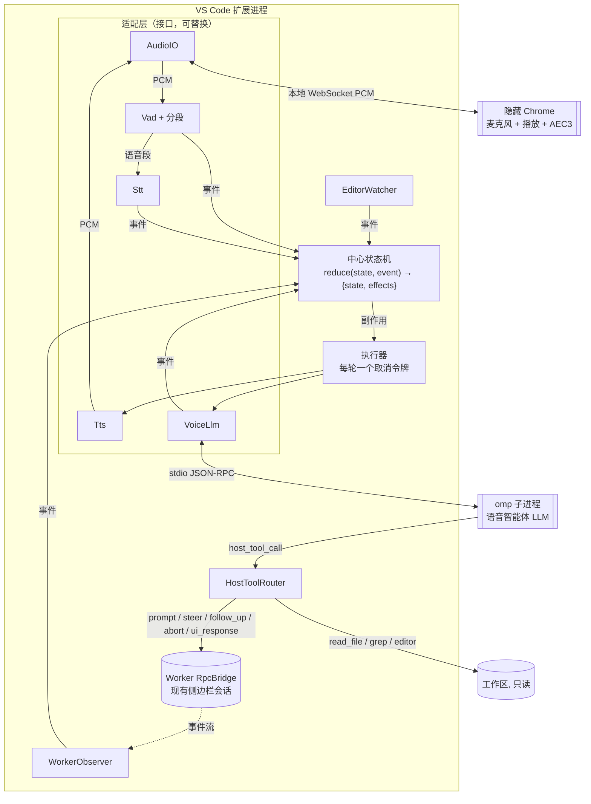
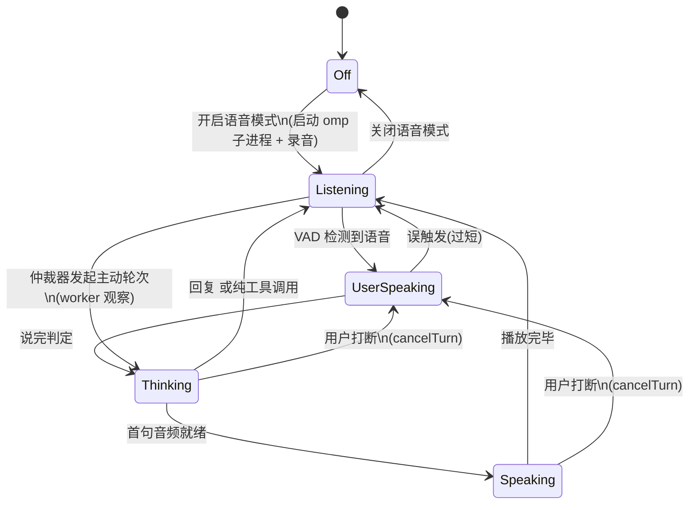

# 语音结对智能体（Voice Agent）设计文档

状态：草案 · 仅设计，未实现

## 1. 目标

在 VS Code 扩展中提供一个**实时语音聊天机器人**。它和用户持续对话，同时指挥 omp/pi 干活。

两个智能体，职责严格分开：

| | 语音智能体（Voice Agent） | 工作智能体（Worker） |
|---|---|---|
| 身份 | 坐在旁边的搭档，"看着 omp 干活并和你聊" | 真正写代码的 omp/pi 会话（即现有侧边栏会话） |
| 上下文 | 独立：与用户的对话 + 注入的观察（worker 进展、编辑器状态） | 自己的编程上下文，不感知语音 |
| 能力 | 理解意图、给 worker 派指令/纠偏/叫停、播报进展、完成后总结、就当前代码和文档讨论 | 读写代码、运行命令 |
| 写代码 | **不写**，只读 | 写 |
| 发声 | 是 | 否 |

### 1.1 功能

1. 语音闲聊与讨论，可随时打断机器人（barge-in）。
2. 理解意图后给 worker 派任务；干活途中可插话纠偏、排队追加、叫停。
3. worker 干活时，简要说明它正在做什么；不刷屏，不念代码。
4. worker 完成时做一次总结：做了什么、改了哪些文件、测试结果、遗留问题。
5. worker 需要确认/选择/输入时，由语音智能体转述并收集用户回答。
6. 结对编程：基于用户当前打开的文件、选区、可见范围讨论代码和文档，需要时自行读取文件。

### 1.2 非目标（首版）

- worker 不直接发声。
- 语音智能体不直接修改文件，所有写操作都经 worker 执行。
- 不做远程通话（WebRTC/电话）；只支持本机麦克风和扬声器。
- 首版不做回声消除（AEC），见 §12。

## 2. 已验证事实

本节只记录实测结果（2026-09-24，omp v18.2.11，本机）。

### 2.1 用第二个 omp RPC 进程充当语音智能体：可行

启动命令：

```
omp --mode rpc --no-tools --no-skills --no-rules --no-extensions --no-lsp \
    --no-session --no-title --thinking off --system-prompt "<语音智能体提示词>"
```

然后发送 `set_host_tools`，注册宿主侧工具 `dispatch_task`，并将 `loadMode` 设为 `essential`。

| 测量项 | 结果 |
|---|---|
| 进程启动 → `ready` 帧 | 0.28 s |
| `set_host_tools` | 成功，响应 `toolNames: ["dispatch_task"]` |
| 默认模型（`get_state`） | `anthropic/claude-opus-5-5`，即 omp 当前默认模型 |
| 纯闲聊一轮 | 首个 text_delta 0.7 s，整轮 1.78 s |
| 派活一轮（"让它把 README 版本号改成 0.3.0"） | 2.82 s 发出 `host_tool_call`；回传结果后，4.05 s 出首句 |

模型自主把口语改写成了结构化的 worker 指令，包括范围约束和自检步骤。

结论如下：

- 语音智能体的 LLM **直接复用 omp 的登录凭据、provider 和模型体系**，扩展不需要自己实现 LLM 客户端。
- `--no-tools` 不影响 host tools 的注册与调用。
- 流式文本来自 `message_update.assistantMessageEvent.text_delta`，一轮结束以 `agent_end` 为准。
- host tools 属于 omp 的 RPC 扩展，pi 的 RPC 没有（见 omp `rpc.md`「Pi-family adapter」一节）。因此**语音智能体进程始终用 omp**；worker 可以是 omp，也可以是 pi。

### 2.2 `omp say`：不能直接作为中文实时 TTS

| 测量项 | 结果 |
|---|---|
| 引擎 | 本地 Kokoro（首次运行下载 `model_quantized.onnx`） |
| 可用音色 | `tts.localVoice` 枚举：af_heart / af_bella / af_nicole / af_aoede / af_kore / af_sarah / am_michael / am_fenrir / am_puck / bf_emma / bm_george / bm_fable，**全部是英文音色** |
| 中文音色 `zf_xiaobei` | 拒绝，退出码 1 |
| 输出 | 24 kHz / 16 bit / 单声道 WAV，整段生成完才返回，不能流式输出 |
| 耗时（模型已缓存） | 7.21 s 生成 15.7 s 音频，含每次启动进程和加载模型的开销 |

结论：`omp say` 作为**可选 TTS 后端**保留，适合英文场景或零配置试用。中文实时对话默认应走可配置的 OpenAI 兼容 TTS 服务。另外，omp 配置里有 `modelRoles.speech`（当前值为 `deepinfra/hexgrad/Kokoro-82M`），说明 omp 自身也有云端 TTS 角色；它能否被外部调用尚未验证，见 §13。

## 3. 总体架构



**关键点**：

- worker 就是现有侧边栏里的那个会话。用户在聊天面板里看到的内容和语音驱动的内容是同一个会话，两种操作方式可以混用。
- 语音智能体是一个隐藏的 omp 子进程，不写会话文件（`--no-session`），生命周期与"语音模式"开关绑定。
- 麦克风和播放在扩展启动的**隐藏 Chrome** 里：webview 开不了麦克风，而且回声消除要靠 Chrome 的 AEC3，它必须同时掌握播放和录音。Chrome 通过本地 WebSocket 和扩展进程交换 PCM；VAD、STT、LLM、TTS 和所有决策都在扩展进程里。依据见[原型文档](voice-loop-prototype.md) §3、§8。

## 4. 运行模型：接口 + 中心状态机 + 取消令牌

**决定（2026-09-24，原型验证后）：不实现 Pipecat 式的帧流水线（Frame / FrameProcessor / Pipeline）。** 原型已按本节结构实现（`src/voice/prototype-voice-loop/`）。

### 4.1 为什么不用帧

| Pipecat 需要帧的原因 | 我们的情况 |
|---|---|
| 通用框架：上百种 STT/TTS/LLM 服务、十几种传输方式，用户可以随意拼装处理器，所以需要统一的"货币"在环节之间流动 | 具体应用：环节固定（音频、VAD、STT、LLM、TTS），拓扑不变。可替换的只有 TTS 后端和音频方式，用接口就够 |
| 决策分散在各处理器里，跨环节的规则靠帧上下传递 | 复杂度集中在**决策**：谁该说话、插嘴真假、念到哪句、worker 播报。集中在一个状态机里更容易写对、测对 |
| 打断必须穿过任意处理器，所以需要 `InterruptionFrame` | 这是帧唯一真正有价值的能力，用**每轮一个取消令牌**就能获得（§4.4） |

引入帧的代价：队列、帧类型、方向、优先级这一整层框架；所有逻辑都要拆成"帧从 A 传到 B"，排序竞态也更难排查。

**以后遇到下面的情况再考虑帧**：
- 音频路径需要可配置地串接任意处理（降噪 → 说话人分离 → 情绪分析……）；
- 需要同时处理多路音频流（多人会议）；
- 想直接复用 Pipecat 的服务实现。

### 4.2 接口（适配层）

| 接口 | 职责 | 实现 |
|---|---|---|
| `AudioIO` | 送出 16 kHz 麦克风 PCM；按顺序播放 PCM；`flush()` 丢弃所有排队的音频 | 隐藏 Chrome（默认）/ 浏览器标签页（找不到 Chrome 时）/ pulse（对照组） |
| `Vad` + 分段 | 每帧打分，产生 speechStart 和整段 PCM | `SileroVad` + `SpeechSegmenter`（正式代码） |
| `Stt` | `transcribe(pcm) → text` | `SttClient`（OpenAI 兼容） |
| `Tts` | `synthesize(text, signal) → PCM` | OpenAI 兼容 `/audio/speech` / `omp say` |
| `VoiceLlm` | `prompt(message, signal)`，产生 `llmText`、`llmEnd` 事件（P1 起还有 `host_tool_call`） | omp RPC 子进程 |

### 4.3 中心状态机

纯函数 `reduce(state, event) → { state, effects }`，不做任何 I/O；原型对应 `conversation.ts`。它做全部决策：话语权、什么时候发 prompt、打断、`<interrupted>` 补偿、切句。P1 的 FloorArbiter、观察队列和工具状态也放进这个状态机，或者作为它组合进来的子状态机，不另开决策点。

| 事件（输入） | 来源 |
|---|---|
| `userSpeechStart` / `userSpeechEnd` | VAD 分段（机器人说话时，要先经过插嘴确认） |
| `transcript` | STT |
| `llmText` / `llmEnd` | VoiceLlm |
| `sentencePlaying` / `sentencePlayed` / `audioIdle` | 执行器（播放进度） |
| `shutUp` / `toggleMute` / `toggleHalfDuplex` | 界面、快捷键 |
| P1：`workerEvent`、`hostToolCall`、`tabSwitched`；P2：`editorChanged` | WorkerObserver、HostToolRouter、EditorWatcher |

| 副作用（输出） | 执行 |
|---|---|
| `prompt { turnId, message }` | 新建本轮的取消令牌，调用 `VoiceLlm.prompt` |
| `speak { turnId, text }` | 在本轮令牌下合成并排队播放 |
| `cancelTurn { turnId }` | 中止本轮令牌 |
| P1：`hostToolResult`、`workerCommand` | HostToolRouter / Worker RpcBridge |

### 4.4 取消令牌（替代 `InterruptionFrame`）

每一轮机器人回复对应一个 `AbortController`，由执行器在处理 `prompt` 副作用时创建。这一轮的所有异步工作都订阅它的 signal：

| 订阅者 | abort 时 |
|---|---|
| VoiceLlm | 若 omp 仍在生成这一轮，发 RPC `abort`；丢弃之后到达的 `text_delta` |
| Tts | 在途的合成请求随 `fetch` / 子进程一起取消 |
| 播放队列 | 清空排队的句子；AudioIO `flush()`；清除播放进度计时器 |

**约定**：abort 之后，这一轮不再向状态机投递任何事件，**唯一的例外是 `llmEnd`**。`llmEnd` 只表示"LLM 空闲了，可以发下一条 prompt"，因为 omp 一次只处理一条 prompt。因此状态机不需要判断事件是否过时。

原型实测：打断时由 `cancelTurn` 一处完成全部停止；扬声器录音显示输出 0.3 s 内静音，被取消那一轮之后没有任何播放事件（[原型文档](voice-loop-prototype.md) §5）。它替换了原型早期分散的四处处理：播放器代次计数、`discarding` 标记、按 `turnId` 丢弃事件、单独的页面 flush。

### 4.5 与 Pipecat 概念的对照

| Pipecat | 本项目 |
|---|---|
| `Frame` / `FrameProcessor` / `Pipeline` | 接口 + 事件 / 副作用 + 中心状态机 |
| `InterruptionFrame` | `cancelTurn` → 本轮 `AbortController.abort()` |
| `UserStarted/StoppedSpeakingFrame` | 事件 `userSpeechStart` / `userSpeechEnd` |
| `TranscriptionFrame`、`LLMTextFrame` | 事件 `transcript`、`llmText` |
| `BotStarted/StoppedSpeakingFrame`（向上游） | 事件 `sentencePlaying` / `audioIdle` |
| `PipelineTask.queue_frames()`（外部注入） | 直接 `dispatch(event)` |
| 用户轮次控制器、开始/结束/静音策略 | 状态机里的规则 |
| VAD Analyzer / Smart Turn | `SileroVad`（每 5 s 重置状态，与 pipecat 一致）+ `SpeechSegmenter`；Smart Turn v3 作为后续增强 |

## 5. 组件设计

### 5.1 AudioIO（麦克风 + 播放）

- 默认：扩展找到本机的 Chrome、Edge、Chromium 或 Brave，以无界面方式启动，加载本地音频页面。页面负责 `getUserMedia`（开启回声消除、降噪、自动增益）和 WebAudio 播放，通过本地 WebSocket 与扩展交换 PCM。协议和启动参数见[原型文档](voice-loop-prototype.md) §3.2。
- 找不到 Chrome 时，用 `vscode.env.openExternal` 打开同一页面，并提示用户保持标签页打开。
- 听写功能仍用 `dictation.ts` 的命令行录音。进入语音模式时停用听写按钮，避免两边同时占用麦克风。

### 5.2 VAD 与说完判定（TurnDetector）

- 复用 `SileroVad` 和 `SpeechSegmenter`。
- 听写的结束阈值 `vadStopSecs=0.8` 对讨论场景来说太短。语音模式使用独立配置 `turnStopSecs`，默认 1.2 s（待调）。
- `userSpeechStart` 需要**持续约 200 ms 的语音**才触发，避免咳嗽、键盘声造成误打断。机器人说话时还要经过插嘴确认（STT + 回声比对，见[原型文档](voice-loop-prototype.md) §4.3）。
- 增强（P3）：接入 Smart Turn v3 做语义层面的说完判定。

### 5.3 Stt

- 复用 `SttClient`（OpenAI 兼容 `/audio/transcriptions`），配置沿用 `oh-my-pi-chater.voice.sttUrl/sttModel/language`。
- 同一轮里的多个语音片段按顺序拼接；用户在 `turnStopSecs` 之内继续说话时，合并为同一轮。

### 5.4 VoiceLlm（omp 子进程）

**启动**：使用 §2.1 的命令行，额外参数如下：

- `--model <provider/id>`：配置 `voiceAgent.model` 为空时，**跟随 worker 当前模型**：启动前对 worker 执行 `getState()`，取 `model.provider/model.id`。
- `--thinking <level>`：配置项，默认 `off`，语音场景对延迟敏感。
- `--cwd <workspace>`：与 worker 保持一致。
- `--tools read,grep,glob`：替代 §2.1 的 `--no-tools`，开放 omp 自带的**只读**工具（工具名见 omp `sdk.md`），代码库读取不需要扩展自己实现。与 host tools 同时启用的情况尚未实测。
- `--system-prompt`：内容见 §8。

**跟随 worker 模型**：

- 仅在语音模式启动时读取一次。
- worker 中途换模型时，**不自动跟随**，避免对话中途改变语气和能力；用户可以通过命令"语音智能体：同步 worker 模型"手动同步，底层发 `set_model`。
- 配置了固定模型时，始终使用该模型。

**一轮对话**：

1. 发送 `prompt`，内容为用户话语，外加编辑器快照和未消费的观察，格式见 §7.2。
2. 把 `text_delta` 作为 `llmText` 事件投递给状态机。
3. 收到 `host_tool_call` 时交给 HostToolRouter，由它回传 `host_tool_result`。
4. 收到 `agent_end` 时投递 `llmEnd`。

**打断**：本轮取消令牌被中止时发送 `abort`，丢弃之后到达的文字（§4.4）。

**被打断后的上下文补偿**：omp 会话里保存的是**生成的全文**，而用户实际只听到一部分。下一轮 prompt 开头附上：

```
<interrupted>你上一条回复只念到："……"，之后被用户打断，未念出的部分用户没有听到。</interrupted>
```

已念出的文字来自播放进度事件 `sentencePlayed`，精度到句子。

**进程健康**：子进程退出时，如果语音模式仍处于开启状态，自动重启一次；再次失败则退出语音模式，并在 UI 上报错。

### 5.5 切句

- 把流式文本切成适合 TTS 的片段，切分点为中英文句末标点 `。！？!?.;；\n`。
- 首句优先：第一个片段只要遇到逗号且长度达到约 8 个字就可以送出，以压低首句延迟。
- 过滤不适合朗读的内容：代码块、URL、Markdown 符号。提示词要求模型不输出这类内容，这里是兜底。

### 5.6 Tts（可配置）

统一接口：

```
synthesize(text, signal) → AsyncIterable<{ pcm: Int16Array, sampleRate }>
```

| 后端 | 配置 | 流式 | 说明 |
|---|---|---|---|
| `openai`（默认） | `ttsUrl`、`ttsModel`、`ttsVoice` | 取决于服务端；支持 `response_format: pcm` 时按块读取 | OpenAI 兼容 `/audio/speech`，适配 OpenAI、本地 Kokoro-FastAPI / CosyVoice / speaches 等服务 |
| `omp` | `ttsVoice`（omp 音色） | 否 | 调用 `omp say <text> --voice <v> -o <tmp.wav>`，再读取 WAV。仅适合英文，每句都要付出启动进程和加载模型的开销（§2.2） |

- 句子之间流水线化：第 N 句播放时，并行合成第 N+1 句，最多提前合成 2 句。
- 设置页的 STT 标签页扩展出 TTS 区块，提供"连通性测试"和"试听"两个功能，仿照现有 `testSttConnectivity`。

### 5.7 播放与播放进度

- 每句合成完成后按顺序交给 AudioIO 播放，采样率以每句返回的实际值为准。
- 打断：由本轮取消令牌统一停止（§4.4）。已完整播放的句子记在状态机里，用于 `<interrupted>` 补偿。
- 播放进度目前是估算的：写出时刻加 80 ms 延迟，以句为单位。改进方向：由浏览器页面回报每句实际的开始和结束时间（[原型文档](voice-loop-prototype.md) §10）。

### 5.8 WorkerObserver

订阅 worker `RpcBridge` 的事件流（与侧边栏同源），维护两样东西：

1. **工作日志（digest）**：把原始事件压缩成人类可读的条目，只保留最近 N 条。

   ```
   [12:03:10] 开始任务：把 README 版本号改为 0.3.0
   [12:03:12] 读取 README.md
   [12:03:18] 编辑 README.md
   [12:03:25] 运行 grep "0.2.40" README.md → 无匹配
   [12:03:30] 完成（本轮 20 s，修改 1 个文件）
   ```

2. **观察事件**：按类别产生 `observation` 事件，投递给中心状态机。

| 类别 | 触发 | 优先级 | 默认处理 |
|---|---|---|---|
| `needs_input` | worker 发出 `extension_ui_request`（select / confirm / input / editor） | 高 | 尽快转述并询问用户 |
| `error` | 工具失败累计、轮次异常结束、进程退出 | 高 | 尽快说明 |
| `done` | worker `agent_end` | 中 | 生成完成总结 |
| `progress` | 阶段变化（开始编辑、开始运行测试、切换文件组），或距上次播报 ≥ `narrationIntervalSecs` | 低 | 节流，过期即丢 |

- `done` 总结的输入：本轮 digest、worker 最终 assistant 文本（截断）、修改文件列表和行数统计（来自工具事件）。
- worker 由用户在聊天面板直接触发时，同样会被观察和播报。可以配置为"只播报语音派发的任务"。

### 5.9 FloorArbiter（话语权仲裁）

这是整个体验的核心，Pipecat 没有现成实现。它是中心状态机（§4.3）的一部分，不是独立的处理器。

**状态**：`userSpeaking`、`botSpeaking`、`llmBusy`、待发言的观察队列。

**规则**：

1. **用户优先**：`userSpeechStart` 到达时，如果 bot 正在说话或 LLM 正在生成，立即 `cancelTurn`（§4.4）。
2. 用户说话期间，观察只入队，不触发 LLM。
3. 一轮用户话语结束时，把未消费的观察合并进这一轮 prompt（§7.2），由模型自己决定是否顺带提及。
4. 空闲时（用户没在说，bot 没在说，LLM 空闲），从队列里取优先级最高的观察，发一个**主动轮次** prompt：

   ```
   <worker-update priority="done">…digest…</worker-update>
   按需用一两句话告诉用户；如果不值得说，只回复 <silent/>。
   ```

   `<silent/>` 回复不送 TTS。
5. **过期丢弃**：`progress` 类观察在队列里等待超过 `narrationIntervalSecs` 就丢弃，只保留最新一条。
6. **防连播**：两次主动播报之间至少间隔 `minProactiveGapSecs`，默认 8 s。`needs_input` 和 `error` 不受此限制。

### 5.10 EditorWatcher

- 监听 `window.activeTextEditor`、选区和可见范围的变化，维护当前快照：文件相对路径、可见行范围、选区（带文本，截断）、语言。
- 复用 `src/shared/editorContext.ts` 的片段格式。
- 每个用户轮次附带**当前快照**。快照没变化时，只附一个"同上"标记，节省 token。
- 语音模式下不附带文件全文，模型需要时自己调用 `read`，见 §7.4。

### 5.11 HostToolRouter

负责分发 `host_tool_call`，执行后回传 `host_tool_result`；收到 `host_tool_cancel` 时中止执行。工具清单见 §6。

### 5.12 多会话：跟随当前 tab

侧边栏可以同时开多个会话（每个 tab 一个独立的 omp/pi 进程）。语音侧的规则：**语音智能体只有一个，控制对象始终是当前 tab**。

**为什么只有一个语音智能体**：只有一个麦克风、一个扬声器和一个用户。每个 tab 各配一个语音智能体会抢话，还会让语音对话在切换时断开。

**为什么跟随 tab，而不让模型按名字路由**：用户在界面上能直接看到语音控制的是哪个会话；工具不需要 `worker` 参数，模型也不用解析“二号”“那个做 TTS 的”之类的指代，避免 STT 错字把指令派到错误的会话。

**规则**：

1. **目标在用户开口时绑定**：`userSpeechStart` 到达时记录当前 tab id，该轮的所有工具调用都作用于这个 tab，即使用户说话途中点了别的 tab。主动轮次绑定到产生观察的那个 tab。
2. **切换 tab 要告诉模型**：绑定目标与上一轮不同时，本轮 prompt 开头注入
   ```
   <worker-switch>当前对象换成「TTS 设计」（omp，空闲）。之前说的“它”指的是上一个会话。</worker-switch>
   ```
   同时附上新会话的 digest。
3. **语音也能切换 tab**：新增工具 `switch_worker`（见 §6）。用户说“切到 TTS 那个”时，模型调用它，扩展执行与点击 tab 相同的切换。这样仍然保持“目标 = 当前 tab”这一个规则，只是切换可以通过语音触发。
4. **每个 tab 各有一个 WorkerObserver**，各自维护 digest；`observation` 事件带上 `tabId`。FloorArbiter 的队列是全局的，`minProactiveGapSecs` 也是全局的，不按 tab 分别计算。
5. **后台 tab 的播报**（后台 tab 指不是当前 tab 的会话）：

   | 类别 | 当前 tab | 后台 tab |
   |---|---|---|
   | `needs_input` | 转述并询问 | 一句话提醒，并说明时限：“「TTS 设计」在等你确认，要切过去吗？”，**不自动切换** |
   | `error` | 说明 | 一句话提醒 |
   | `done` | 完成总结 | 一句话：“「TTS 设计」做完了”；用户切过去后再给总结 |
   | `progress` | 按 `narration` 设置 | 不播报 |

   不自动切换 tab，因为用户可能正在别的 tab 里打字或阅读。`answer_worker` 只能回答当前 tab 的请求；要回答后台 tab，先切过去。多个 `needs_input` 同时等待时，按超时时间先后提醒。
6. **tab 生命周期**：
   - 新开 tab：不播报，下一轮切换过去时按规则 2 处理。
   - 关闭 tab：丢弃该 tab 在队列里的观察；针对它的在途工具调用返回“会话已关闭”。
   - TUI 模式：待验证 TUI 模式下 RPC 会话是否仍能接收 `prompt`/`steer`；不能则语音模式只保留闲聊，工具返回“当前 tab 在 TUI 模式，无法语音控制”。
7. **`steer` 必须检查 worker 状态**：worker 空闲时，omp 会把排队的 steer 当作新一轮自动执行（见 2026-09-24 侧边栏 steer 调试：omp 18.2.11 不发 `queue_update`，未消费的 steer 在本轮结束后仍会触发模型调用）。因此 `steer` 工具在目标空闲时直接报错，提示改用 `dispatch_task`。
8. **语音模型跟随**：§5.4 的“跟随 worker 模型”指开启语音模式时**当前 tab** 的模型；之后切换 tab 不改变语音模型。

## 6. 语音智能体工具（host tools）

所有工具都设为 `loadMode: 'essential'`，避免被归类为 discoverable，导致模型看不到。

| 工具 | 参数 | 行为 | 返回给模型 |
|---|---|---|---|
| `dispatch_task` | `instruction` | 当前 tab 的 worker 空闲时发 `prompt`；忙时报错，提示改用 `steer` 或 `queue_followup` | "已派发" + 任务 id |
| `steer` | `message` | 当前 tab 的 worker 正在工作时发 `steer`，在当前任务中途插话纠偏；空闲时报错（§5.12 规则 7） | "已送达" |
| `queue_followup` | `message` | worker `followUp`，排在当前任务之后 | "已排队" |
| `abort_worker` | — | worker `abort` | "已叫停" |
| `worker_status` | — | worker `getState` + 当前 digest | 状态摘要文本 |
| `answer_worker` | `requestId`、`value` | 回复 worker 的 `extension_ui_request` | "已回复" |
| `read` / `grep` / `glob` | — | omp 内置只读工具（§5.4），不经过 HostToolRouter | 文件内容 / 匹配 / 路径 |
| `worker_transcript` | `turn?`（默认最近一轮）、`detail?: 'summary' \| 'full'` | 通过 worker RPC `get_entries` 取某一轮的用户指令、工具调用和最终回复，按 `detail` 截断 | 该轮记录 |
| `worker_diff` | `path?` | 工作区的 `git diff --stat`；指定 `path` 时返回该文件 diff（截断） | diff 文本 |
| `diagnostics` | `path?` | VS Code `languages.getDiagnostics`，默认取当前文件 | 错误/警告列表 |
| `switch_worker` | `target`（tab 标题或序号） | 切换侧边栏当前 tab，与用户点击 tab 等价；返回可选列表时附带每个 tab 的状态（空闲 / 工作中 / 等待确认 / 出错） | 切换后的会话名和状态 |

**派活确认策略**（配置 `confirmBeforeDispatch`，默认 `true`）：

- `true`：提示词要求模型先口头复述计划，得到用户肯定后才调用 `dispatch_task`。工具层同时做校验：本轮用户话语里必须出现肯定表达，或者由模型显式声明用户已经确认；否则返回错误，让模型先去确认。
- `false`：用户表达意图后，模型直接派发。
- `steer`、`abort_worker`、`queue_followup` 不需要确认，因为它们本身就是用户的即时指令。
- `answer_worker` **始终需要**用户的明确回答，不允许模型替用户做决定。

## 7. 输入、上下文与控制循环

### 7.1 输入分层

语音智能体的输入**不只是转写文本**。按"什么时候进入、以什么方式进入"分为五层：

| 层 | 内容 | 何时进入 | 方式 | 体量 |
|---|---|---|---|---|
| L0 身份与规则 | 角色、分工、朗读风格、确认策略 | 启动 | `--system-prompt`（§8） | 固定；保持不变，以利用 prompt 缓存 |
| L1 项目卡片 | 工作区名和根路径、git 分支、主要语言/框架、`AGENT.md` / README 开头若干行 | 启动 | 首条引导消息（§7.5） | ≤ 约 1.5k token |
| L2 worker 简报 | 当前 tab 的后端、模型、状态、todo，最近 K 轮的"用户指令 + worker 最终回复摘要" | 启动、切换 tab | 引导消息 / `<worker-switch>` | ≤ 约 2k token |
| L3 每轮附件 | ① 用户转写文本（必有）② 编辑器快照（有变化才发）③ 未消费的 worker 观察 ④ `<interrupted>` ⑤ 待回答的 worker 请求 | 每个轮次 | user message（§7.3） | 通常 < 1k token |
| L4 按需拉取 | 文件内容、代码搜索、worker 某一轮的完整记录、git diff、诊断 | 模型自己决定 | 工具（§6） | 按需，工具侧截断 |

原则：**推送结论，按需拉取细节**。L0–L3 由扩展推送，保证语音智能体"知道现在发生了什么"；L4 由模型自己拉取，保证"想看细节时看得到"。

### 7.2 omp 的上下文要不要全部给它：不给

| 原因 | 说明 |
|---|---|
| 延迟 | 首 token 延迟随输入长度增长。worker 上下文动辄数万 token，每轮对话都背着它，语音就不"实时"了 |
| 成本 | 语音轮次多且短，每轮都重复带上 worker 上下文，费用随对话轮数成倍增长 |
| 角色污染 | 大量工具调用和代码 diff 会诱导它"像 worker 一样思考"：念代码、陷入细节、想自己动手 |
| 播报需要的是结论 | 用户要听的是"改了什么、结果如何、卡在哪"，不是逐条工具输出 |
| 同步复杂 | worker 会压缩上下文、分支、切换 tab，全量镜像需要持续对齐 |

替代方案：

- **进展**：WorkerObserver 的 digest（§5.8），按轮次推送。
- **结论**：worker 每轮结束时的最终回复（截断）随 `done` 观察推送。
- **细节**：`worker_transcript` 按需拉取某一轮，`worker_diff` 看改动。

这样语音智能体对 worker 的了解，相当于"一个在旁边看屏幕的人"：知道它在干嘛、干完得出什么结论，想细看时可以翻记录。

### 7.3 用户轮次 prompt 格式

```
<editor file="src/voice/stt.ts" visible="120-180" selection="133-150" lang="typescript">
…选区文本（截断）…
</editor>
<worker-updates tab="TTS 设计">
[12:03:25] 运行 npm test → 2 失败
</worker-updates>
<worker-request id="ui_7" method="confirm" timeout="60s">是否覆盖 package-lock.json？</worker-request>
<interrupted>…（仅在上一轮被打断时出现）…</interrupted>
<user source="stt">这个 SttClient 为什么要自己拼 wav？</user>
```

- 各块只在有内容时出现。编辑器快照与上一轮相同时，只写 `<editor unchanged/>`。
- `source="stt"` 提醒模型：这是语音转写，可能有错别字和同音词，要宽容理解，拿不准时追问。面板上用键盘输入的文字标为 `source="text"`（§11）。
- 附件都放在 user message 里，系统提示词保持不变，以最大化 prompt 缓存命中。

### 7.4 代码库：不预先塞入，按需读取

- **不预先塞入**代码库内容，也不做向量索引。L1 项目卡片只提供"这是什么项目"的轮廓。
- 讨论代码时，主要线索是编辑器快照（用户正在看什么），其余由模型用 `read` / `grep` / `glob` 自己去找。
- **轻量问题自己查**："这个函数谁在调用""这个配置在哪"，一两次工具调用就能回答。
- **重型调研交给 worker**："把整个鉴权流程讲一遍"需要读十几个文件。语音智能体应当先问用户："这个要多看一些文件，我让它去调研一下？"得到同意后，用 `dispatch_task` 派一个**只读调研任务**，要求 worker 输出结论报告；完成后由语音智能体口头总结。代价是会占用 worker 并写入它的上下文，所以需要用户同意。
- 限制：单个轮次内，内置读工具最多调用 `maxReadSteps` 次（默认 6）。超出时由扩展发 `steer`："先用已有信息回答用户"。

### 7.5 开启时的引导轮次

语音模式启动后，omp 子进程就绪，此时先发一条**静默引导消息**，内容为 L1 项目卡片和 L2 worker 简报，并要求模型只回复 `<silent/>`。这样用户第一句话就能直接接上当前的工作。

- 引导轮次与用户第一次开口并行进行；用户先开口时，引导内容并入第一轮的附件，不单独发送。
- 切换 tab 时不重新引导，只注入 `<worker-switch>` 和新 tab 的简报（§5.12）。

### 7.6 派活时的上下文交接

worker 看不到语音对话，所以 `dispatch_task` 的 `instruction` **必须自成一体**：

- 讨论得出的结论和取舍（"不用 A 方案，改用 B，因为……"）；
- 涉及的文件和行号；
- 约束（不要动哪些文件、保持哪些接口不变）；
- 验收方式（跑什么命令、期望什么结果）。

`dispatch_task` 增加可选参数 `includeEditorContext: boolean`。为 `true` 时，扩展用 `buildEditorContextFragment` 把当前选区附在指令后面，与聊天面板手动发送时的格式一致。

### 7.7 控制循环

循环分两层：

**内层：单个轮次内的 LLM ↔ 工具循环**，由 omp 子进程自己运行（omp 的 agent loop）。扩展只需要：

- 响应 `host_tool_call`；
- 统计工具调用次数，超出限制时发 `steer`（§7.4）；
- 首句超时兜底：轮次开始 `fillerAfterSecs`（默认 3 s）内还没有任何 `text_delta` 时，播放一个短提示音，让用户知道它在想，而不是没听见。

**外层：扩展里的事件驱动编排循环（VoiceOrchestrator）**。它是一个单一事件队列，不是定时轮询：

```
on event:
  UserStartedSpeaking   → if turn 运行中 or bot 在说话: interrupt()   # abort + 停止播放
  UserTurnEnd(text)     → startTurn(kind=user, attachments = 编辑器 + 全部未消费观察 + interrupted)
  WorkerEvent(e)        → observer[tab].ingest(e)，产生的观察 → arbiter.enqueue(obs)
  EditorChanged         → 只更新快照，不触发轮次
  TabSwitched           → 标记下一轮需要注入 <worker-switch>
  TurnEnded / BotStoppedSpeaking / Tick(1s) → maybeProactive()

maybeProactive():
  if 用户在说话 or 轮次运行中 or bot 在说话: return
  obs = arbiter.next()            # 按优先级取出；过期的 progress 丢弃；遵守 minProactiveGapSecs
  if obs: startTurn(kind=proactive, attachments = obs)
```

**轮次类型**：

| 类型 | 触发 | 允许 `<silent/>` | 可被打断 |
|---|---|---|---|
| `bootstrap` | 语音模式启动 | 必须 | 是（并入用户轮次） |
| `user` | 用户说完 | 否 | 是 |
| `proactive` | 仲裁器取出观察（needs_input / error / done / progress） | 是 | 是 |

**不变式**：

1. 同一时刻**最多一个**语音智能体轮次在运行。omp 子进程本身也是串行的，外层保证不在轮次运行中发送 `prompt`。
2. 用户开口的优先级最高：打断会取消当前轮次，丢弃待播放的音频。被打断轮次里已经发出的 host 工具调用**不撤销**，例如已经派出的任务照常执行，并记录在 `<interrupted>` 里告诉模型。
3. 轮次运行中到达的观察只入队，不 `steer` 进语音智能体，避免它话说到一半改口。
4. 用户轮次会带走队列里的全部观察；主动轮次一次只取一条（`needs_input` 例外：同一 tab 的多个请求合并成一条）。
5. `<silent/>` 的回复不送 TTS，但保留在 omp 上下文里，让模型知道自己"看过了"。
6. 关闭语音模式时：中止当前轮的取消令牌，关闭音频页面和隐藏 Chrome，关闭 omp 子进程的 stdin，保存对话记录（§11.4）。

## 8. 系统提示词要点

1. 身份：你是用户的语音结对搭档，旁边有一个程序员智能体（worker）负责动手。
2. 输出适合朗读：短句、口语；不输出代码块、Markdown、URL、长列表；数字和路径用口语化表达（"stt 点 ts"）。
3. 默认一到三句话，除非用户要求详细讲解。
4. 分工：需要改代码、跑命令时交给 worker；讨论、解释、评审自己来，需要时用 `read` / `grep` / `glob` 查看代码；重型调研先征得同意再交给 worker（§7.4）。
5. 派活：把用户意图改写成清楚、可验证的 worker 指令，包括范围和验收方式；按 §6 的确认策略执行。
6. 播报：收到 `<worker-update>` 时，只说用户关心的部分；不值得说就回复 `<silent/>`。
7. 被打断：遵循 `<interrupted>` 提示，不要假设用户听到了没念出的内容。
8. 调用工具前先说一句过渡语（"好，我让它去改"），以压低首句延迟（§2.1 显示，调用工具的轮次首句约 4 s）。

## 9. 会话状态机



## 10. 配置项（草案）

命名空间为 `oh-my-pi-chater.voiceAgent.*`。STT 继续沿用 `oh-my-pi-chater.voice.*`。

| 键 | 类型 | 默认 | 说明 |
|---|---|---|---|
| `model` | string | `""` | 空表示启动时跟随 worker 当前模型；也可填 `provider/id`（omp 支持模糊匹配） |
| `thinking` | enum | `off` | 语音智能体的思考等级 |
| `tts.provider` | `openai` \| `omp` | `openai` | TTS 后端 |
| `tts.url` | string | `""` | OpenAI 兼容 TTS 端点 |
| `tts.model` | string | `""` | 空表示使用服务端默认模型 |
| `tts.voice` | string | `""` | 音色 |
| `tts.speed` | number | `1.0` | 语速 |
| `turnStopSecs` | number | `1.2` | 静音多久判定用户说完 |
| `narration` | `off` \| `important` \| `all` | `important` | `important` 只播报 needs_input、error、done；`all` 同时播报 progress |
| `narrationIntervalSecs` | number | `30` | progress 播报的最小间隔 |
| `confirmBeforeDispatch` | boolean | `true` | 派活前口头确认 |
| `narrateUserTasks` | boolean | `true` | 用户在面板里直接发起的任务是否也播报 |
| `maxReadSteps` | number | `6` | 单个轮次内置读工具的调用上限（§7.4） |
| `fillerAfterSecs` | number | `3` | 轮次开始多久没有文字时播放提示音 |
| `panelAutoReveal` | boolean | `true` | 开启语音模式时自动显示语音面板（§11） |
| `historySessions` | number | `20` | 每个工作区保留的语音会话记录数 |

## 11. 语音面板

### 11.1 放在哪里：底部面板区

| 位置 | 优点 | 缺点 | 结论 |
|---|---|---|---|
| **底部面板区**（与终端、输出同一区域） | 横向宽，适合看对话流；与左侧 worker 聊天、中间代码同时可见；不挤占侧边栏 | 默认高度较矮 | **推荐** |
| 侧边栏第二个视图（堆在 worker 聊天下面） | 与 worker 靠在一起 | 侧边栏高度被两个对话流平分，两边都变挤 | 不选 |
| 编辑器标签页（WebviewPanel） | 空间最大 | 占用看代码的区域，与结对编程冲突 | 不选 |
| 右侧辅助侧边栏 | 宽屏上很合适：左边 worker、中间代码、右边语音 | 扩展能否直接把视图贡献到这里未验证 | 用户可以把面板视图拖过去，VS Code 会记住位置 |

实现要点：

- 在 `viewsContainers.panel` 新增容器（标题"语音"），其中放一个 webview 视图 `oh-my-pi-chater.voice`。
- 视图的 `when`：`oh-my-pi-chater.voiceAgentActive || oh-my-pi-chater.voiceAgentHasHistory`。没用过语音模式的用户看不到它；用过之后，关闭语音模式也能回看记录。
- 开启语音模式且 `panelAutoReveal` 为真时，自动显示面板，**不抢焦点**，避免打断用户正在编辑的文件。
- 状态栏常驻一个语音状态项（`$(mic)` 聆听中 / 思考中 / 说话中 / 已静音），点击即可打开面板。面板被收起时，这是唯一的状态提示。

### 11.2 面板内容

```
┌ 语音 ─────────────────────────────────────────────────────────────┐
│ ● 聆听中 ▁▃▅▃▁   模型 claude-opus-5-5 · TTS 本地   对象: [TTS 设计] │
│ [静音麦克风] [闭嘴] [按住说话] [结束语音]            [显示输入 ☐]   │
├───────────────────────────────────────────────────────────────────┤
│ worker「TTS 设计」 工作中 00:42 · todo 2/5 · 最近：运行 npm test   │
├───────────────────────────────────────────────────────────────────┤
│ 你   这个 SttClient 为什么要自己拼 wav？                    12:01  │
│ 助手 因为接口要的是文件上传，它把 PCM 包成 WAV……            12:01  │
│ 你   那让它改成直接传 PCM 吧                                12:02  │
│ 助手 好，我让它去改。   ⟶ 派发任务「把 SttClient 改为…」 ▸     12:02  │
│ 播报 它正在跑测试，有两个失败，我在盯着。                   12:03  │
│ 助手 改好了，改了两个文件…… ~~后面还有测试结果~~（被打断）    12:04  │
├───────────────────────────────────────────────────────────────────┤
│ [ 键盘输入给语音助手…                                     ] [发送] │
└───────────────────────────────────────────────────────────────────┘
```

- **状态条**：状态机状态（§9）、麦克风音量、语音模型、TTS 后端、当前控制对象（tab）。
- **worker 卡片**：当前 tab 的状态、耗时、todo 进度、最近一条 digest；点击会聚焦侧边栏对应的 tab。
- **对话流**：
  - 用户的话显示 STT 转写，同一轮合并为一条。
  - 助手的话**逐句高亮已念出的部分**；被打断时，未念出的部分以删除线显示。这正是模型上下文与用户实际听到内容的差别（§5.4）。
  - 工具调用显示为可展开的标签：派发内容、steer 内容、读取了哪些文件。
  - 主动播报标注为"播报"；`<silent/>` 轮次默认隐藏。
- **显示输入**开关：打开后，每轮上方展开实际发给语音智能体的附件（L3 的编辑器快照、观察、interrupted）。用于调试"它为什么这么说"。
- **键盘输入框**：环境嘈杂或不方便说话时，用打字代替说话。打字轮次同样走 VoiceOrchestrator，标记为 `source="text"`，回复照常朗读。

### 11.3 与侧边栏的关系

- 侧边栏输入区的"语音模式"开关保留，与听写按钮并列，开启后听写按钮置灰。面板只是语音模式的**观察窗和控制台**，关掉面板不会结束语音模式。
- worker 的聊天流里不混入语音对话。由语音派发的用户消息加一个小标记"🎙 来自语音"，让用户分清这条指令是谁发的。

### 11.4 对话记录的存储

- 面板显示的记录由扩展维护（`VoiceTranscriptStore`），不从 omp 子进程读取，因为子进程用的是 `--no-session`。
- 按工作区存入 `workspaceState`，保留最近 `historySessions` 次语音会话，每次记录都有条数上限。面板顶部可以切换查看过去的会话。
- **只读回看**：过去的会话不会恢复语音智能体的上下文。需要续聊时，可以把该会话的摘要作为引导内容注入新会话，这属于后续功能。
- 快捷键：一键开关语音模式；一键"闭嘴"；按住说话。

## 12. 延迟预算（估算，尚未整体实测）

| 环节 | 估计 | 依据 |
|---|---|---|
| 说完判定 | 1.2 s | `turnStopSecs` 默认值 |
| STT | 0.3–1 s | 取决于服务，未测 |
| LLM 首句 | 0.7 s（闲聊）/ ≤1 s（工具轮次，前提是提示词要求先说过渡语） | §2.1 实测 0.7 s；过渡语的效果未测 |
| TTS 首句 | 0.2–0.5 s | 取决于服务，未测 |
| **合计** | **约 2.5–3.5 s** | 讨论场景可接受；Smart Turn 可以把说完判定压到 0.3–0.5 s |

## 13. 风险与待决问题

| # | 问题 | 影响 | 当前决策 / 待办 |
|---|---|---|---|
| R1 | 回声：外放时麦克风收到 bot 自己的声音，导致误打断甚至自言自语 | 高 | **已解决**：隐藏 Chrome 的 AEC3，加上插嘴需 STT 确认 + 回声比对。原型实测外放不再被自己打断；PipeWire `echo-cancel` 效果明显更差，已放弃（[原型文档](voice-loop-prototype.md) §8 P1、P10）。"按住说话"半双工作为兜底保留 |
| R2 | `omp say` 没有中文音色、不能流式输出 | 中 | 默认使用 OpenAI 兼容 TTS；`omp say` 作为可选后端。待验证：omp 的 `modelRoles.speech`（云端 Kokoro）能否被外部复用 |
| R3 | 被打断后，omp 上下文里保留了未念出的文字 | 中 | 用 `<interrupted>` 补偿（§5.4） |
| R4 | 两个 omp 进程共享同一账号的额度 | 低–中 | 语音轮次短；可以配置更便宜的模型 |
| R5 | pi 用户没有 omp | 中 | 语音模式要求安装 omp；检测不到 omp 时给出明确提示 |
| R6 | STT 转写错误导致派错活 | 中 | 默认派活前确认（§6） |
| R7 | worker 触发的 `extension_ui_request` 有超时 | 中 | 转述时说明时限；超时后告知用户"已按默认处理" |
| R8 | 录音进程冲突（听写与语音模式） | 低 | 共享录音模块，互斥使用 |
| Q1 | omp 配置里的 `live.voice`（sol / arbor / …）是否对应一套现成的实时语音能力？ | — | 未调研；如果它可以通过 RPC 使用，可作为"端到端语音"路线的备选 |
| Q2 | 是否支持多个 worker（多个并行会话）？ | — | 已决定：语音智能体只有一个，控制对象跟随当前 tab，后台 tab 只做简短提醒，见 §5.12 |
| R9 | 多个 VS Code 窗口同时开启语音模式，会争用同一个麦克风并同时应答 | 中 | 用 `proper-lockfile`（已是依赖）在 globalStorage 放一把跨窗口锁；另一个窗口开启语音模式时，提示“接管”并让原窗口退出语音模式 |
| R10 | 语音智能体在单个轮次里用读工具查太久，用户干等 | 中 | `maxReadSteps` 上限 + 过渡语 + `fillerAfterSecs` 提示音（§7.4、§7.7） |
| R11 | 派出的指令缺少讨论中的关键结论，导致 worker 做偏 | 中 | 提示词要求指令自成一体（§7.6）；面板展示派发内容，用户可以随时看到并用语音纠正 |

## 14. 分阶段计划与验收

| 阶段 | 内容 | 验收 |
|---|---|---|
| **P0 语音对话底座** | 接口层（AudioIO/隐藏 Chrome、Vad、Stt、Tts、VoiceLlm）；中心状态机 + 执行器 + 每轮取消令牌（§4）；TTS（openai + omp 两种后端）；VoiceLlm 子进程（只闲聊，无工具）；打断与 `<interrupted>` 补偿；语音面板（状态条 + 对话流 + 记录存储）和状态栏项 | 外放（不戴耳机）可以连续多轮中文闲聊；插嘴后 bot 在约 1 s 内停下（原型按参数推算约 0.75 s）；被打断后下一轮不会接着"刚才没说完的话"；面板正确显示已念出和被打断的部分 |
| **P1 指挥 worker** | HostToolRouter；dispatch / steer / followUp / abort / status / answer / worker_transcript / worker_diff 工具；WorkerObserver；FloorArbiter；引导轮次；完成总结；派活确认；面板 worker 卡片 | 口头派一个任务，worker 在侧边栏执行；过程中听到关键进展；完成后听到总结；中途说"停"能叫停；worker 的确认框可以用语音回答 |
| **P2 结对编程** | EditorWatcher；omp 内置 read / grep / glob；diagnostics 工具；重型调研转交 worker；面板"显示输入"开关 | 选中一段代码问"这段在干嘛"，能正确讲解；能主动去读相关文件；大问题会先征求同意再派 worker 调研 |
| **P3 体验增强** | Smart Turn v3；浏览器回报实际播放进度；按住说话；延迟埋点与调优 | 端到端延迟有埋点数据；停顿思考时不会被抢话 |

## 15. 现有代码的复用与改动面（预估）

| 现有模块 | 用法 |
|---|---|
| `src/voice/dictation.ts` | 拆出录音器探测和分帧，成为共享模块 |
| `src/voice/sileroVad.ts`、`speechSegmenter.ts` | 直接复用 |
| `src/voice/stt.ts` | 直接复用；TTS 客户端仿照它新建 |
| `src/voice/voiceSettings.ts` | 扩展 TTS 和语音智能体配置 |
| `src/pi/piRpcBridge.ts` | worker 侧直接复用；语音智能体侧复用进程与 JSON 行协议部分，增加 host tool 处理 |
| `src/shared/editorContext.ts` | 复用片段格式 |
| `src/providers/sidebar.ts`、webview | 语音模式开关、状态和转写条带 |
| `package.json` | 新增 panel 视图容器、语音视图、状态栏项、`voiceAgent.*` 配置 |
| 新增 `src/providers/voice-panel.ts` + `src/webview/voicePanel.ts` | 语音面板（沿用现有 webview provider 模式） |
| `src/providers/settings-panel.ts`、`src/webview/settings.ts` | 设置页的语音标签页 |

新增目录：`src/voiceAgent/`，包含 io（AudioIO 与隐藏 Chrome）、conversation（中心状态机）、executor（取消令牌）、observer、tools。
