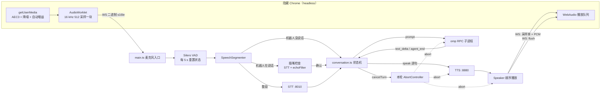
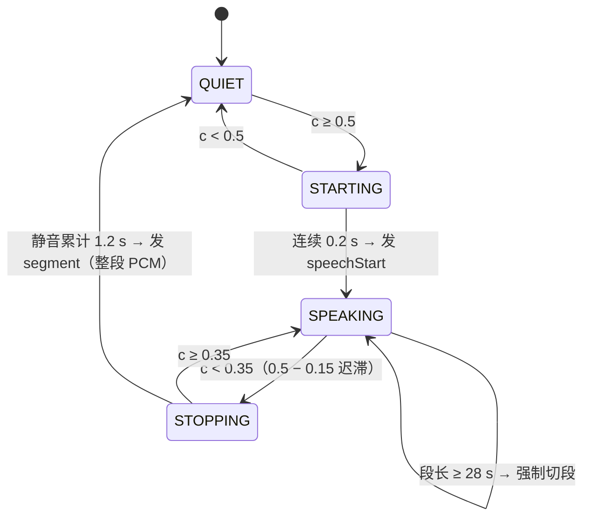
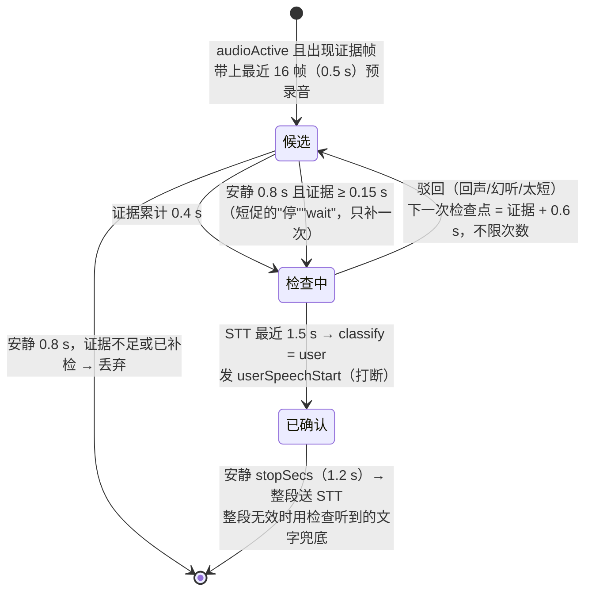
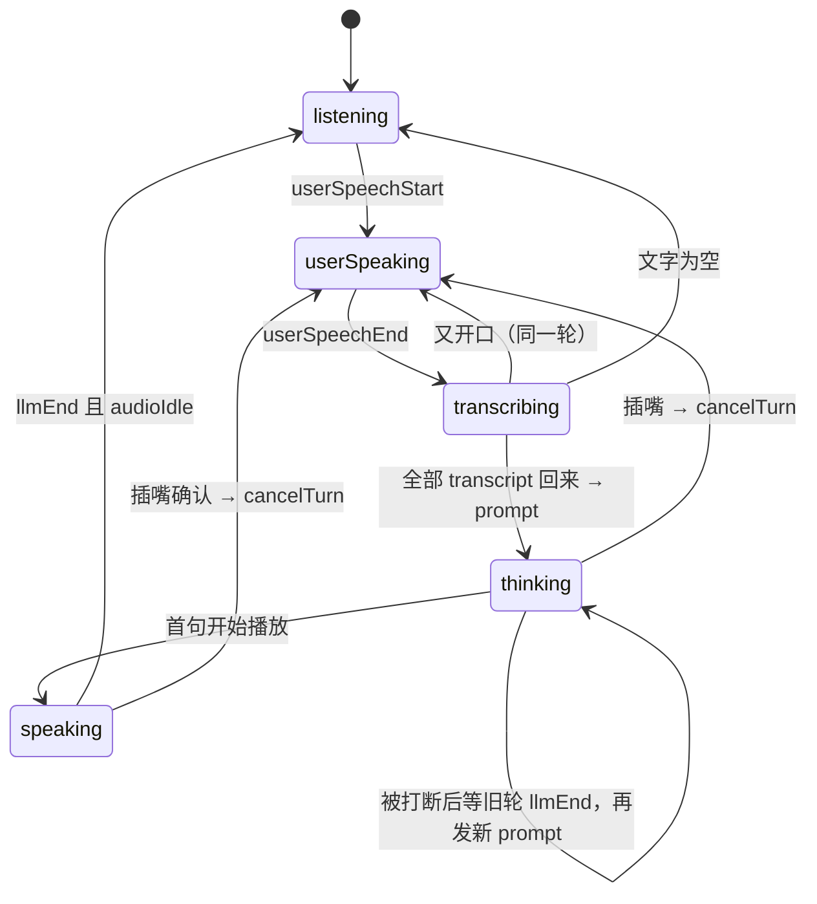
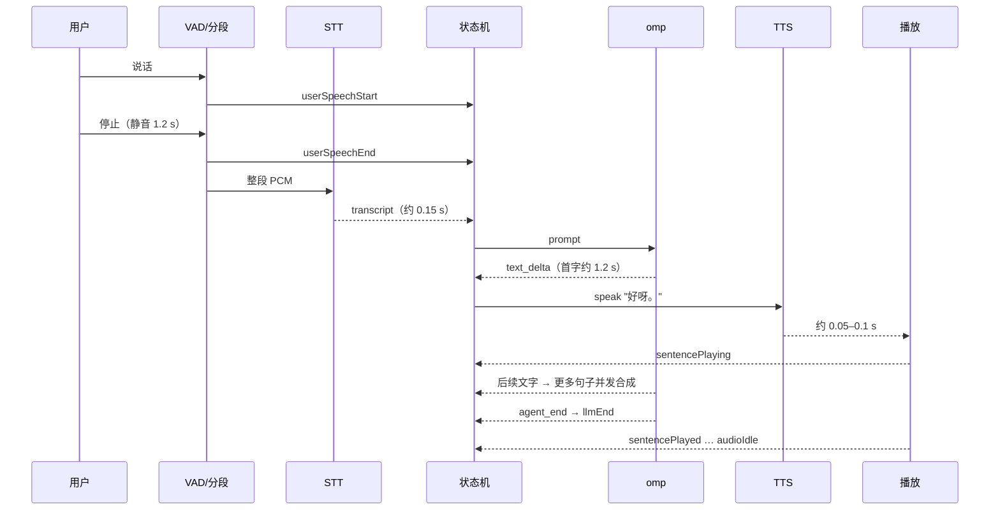
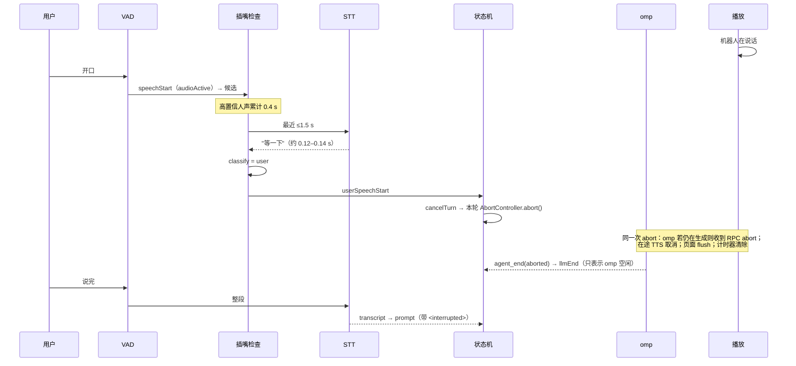

# 语音环路原型：算法、状态机、时序与问题记录

状态：原型（一次性代码），2026-09-24 · 代码：`src/voice/prototype-voice-loop/` · 运行：`npm run proto:voice`

总体设计见 [voice-agent-design.md](voice-agent-design.md)。本文只记录原型**实际实现并测过**的内容。

## 1. 目的与范围

原型要回答一个问题：**"麦克风 → VAD → STT → LLM → 逐句 TTS → 扬声器"这条全双工链路，加上随时插嘴，体验是否足够自然，能否作为语音智能体的底座？**

| 包含 | 不包含 |
|---|---|
| 实时语音对话、插嘴打断、被打断后的上下文补偿 | 控制 omp/pi worker、工具调用、编辑器上下文 |
| 回声消除（浏览器 AEC3 / PipeWire） | Smart Turn 语义说完判定 |
| 终端界面：状态、对话、分段耗时、日志 | VS Code 面板 |

## 2. 组成

| 文件 | 性质 | 内容 |
|---|---|---|
| `conversation.ts` | 纯逻辑，可复用 | 对话状态机 `reduce(state, event) → { state, effects }` |
| `sentences.ts` | 纯逻辑，可复用 | 流式文本切句、清理朗读内容 |
| `echoFilter.ts` | 纯逻辑，可复用 | 插嘴判定：回声比对、STT 幻听过滤 |
| `browserAudio.ts` | 外壳 | 本地 HTTP/WebSocket 服务、音频页面、隐藏 Chrome 的查找与启动 |
| `main.ts` | 外壳，用完即弃 | 设备接线、VAD 分段、插嘴检查、omp RPC、TTS、播放、终端界面 |
| `src/voice/sileroVad.ts`、`speechSegmenter.ts`、`stt.ts` | **正式代码**，原型复用 | Silero VAD、分段状态机、OpenAI 兼容 STT 客户端 |

外部服务（本机实测环境）：
- STT：speaches（docker `whisper-speaches`，`:8010`），模型 `faster-whisper-large-v3-turbo`。
- TTS：Kokoro-FastAPI（docker `echo-read-kokoro-gpu`，`:8880`），中文音色 `zf_xiaobei`。
- LLM：隐藏的 `omp --mode rpc` 子进程，不带任何工具，模型用 omp 当前默认模型。

### 2.1 架构：事件 + 中心状态机 + 取消令牌（不用帧流水线）

原型**没有**实现 Pipecat 那种帧流水线（Frame / FrameProcessor / Pipeline），而是分三层：

1. **接口 / 外壳**：麦克风、VAD、STT、omp、TTS、播放都只负责产生**事件**、执行**副作用**，不做决策。
2. **中心状态机**（`conversation.ts`）：纯函数 `reduce(state, event) → { state, effects }`，所有决策都在这里：什么时候发 prompt、打断、`<interrupted>` 补偿、切句。
3. **执行器 + 每轮一个取消令牌**（`main.ts` 的 `runEffect`）：处理 `prompt` 时为这一轮新建一个 `AbortController`；omp 生成、每句 TTS 请求、播放计时器、浏览器页面的播放队列都订阅它的 signal。`cancelTurn` 只做一件事：`abort()`。

**为什么不用帧**：
- Pipecat 是通用框架，要支持上百种服务、任意拼装处理器，所以需要帧作为统一的"货币"。我们的环节和拓扑都是固定的，可替换的部分用接口就够。
- 我们的复杂度在**决策**（谁该说话、插嘴真假、念到哪句），集中在一个纯函数里更容易写对、测对；分散到各处理器里靠帧传递反而难追踪。
- 帧唯一真正有价值的能力是 `InterruptionFrame` 的统一打断，取消令牌同样能做到。

**取消令牌的约定**：abort 之后，这一轮不再向状态机投递任何事件，唯一的例外是 `llmEnd`。`llmEnd` 只表示"omp 空闲了，可以发下一条 prompt"。所以状态机里不需要任何"这个事件是否过时"的判断。

它替换了原型早期分散在四处的打断处理，这四处任漏一处都会出 bug（见 §8 P11）：

| 早期机制 | 现在 |
|---|---|
| `Speaker.generation` 代次计数，过期的播放循环和计时器自行退出 | 播放计时器订阅本轮 signal，abort 时清除 |
| 状态机 `discarding` 标记，丢弃被中止那轮的文字 | omp 适配层丢弃已中止轮的 `text_delta`；状态字段删除 |
| 状态机按 `turnId` 丢弃过时的播放事件 | 被中止的轮不再产生播放事件；比对删除 |
| `stopAudio` 副作用单独通知页面 flush | 播放器订阅 signal，abort 时 flush |

以后遇到这些情况再考虑帧：音频路径需要可配置地串接任意处理；需要同时处理多路音频流；想直接复用 Pipecat 的服务实现。

## 3. 总体数据流



### 3.1 三种音频方式（`--audio`）

| 方式 | 麦克风 | 播放 | 回声消除 | 用途 |
|---|---|---|---|---|
| `headless`（默认） | 隐藏 Chrome | 同一个 Chrome | Chrome AEC3 | 推荐，不弹窗口 |
| `tab` | 默认浏览器标签页 | 同一标签页 | 浏览器 AEC | 找不到 Chrome 时自动退到这里 |
| `pulse` | `parecord` | `pacat` | PipeWire `module-echo-cancel`（WebRTC） | 对照组，效果差（见 §8） |
| `--mic-file` | 回放原始音频文件 | `pacat` | 无 | 脚本化测试 |

### 3.2 浏览器页面协议（WebSocket `/ws`）

| 方向 | 帧 | 内容 |
|---|---|---|
| 页面 → 进程 | 二进制 | 16 kHz、单声道、s16le，每块 512 采样（32 ms），已经过回声消除 |
| 进程 → 页面 | 二进制 | `[u32 LE 采样率][s16le 单声道 PCM]`，一句一块，页面按 `nextTime` 无缝排队播放 |
| 进程 → 页面 | 文本 `{"type":"flush"}` | 停止所有已排队的音频（打断） |
| 页面 → 进程 | 文本 `{"type":"log","message":…}` | 隐藏页面没有控制台，日志转发到原型日志 |

隐藏 Chrome 的启动参数：`--headless=new`、独立的临时 `--user-data-dir`、`--use-fake-ui-for-media-stream`（自动授予麦克风）、`--autoplay-policy=no-user-gesture-required`。退出时进程和临时目录都会清理。同一时间只接受一个页面连接，新连接会顶掉旧的。

## 4. 算法

### 4.1 VAD 分段（`SpeechSegmenter`，沿用 pipecat 的状态机）

每 32 ms 一帧，Silero 输出人声概率 `c`。



- 段开头保留 0.3 s 预录音，避免吞掉第一个字。
- 一段结束后重置 VAD 状态。
- **每 5 s 无条件重置 Silero 的循环状态**（`sileroVad.ts`），与 pipecat `silero.py` 一致。原因见 §8 问题 P7。
- 说完判定时长可以用 `+`/`-` 键在 0.3–3 s 之间调整，等当前这段话结束后才生效。

### 4.2 用户轮次拼装

- 每个 segment 单独送 STT；多个请求并发，但**按说话顺序**交付结果。
- 状态机只在两个条件都满足时才发 prompt：`用户没在说话`，且 `STT 待处理数 = 0`。所以同一轮里被停顿切开的几段会合并成一条。
- 文字被判为幻听（§4.5）时当作空文字。

### 4.3 插嘴判定（机器人说话时听到人声）

机器人没在说话时，VAD 的 `speechStart` 直接触发 `userSpeechStart`。机器人正在说话时，先建一个"插嘴候选"，**机器人继续说**，直到 STT 证明这是用户本人。

**证据帧** = VAD 置信度 ≥ 0.6 **或** 音量 ≥ −35 dBFS。只看 VAD 不够：机器人说话时，Chrome AEC3 会把用户的声音切得断断续续（双讲抑制），VAD 撑不到 0.2 s，候选根本建不起来（见 §8 P12）。

候选存在期间，它独占这段音频，分段器不再接收帧。



- 每次检查只识别**最近 1.5 s**，避免前面的回声把用户的话淹没。
- 检查次数不设上限：用户的话可能在一段回声之后才开始。
- "安静"指既没有 VAD ≥ 0.5 的帧，也没有 ≥ −35 dBFS 的帧。
- 真正做决定的是 STT 检查，音量只负责"开一个候选"。Chrome 刚启动时回声消除还没收敛，第一段回复的残留回声实测能到 −4 dBFS，这些候选都被 STT 检查驳回了（识别为幻听或回声）。
- 静音、半双工，或 PipeWire 学习期门控打开时，候选直接作废；已确认的候选先把已有音频作为一段话送出。

### 4.4 回声判定（`echoFilter.classifyBargeIn`）

1. **分词**：先把阿拉伯数字按中文读法展开（`4800万` → `四千八百万`）；然后每个汉字算一个 token，每个拉丁单词算一个 token。
   - 按字母对比较不行：英文里 "th""he" 到处都是，任何两句英文都会高度重合。
2. **打断词**：整句是 `停/等等/等一下/打住/stop/wait/hold on`，且机器人刚才没说过这个词 → 判为用户。
3. 少于 2 个 token → 驳回（太短）。
4. **相邻 token 对重合率**：听到文字里的相邻 token 对，有多少出现在机器人最近两条回复中。重合率 ≥ 50% → 驳回（像回声）；否则判为用户。

用真实日志样本验证，15/15 判对。例如："这个顾设是4800万像"，机器人当时在说"主摄是四千八百万像素"，重合 60%，驳回；"等等，我想问一下Pro版多少钱"判为用户；"One day, Pip, found a lost puppy" 重合 100%，驳回。

### 4.5 STT 幻听过滤

Whisper 在噪音或残留回声上会编出固定的句子：
- **包含即丢弃**：`点赞 订阅 打赏 字幕 独播剧场 明镜 谢谢观看 感谢观看 amara television subscribe thanks for watching`。
- **整句完全等于才丢弃**：`thank you / thanks / you / bye / 谢谢 / 谢谢大家`。只要求整句相等，所以"Thank you, that is enough"不会被误杀。

### 4.6 流式切句（`sentences.ts`）

- **硬断点**：`。！？!?；;` 和换行，遇到就切。英文句号要求后面跟空白，避免把 `0.3`、`e.g.` 切开。
- **软断点**：`，,、：:`。
  - 播放队列为空时（回复开头，或 TTS 跟不上），片段 ≥ 8 字就切，目的是尽快开口。
  - 其他时候，片段 ≥ 60 字才切。
- 清理：去掉代码块、Markdown 符号，合并空白；没有字母或数字的片段丢弃。
- 回复结束时，把剩余文字作为最后一句。

### 4.7 TTS 与播放

- 每切出一句，**立刻**发起 TTS 请求（`response_format: wav`），多句并发合成；播放严格按顺序。
- 播放时间是**估算**的：`开始 = max(now + 80 ms, 上一句结束时刻)`，`结束 = 开始 + 时长`。到点分别触发 `sentencePlaying`、`sentencePlayed`，队列播完触发 `audioIdle`。
- 打断时：本轮取消令牌一次性停止所有东西，包括在途的 TTS 请求、排队的句子、播放计时器；向页面发 `flush`（pulse 方式下直接杀掉 `pacat`）。

### 4.8 被打断后的上下文补偿

omp 会话里保存的是**完整生成的文字**，而用户只听到了一部分。下一条 prompt 开头会附一段说明：

```
<interrupted>你上一条回复只念到：“好呀。程序员的老婆说……”（接下来的“结果他……”只念了一部分），之后被用户打断，后面的内容用户没有听到。</interrupted>
```

三种情况分别有不同措辞：一句都没开口、刚开始念第一句、已经念完若干句。系统提示词要求模型不假设用户听到了其余内容，也不重复没说完的话。

实测 omp 的 abort：发出后 0 ms 内收到 `agent_end`，stopReason 为 `aborted`；紧接着的下一条 prompt 正常执行。omp 已经生成完、只剩播放时，取消令牌不会再发 RPC `abort`。

## 5. 对话状态机（`conversation.ts`）

### 5.1 状态字段

| 字段 | 含义 |
|---|---|
| `phase` | 展示用：`listening / userSpeaking / transcribing / thinking / speaking`，由下面的字段推出 |
| `userSpeaking` | VAD 认为用户正在说话（插嘴已确认） |
| `sttPending` | 还没回来的 STT 请求数 |
| `userBuffer` | 已识别、还没发给 LLM 的文字 |
| `llmBusy` | 有 prompt 在途。被取消的那一轮也保持为真，直到它的 `llmEnd` 回来 |
| `audioActive` | 有句子在合成、排队或播放 |
| `textBuffer` | 流式文字里还没切成句子的尾巴 |
| `botTurnId` | 当前回复的编号；取消后清空。清空后仍 `llmBusy` 表示"正在等被取消那一轮收尾" |
| `interruptedNote` | 下一条 prompt 要附带的打断说明 |
| `entries` | 对话记录；机器人条目记录 `generated`、`spoken`、`playing`、`interrupted` |

### 5.2 事件与副作用

| 事件 | 处理 | 副作用 |
|---|---|---|
| `userSpeechStart` | `interrupt()`；标记用户在说话 | 有进行中的回复时 `cancelTurn` |
| `userSpeechEnd` | `sttPending+1` | — |
| `transcript` | `sttPending−1`；文字追加到 `userBuffer`；`tryPrompt()` | 条件满足时 `prompt { turnId }`（带 `<interrupted>`） |
| `llmText` | 切句 | 每句一个 `speak` |
| `llmEnd` | `llmBusy=false`；若本轮没被取消，输出最后一句并标记 `llmDone`；然后 `tryPrompt()`，处理取消后用户已说完、正在等 omp 空闲的情况 | `speak`，或下一个 `prompt` |
| `sentencePlaying/Played` | 更新 `playing` 和 `spoken` | — |
| `audioIdle` | 生成和播放都结束时，收尾本轮、归档耗时数据 | — |
| `shutUp`（空格键） | 同 `interrupt()`；仅在有东西可打断时才派发 | 同上 |

副作用只有三种：`prompt { turnId, message }`、`speak { turnId, text }`、`cancelTurn { turnId }`。

### 5.3 状态图



### 5.4 不变式

1. 同一时刻最多只有一个 prompt 在途：abort 之后要等 `llmEnd` 回来，才会发下一条。
2. 用户在说话，或还有 STT 结果没回来时，不发 prompt。
3. 被取消的轮，除 `llmEnd` 外不再有任何事件到达状态机（由执行器的取消令牌保证）。
4. 打断时一定记录"用户实际听到了什么"，下一轮 prompt 恰好消费它一次。

## 6. 时序

### 6.1 正常一轮（实测，脚本用户，Chrome AEC3）



实测一轮耗时（2026-09-24）：说完判定 1.20 s，STT 0.14 s，LLM 首字 1.21 s，首句 TTS + 播放 0.59 s，**从停嘴到听到回答 3.15 s**。LLM 为 `anthropic/claude-opus-5-5`，关闭思考。

### 6.2 插嘴（确认）



从开口到机器人停下 ≈ VAD 起始 0.2 s + 累计 0.4 s + STT 约 0.13 s，**约 0.75 s**（按参数推算；STT 检查实测 0.12–0.14 s，整体未单独计时）。取消之后扬声器输出的变化是实测的：取消前约 -19 dB，取消后 0.3 s 内降到 -49 dB。之后录到的声音识别为假用户说的后半句，不是机器人。

### 6.3 插嘴（驳回：残留回声）

候选 → 检查 → STT 听出"不好意思"，机器人正在说"不好意思，刚才那句我没听清" → 重合 100% → 驳回。0.6 s 后再检查……直到这段结束，候选丢弃。**机器人全程没有停。**

## 7. 参数表

| 参数 | 值 | 位置 | 依据 |
|---|---|---|---|
| VAD 帧长 | 512 采样 / 32 ms | `sileroVad.ts` | Silero v5 |
| VAD 阈值 / 迟滞 | 0.5 / −0.15 | `--vad-confidence`、`speechSegmenter.ts` | Silero 参考实现 |
| 起始确认 | 0.2 s | `main.ts` | pipecat 默认值 |
| 说完判定 | 1.2 s（可调） | `--stop-secs` | 讨论场景；pipecat 示例用 0.7 s + Smart Turn |
| 预录音 / 最长段 | 0.3 s / 28 s | `main.ts` | Whisper 窗口 30 s |
| Silero 状态重置 | 每 5 s | `sileroVad.ts` | pipecat `silero.py`；问题 P7 |
| 插嘴：证据（置信度 / 音量） | ≥ 0.6 或 ≥ −35 dBFS | `main.ts` | 用户实测：机器人说话时用户声音 −12…−27 dBFS 但 VAD 断续；收敛后残留回声 −41…−62 dBFS |
| 插嘴：首次检查 / 复检间隔 / 识别窗口 | 证据 0.4 s / +0.6 s / 最近 1.5 s | `main.ts` | |
| 插嘴：候选作废的安静时长 / 补检下限 | 0.8 s / 0.15 s | `main.ts` | 为短促的"停""wait"补一次检查 |
| 回声重合阈值 / 最少 token 数 | 50% / 2 | `echoFilter.ts` | 真实样本 15/15 |
| 首句最短 / 长句切分 | 8 字 / 60 字 | `sentences.ts` | 首字延迟与流畅度的折中 |
| 播放延迟估计 | 80 ms | `main.ts` | 估计值，没有测量 |
| PipeWire 学习期 | 5 s | `main.ts`（仅 pulse 方式） | 实测约 4 s 后收敛 |

## 8. 问题记录

按发现顺序排列。"证据"都来自日志或离线实验。

| # | 现象 | 证据 | 根因 | 处理 | 状态 |
|---|---|---|---|---|---|
| P1 | 机器人刚开口 0.3–1 s 就被自己打断，识别出"我在哪"（它刚说"我在呢"） | 用户首轮日志：4 次开口，全在机器人播放后 0.27–1.0 s 内 | 外放（HDMI）+ 显示器麦克风，没有回声消除 | 先试 PipeWire WebRTC AEC，最后改用 Chrome AEC3 | ✅ 浏览器方式解决 |
| P2 | PipeWire AEC 的前几秒仍然漏回声 | 录音对比：前约 4 s，VAD 0.5–0.9；之后 ≤0.4 | 自适应滤波器需要学习 | 播放满 5 s 之前不听麦克风。第一版在"写出音频"时就计时，实际还没播就解除了门控，已改为按实际播放完计时 | ⚠️ 仅 pulse 方式；效果不如浏览器 |
| P3 | 开始说话的时间点总落在 2 s 整点上 | 日志时间戳 .667/.672/.675；实测默认 `parecord` 每 2000 ms 才交一次数据 | `parecord` 默认缓冲太大 | 加 `--latency-msec=30`，实测改为每 30 ms 一块 | ✅ |
| P4 | 识别出"请不吝点赞 订阅 转发…""优优独播剧场""Thank you." | 多次日志 | Whisper 在噪音或残留回声上的已知幻听 | 幻听过滤（§4.5） | ✅ 已知句式 |
| P5 | 残留回声被识别成"不好意思""没关系"，并打断了机器人 | 用户第三轮日志 | 回声与用户声音无法只靠 VAD 区分 | 插嘴需 STT 确认 + 回声比对（§4.3、§4.4）。最初按字符对比较，英文全部误判为回声，改为按 token 比较 | ✅ |
| P6 | 插嘴确认、机器人闭嘴之后，没有任何回应 | 日志：整段识别为幻听 → 空文字 → 不发 prompt | 整段识别失败时，这一轮没有文字 | 用插嘴检查时已听到的文字兜底 | ✅ |
| **P7** | **"说着说着就没反应了"：机器人说完后，用户再说什么都不触发** | 心跳：声音在进（-15 dB）但 VAD 0.3；**同一录音**离线跑：状态连续时 20 s 后全是 0.0、45 s 的人声为 0.0，每秒重置时同一句 0.9；原始录音离线识别清楚 | Silero 循环状态只在一段话结束时重置，长时间没有完整一段时状态漂移、卡死 | `sileroVad.ts` 每 5 s 无条件重置（pipecat 同样做法）。**正式代码，听写功能同样受益** | ✅ 离线 0.0 → 0.7–1.0；端到端 2/2 通过 |
| P8 | 按住空格，一次打出 99 个"闭嘴"事件 | 日志每 30 ms 一条 | 键盘连发 | 只在有东西可打断时才派发 | ✅ |
| P9 | 打断说明里出现"只念到：“”" | 日志 | 第一句还在播就被打断 | 增加"刚开始念…"这种措辞 | ✅ |
| P10 | 用 PipeWire AEC 时，残留回声仍持续误触发；pipecat（浏览器）却不会自己打断自己 | pipecat 服务端源码里没有回声处理；用 pipecat 的 VAD 规则（0.7 + 音量）离线套在同一残留回声上，触发次数和我们一样 | 差别在回声消除的位置和实现，不在 VAD 规则 | 改用浏览器音频；VS Code webview 开不了麦克风，所以用隐藏 Chrome | ✅ 方案 A |
| P11 | 打断逻辑分散在四处（代次计数、`discarding`、`turnId` 比对、单独 flush），每加一种异步工作都要记得同时处理这四处 | 代码审视；加浏览器播放时就需要多加一处 flush | 没有统一的"一轮"作用域 | 每轮一个取消令牌（§2.1） | ✅ 状态机场景脚本验证；端到端打断后该轮无播放事件漏出，扬声器录音确认静音 |
| **P12** | **真人说话打断不了机器人** | 用户实测日志：机器人说话时用户的声音 −12…−27 dBFS，但 VAD 最大置信度只在 0.2–0.8 之间闪；候选最多只累计到 128 ms，全部因安静被丢弃 | Chrome AEC3 在双讲（机器人和用户同时出声）时压制近端语音，VAD 看到的是断断续续的片段，撑不到 0.2 s 起始确认 | 音量也算证据（§4.3）；候选改为独占音频、按自身的安静计时结束，不再依赖分段器 | ⚠️ 脚本用户测试：插嘴被确认，Chrome 刚启动时的强回声都被 STT 驳回、没有误打断。**真人说话还需验证**；原型默认把麦克风原始录音存到 `/tmp/voice-proto-mic.raw`，再出问题可以直接离线分析 |

### 8.1 测试过程中我自己造成的问题

| 事件 | 后果 | 处理 |
|---|---|---|
| 以为本机没有 TTS，往 speaches（STT 服务）里下载了 Kokoro | 扩展没指定 STT 模型，会用服务器列出的第一个模型 → 变成 Kokoro，听写会坏 | 已从 speaches 删除，只剩 whisper |
| 用户运行原型时，我同时跑自动测试 | 第二个实例卸载了用户实例的 AEC 模块，并覆盖了日志 | 停止并行测试；之后每次测试前先检查有没有实例在运行 |
| 测试进程被强制杀掉 | PipeWire AEC 模块残留 | 手动卸载；启动时也会先清理残留模块 |

### 8.2 测试方法本身的局限

- 假用户是 Kokoro 合成的语音，通过扬声器播放。它和机器人从**同一个扬声器**出声时，两者会重叠，导致插嘴后的整段识别出现乱码。后来改用 Studio Display 的扬声器播放假用户（机器人走 HDMI）。
- 合成语音从显示器扬声器播出、音量偏小，识别错字较多（"程序人""适合过什么"）。**真人说话的效果尚未验证。**

## 9. 与 pipecat 的对照

| 环节 | pipecat | 原型 |
|---|---|---|
| 回声消除 | 服务端不做；靠浏览器 `getUserMedia` 默认的 AEC | 隐藏 Chrome AEC3（相同机制） |
| 开始说话 | 默认 VAD 一有人声就打断，转写结果兜底；可选按词数确认 | 机器人说话时需 STT 确认 + 回声比对 |
| 说完判定 | Smart Turn v3 + 静音 0.7 s | 仅静音 1.2 s |
| 机器人说话信号 | 输出端按**实际播放**发 `BotStarted/StoppedSpeakingFrame`（上下游都发） | 服务端**估算**播放时间 |
| 用户静音策略 | 可选（机器人说话时静音等），默认不开 | 半双工开关 `h` |
| Silero 状态 | 每 5 s 重置 | 每 5 s 重置（P7 之后） |
| 打断 | `InterruptionFrame` 穿过整条流水线，各处理器清空队列 | `cancelTurn` → 本轮 `AbortController.abort()`（§2.1） |
| 架构 | 帧 + 处理器 + 流水线 | 接口 + 中心状态机 + 取消令牌（§2.1） |

## 10. 未解决与待办

1. **真人验证**：插嘴灵敏度、说完判定时长、识别准确率。
2. **一句话被停顿拆成两轮**，例如"等一下"和"不说今天适合过什么"：引入 Smart Turn v3（ONNX，可复用 onnxruntime-web）。
3. **播放时间改为实测**：让浏览器页面回报每句实际开始和结束的时间，替代 80 ms 估算。这会影响插嘴门控和"念到哪句"的准确度。
4. **英文端到端测试没有跑完**：语言跟随的提示词已改，但未验证。
5. **诊断代码待删除**：`[DEBUG-mic]` 心跳、`--dump-mic`、`--mic-processing`。
6. **P7 没有回归测试**：复现需要约 1 分钟的真实录音（约 1.7 MB），不适合作为测试数据提交；需要找到更小的合成用例。
7. **"omp 仍在生成时被取消"这条路径没有单独做端到端测试**：它会发 RPC `abort`，并丢弃之后的 `text_delta`。状态机脚本覆盖了这种情况，早期直接对 omp 的 abort 实验也验证过；但原型端到端测试里，被打断时 omp 都已生成完。
8. **P12 需要真人验证**：用音量作为证据后，真人说话能否打断，以及打断需要多久。

## 11. 搬进扩展时

- **直接复用**：`conversation.ts`、`sentences.ts`、`echoFilter.ts`（纯逻辑）；`sileroVad.ts` 的修复已经在正式代码里。
- **重写**：`main.ts` 的接线部分放进扩展进程；终端界面换成语音面板（设计文档 §11）；隐藏 Chrome 的查找和启动保留，覆盖 Linux、macOS、Windows。
- **LLM**：原型已验证用 omp RPC 子进程做语音智能体的"大脑"，后续加 host tools 就能指挥 worker（设计文档 §6）。
