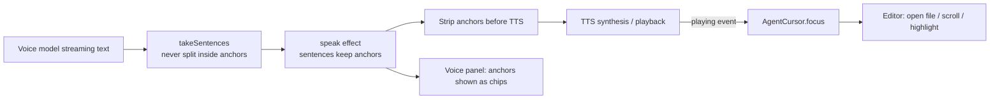

# Agent cursor: pointing at code while talking (2026-09-25)

**Implementation status**:

Implemented:
- **Sees your editor**: every turn's message carries an `<editor>` block. Code is in `editorSnapshot.ts`; editor tracking reuses `utils/fileEditor.ts`.
- **Code anchors**: anchors are extracted from the reply and are neither displayed nor spoken. Code is in `codeAnchors.ts`.
- **Pi highlight**: a label is shown at the end of the line, without changing your selection or focus. Three kinds of focus, three colors: purple `Pi` when explaining, blue `Pi · reading` when reading a file, green `Pi · writing` when writing a file. Code is in `agentCursor.ts`.
- **Synced with speech**: in voice mode, an anchor takes effect only when the sentence following it starts playing; in typed conversation it takes effect immediately.
- **Pi focus**: besides pointing during explanations, this also covers files the voice agent reads itself (`onRead`) and files the worker reads and writes (`workerFocus.ts`). The range of a worker write is computed by comparing content before and after the write; the comparison logic is `changedLines` in `piFocus.ts`. Worker focus is shown only while the voice agent is on.
- **Follow Pi**: there is a single toggle, the crosshair button to the right of "Voice agent" in the status bar above the composer (`data-act="follow"` in `voiceBar.ts`): a filled, highlighted center means following, hollow means not following. Clicking writes the setting `voiceAgent.followPi` (global, default `true`), so your choice persists across restarts. While following, the editor opens Pi's focus in your column in a preview tab, without stealing the keyboard. When not following, only the VS Code status bar shows `$(eye-closed) Pi: writing calc.js:18-22`; files already on screen are still highlighted. As soon as you type, following stops automatically and the button switches to not following; this automatic stop does not write the setting, so the next launch still uses what you last clicked.
- **Anti-jumping**: pointing during an explanation is held for 6 s; during that time read/write activity is only queued, not jumped to, and afterwards only the latest one is performed; read/write activities are also spaced at least 1.5 s apart.
- **`open_file` extension host tool**: when you say "open some file / jump somewhere", it opens even if you are not following.
- **Pointing at a single name**: `⟦path:line#name⟧` circles only that name (variable, parameter, field) on that line, and other uses of it in the same file are marked with dashed boxes (`vscode.executeDocumentHighlights`, scope-aware). If it is not found on the given line, it searches 3 lines up and down; if still not found, it falls back to highlighting the whole line. If the symbol resolved by `⟦path#name⟧` is a variable, constant, field, property, or enum member and its declaration spans a single line, it is also circled by name. Same when `open_file` is given both `startLine` and `symbol`. The VS Code status bar shows it as `Pi: calc.js:6 · sum`. The lookup logic is `findName` in `piFocus.ts`.
- **Prompt rules**: added.

Tested (real VS Code + omp, scripts `/tmp/voice-smoke/suite-pair*.js`, `suite-follow.js`):
- It can see the selection and answers correctly without reading the file;
- Cross-file pointing `main.js` → `calc.js`;
- In voice mode, 4 pointings each land at the moment the corresponding one of 4 steps starts playing;
- When not following, `open_file` still opens the file, and ordinary pointing does not move your editor;
- Re-enabling following jumps to Pi's focus;
- When the worker writes `calc.js`, the focus goes `reading calc.js` → `writing calc.js` → `writing calc.js:18-22`, and that range is exactly the newly added function and export line;
- Following stops as soon as you type, while file reloads caused by the worker writing to disk do not stop it.

Differences from the draft:
- Colors are three fixed colors, not declared in `contributes.colors`;
- The label is at the end of the line, without `◀`;
- Files open in the column of your current editor (`preview` + `preserveFocus`); the toggle has only two states, following and not following; `lead` / `side` / `hint` were not done.

**Not done**:
- §4's opening in a side column (`side`);
- Focus history, e.g. "previous", "back to my code";
- §5's `<agent-focus>`, i.e. whom "here" refers to;
- The voice panel showing anchors as small chips;
- Nothing is shown in the VS Code status bar when the worker runs bash or tests.

Goal: the voice agent has **its own code selector**, separate from your cursor. Whatever code it is talking about gets highlighted in the editor; when it talks about another file, that file opens automatically. Explanation and highlighting are synced per sentence.

Acceptance scenario: you ask "walk me through the full path of an utterance from the microphone to the worker". It opens `voiceMode.ts`, `conversation.ts`, `voiceAgent.ts`, `sidebar.ts` in turn, and for each sentence it speaks, it highlights the lines that sentence is about. Your cursor, selection, and keyboard focus are untouched.

## 1. What the user sees

| Element | Implementation | Notes |
|---|---|---|
| Agent highlight | `TextEditorDecorationType`: its own background color, left bar, gutter icon, scrollbar marker, and `◀ Pi` at line end via `after` | Colors are defined via `contributes.colors` in `package.json` and follow the theme. **Decoration only; `editor.selection` is not changed**, so your cursor and selection are unaffected |
| Switching files | `showTextDocument(uri, { preview: true, preserveFocus: true, viewColumn })` | Uses a preview tab so a full walkthrough doesn't leave a row of tabs; `preserveFocus` keeps keyboard focus where it was |
| Scrolling | `revealRange(range, InCenterIfOutsideViewport)` | No scrolling if the target is already on screen |
| VS Code status bar | `🔊 Pi › stt.ts › transcribe (2/5)` | Shows where it is currently pointing; click to jump there |
| Voice panel | Anchors in sentences shown as clickable `stt.ts:139-141` chips | The format must be agreed with the voice panel currently in progress; see §6 |

## 2. How it "points": anchors embedded in the reply

The model writes anchors in its reply text, **placed at the start of the sentence they refer to**:

```
The entry point is here⟦src/voiceAgent/voiceMode.ts:560-575⟧; it sends each sentence to synthesis.
Then the state machine takes over⟦src/voiceAgent/conversation.ts#reduce⟧ and decides who is speaking.
```

Four forms are supported:

- `⟦path:start-end⟧`: a range of lines
- `⟦path:line#name⟧`: a name on that line, such as a variable or parameter; only the name itself and its other uses in the file are circled
- `⟦path:line⟧`: one line
- `⟦path#symbol⟧`: a symbol. Resolved to a range with `vscode.executeDocumentSymbolProvider`, so the model can point without reading the file or knowing line numbers

**Why embedded anchors rather than an extension host tool (`show_code`)**:

- A tool call costs an extra round trip; the design doc measured about 2.8 s per tool round;
- A tool call happens before speaking, so it cannot be aligned with "which sentence is being spoken";
- Anchors travel with the text stream, are naturally bound to sentences, and add no latency.

The model knows line numbers because its own `read` tool output includes them.

## 3. Data flow



Existing hook points:

- `takeSentences` in `sentences.ts` currently splits sentences at `:` (a soft break), so the `:` inside an anchor could be split. `⟦…⟧` must be kept whole, like a code fence.
- The `speak` effect at `voiceMode.ts:308` hands sentences to `Speaker`; strip anchors before `synthesize` is called at `voiceMode.ts:594`.
- `voiceMode.ts:270` already emits a `playing` event for each sentence (`onAudio`). The agent cursor only needs to subscribe to it: **when a sentence starts playing, focus that sentence's anchor**.
- Typed mode (voice mode off): from the deltas of `VoiceAgentListener.onText` (`voiceAgent.ts:52`), focus an anchor as soon as it is complete.
- Echo filtering: `recentReplies` is taken from generated text, so anchors must also be stripped before comparison, otherwise echo matching is skewed.

## 4. Non-intrusion rules

1. **Never change your cursor, selection, or keyboard focus.** Use only decorations and `preserveFocus`.
2. **Don't take over the main editor area while you are typing.** If you edited within the last 5 s, or the current file has unsaved changes:
   - open in a side column (`ViewColumn.Beside`);
   - or only hint in the VS Code status bar "Pi wants to show you stt.ts › transcribe", and let you decide whether to go there.

   Controlled by the setting `voiceAgent.cursor.follow`: `lead` (take you there directly) / `side` (in a side column) / `hint` (hint only).
3. **When the highlight disappears**: kept for N seconds after the turn finishes; clicking or editing inside that range also clears it immediately.
4. **Interruption**: when you barge in, stop switching and keep the current highlight, since you most likely want to ask about that spot. The `<interrupted>` note already records which sentence was playing, so the model can know where the cursor stopped.
5. **Going back**: maintain a focus history stack. You can say "previous" or "go back"; you can also say "back to my code" to return to the file and position you were at before the explanation began.

## 5. Whose cursor "here" refers to

Once EditorWatcher is wired in, each turn's message carries both positions:

- `<editor …>`: where you are looking
- `<agent-focus file="…" lines="…">`: where it just pointed

Resolution rules:

- If you moved your own cursor or selection after the agent focused: "here" means your position;
- Otherwise it means the position it just highlighted.

This matters. While it is walking you through code and you ask "why is there an await here", "here" means its highlight, not your cursor.

## 6. Validation and safety

- Anchor paths must be inside the workspace and the file must exist; line numbers outside the file are clamped to the valid range; if symbol resolution fails, fall back to the start of the file. Invalid anchors are ignored and only logged.
- This feature is read-only and writes no files. It does not violate the non-goal in design doc §1.2 ("the voice agent does not modify files directly").
- Contract with the voice panel: sentence text keeps the raw anchors `⟦path:start-end⟧` / `⟦path#symbol⟧`; the panel renders them as chips, and clicking executes `oh-my-pi-chater.voiceAgent.revealAnchor`.

## 7. Rules to add to the prompt

The system prompt is static, so adding rules does not affect caching:

- When explaining code, put the anchor it refers to at the start of each sentence; at most one per sentence.
- Prefer the `#symbol` form. Only use line numbers you have just `read` and confirmed.
- Don't read paths aloud; say "here" or "this function" — the user can see the highlight.
- For cross-file explanations, follow execution order, one or two sentences per location.

## 8. Implementation slices

| # | Content | Files | Notes |
|---|---|---|---|
| 1 | Anchor parsing, stripping, keeping anchors whole during sentence splitting (pure functions, with unit tests) | New `src/voiceAgent/codeAnchors.ts`; change `sentences.ts` | Can be done right away; no conflict with the panel |
| 2 | `AgentCursor`: decorations, opening and scrolling, follow policy, history stack, VS Code status bar | New `src/voiceAgent/agentCursor.ts`; add colors, settings, commands to `package.json` | Can be done right away |
| 3 | Wiring: strip anchors before TTS; focus on `playing`; typed mode goes through `onText`; strip anchors for echo comparison | `voiceMode.ts`, `voiceAgentCommands.ts`, `conversation.ts` | **Another session is editing these files** (the panel); wait for it to merge |
| 4 | Prompt rules | `voicePrompt.ts` | |
| 5 | `<agent-focus>` and `<editor>` snapshots, resolving "here" | `voicePrompt.ts`, `voiceAgent.ts`; requires EditorWatcher first | Phase two |
| 6 | Voice panel renders anchors as chips | `voiceView.ts` | Agree on format with the panel author |

## 9. Open questions

1. Should `follow` default to `lead`, `side`, or `hint`? Suggest defaulting to `lead`, automatically downgrading to `side` while you are typing.
2. After a full walkthrough, should it automatically return to the original position? Suggest not returning automatically, but keeping a "back to my code".
3. Highlight color: use a fixed "Pi color" clearly distinct from your own selection color.

## 11. Working beside the worker: the file lock (2026-09-29)

Until 2026-09-29 the voice agent had two modes: one in which it only directed the worker, and one in which it worked in the editor itself. The directing mode was removed, because the voice agent working itself can hand a heavy job to the worker anyway: the prompt's "Dividing the work" section (`VOICE_SYSTEM_PROMPT`) has it do small work (a function or a few blocks in one or two files) at once and send heavy work (many files, a big refactor, a long test run, anything gaining from parallel agents) to the worker with `tell_worker`. That mode's only real value was keeping the two from editing the same files at once; that is now the file lock below. All tools are always available: the voice agent's own tools (`edit_file`, `run_in_terminal`, the debugging tools in §12, the file tools in §13) and the worker tools (`tell_worker`, `confirm_task`, `stop_worker`, `answer_worker`, `worker_status`). Proactive turns may not change files or run commands.

**What the gate reports** (`src/piExtension/permissionGate.ts`, loaded into every RPC chat worker by `PiRpcBridge`):
- The gate runs before every worker tool call. For every call it does not block (allowed, or about to ask the user), it computes `modifiedPaths(toolName, input)` (`src/pi/permissionPolicy.ts`), resolves them against `ctx.cwd` (fallback `process.cwd()`), and synchronously appends one NDJSON line `{"paths":[…]}` of absolute paths to the file named by env `VSCODE_PI_EDITS_FILE` (`EDITS_FILE_ENV`), before the tool runs.
- A call about to ask is reported before the user answers, so its files are locked from the moment the worker asks. A call that is then denied leaves its files locked until the task ends, which is harmless.
- It also reports while pi's own plan mode owns the policy.

**`modifiedPaths`** (`src/pi/permissionPolicy.ts`):
- Read-tier calls (`toolTier`): nothing.
- `write` / `edit`: `editPaths`, i.e. `path` / `file_path`, omp hashline `[path#tag]` section headers and `MV dest` lines, apply_patch `*** Add/Update/Delete File:` and `*** Move to:`, `edits[].rename`. `editPaths` moved here from `src/voiceAgent/piFocus.ts`; `WorkerFocusTracker` (`workerFocus.ts`) uses it from here.
- `ast_edit`: its `paths`; a glob becomes its folder before the first wildcard; no paths means the whole working folder `.`.
- `lsp` rename / code action: its `file` (and `new_name` for rename_file) only.
- Internal URLs (`xd://`, `local://`, `memory://`) are skipped. Commands are not parsed (see the bash gap below).

**Host set** (`PermissionGateFile` in `src/pi/permissionGate.ts`, `WorkerEditLocks` in `src/pi/workerEdits.ts`):
- `PermissionGateFile` creates the edits file next to the permission file (`os.tmpdir()/vscode-pi-edits-<uuid>.ndjson`), passes the env var in `launch()`, and deletes the file with the worker (`dispose`). A new worker process gets a new, empty file.
- `edits()` reads the new whole lines synchronously into a `WorkerEditLocks`, a set of absolute normalized paths (`ingest`, `overlapping(targets)`, `clear`); being synchronous, it always sees a report the gate wrote before its tool ran. `clearEdits()` empties the set and truncates the file.
- Exposed as `PiRpcBridge.workerEdits()` / `clearWorkerEdits()` and `PiChatSession.workerEdits()`. `PiChatSession` clears it on `agent_end` unless `willRetry`, i.e. when the task ends.

**Lock check** (`WorkerController.lockedPaths(tabId, paths)`, implemented in `SidebarWorker`; `HostToolRouter._workerLock` in `hostTools.ts`):
- `lockedPaths` is empty while the tab's worker is not streaming or the tab is in TUI mode. Otherwise it resolves the voice agent's workspace-relative paths against the first workspace folder and returns, workspace-relative, the locked paths that overlap them: the same path, a target inside a locked folder, or a locked file inside a target folder.
- `_workerLock` checks `edit_file`, `create_file` and `delete_file` (`path`), `rename_file` (`from` and `to`), and `save_file` (`path`, or the whole workspace `.` without a path). Other tools are not checked.
- The check runs before the permission checks, so a locked deletion is not even asked about, and again when an approval card is answered; a refusal then settles the card as "Not done: …".
- Refusal text: "The worker's running task is changing <paths>, so you may not touch it/them until that task ends. Tell the user, then work on other files, wait for the worker to finish, or ask whether to stop it." The prompt says the same: tell the user, then work on other files, wait, or ask whether to stop the worker; and do not send the worker a task on a file the voice agent itself is in the middle of changing.
- Other files stay editable while the worker works.

**Known gaps**:
- TUI tabs: the TUI does not load the gate, so nothing is reported. For a tab in TUI mode the router keeps the old rule: while its TUI runs a task, all the voice agent's file changes are refused wholesale ("The worker is still running a task and may be writing files…"). Left as is for now.
- bash: commands are not parsed, so `rm` / `mv` / `sed -i` via bash and other exec tools report nothing, and the files they change are not locked.

**Tests**: `src/test/unit/pi/permissionGate.test.ts` ("reporting file changes to the host"), `src/test/unit/pi/workerEdits.test.ts` (lock set, edits file, gate → host end to end), `src/test/unit/voiceAgent/hostTools.test.ts` ("the worker's file lock", TUI case); eval `src/test/eval/voicePrompt.eval.ts` ("a heavy job goes to the worker", "a file the worker is changing is left alone").

The voice agent's own tools follow.

**`edit_file`** (`pairHands.ts`; location logic is `locateEdit` in `pairText.ts`):
- Uses `oldText` to exactly match the location to change; if there are multiple matches, picks the one nearest `nearLine`. Empty `oldText` can only fill an empty file; a missing file is an error — use `create_file` (§13) for new files.
- First deletes the original text, then types the new code line by line, about 90 ms per line, at most 2 s total. The green `Pi · writing` highlight follows the line being written, and is shown whether or not you are following.
- The deletion and line-by-line typing are merged into one undo step: the first edit sets `undoStopBefore`, and only the last edit sets `undoStopAfter`. So a single Ctrl+Z undoes it.
- If the file had no unsaved changes, it is saved automatically; if you have unsaved changes, it is not saved.
- If the file is changed by someone else while typing (the document version number jumps), it stops and reports.
- Refused on a file the worker's running task is changing (the file lock above).
- Only files inside the workspace can be changed; see §13 for the check rules.
- Its own edits do not count as "you typing", so they don't stop following.

**`run_in_terminal`** (`pairHands.ts`; output cleanup is `cleanTerminalOutput` in `pairText.ts`):
- Runs in a dedicated "Pi" terminal shown at the bottom, without stealing the keyboard.
- Executes via shell integration's `executeCommand`, reads the output and exit code, and gives the last 60 lines to the model.
- Waits 30 s by default; on timeout it returns the output so far, the command keeps running, and the result names the terminal (e.g. "Pi (2)") so it can be operated further with `terminal_send` / `terminal_read`.
- If the previous command is still running, a new "Pi (2)" terminal is opened.
- If the terminal has no shell integration, the command is only sent, with a note that the result cannot be seen.

**`terminal_send` / `terminal_read`** (`pairHands.ts`; operate interactive programs left running after a `run_in_terminal` timeout, e.g. psql; full-screen TUIs such as vim or top are out of scope):
- Timed-out commands continue to be tracked: output keeps being read into their scrollback buffer (at most 200 000 characters), remembering how far the model has already seen.
- `terminal_send {terminal?, text, enter?, waitSecs?}`: `terminal` is a Pi terminal name, defaulting to the most recent one still running; input via `sendText(text, enter)` (`enter` defaults to true; `text` may be empty to just press Enter), waits until output has been quiet for 500 ms or `waitSecs` (default 2, max 30), and returns only new output; if the program has ended, returns the exit code. The result does not repeat the input text (it may be a password); the tool description warns that input is echoed and that passwords should preferably go through `.pgpass` or environment variables. If the program has already ended, nothing is typed (otherwise it would go to the shell as a new command); it only reports that it ended.
- `terminal_read {terminal?}`: returns new output since last time; if there is none, gives the last 20 lines and says whether it is still running.
- An ended command stops being tracked after its exit code is reported once; it is also dropped when a new command runs in the same terminal or the terminal is closed.
- Permissions: `terminal_send` counts as running a command like `run_in_terminal` (rejected in Plan; requires approval in Manual and Edit automatically); `terminal_read` is read-only and needs no approval.

**Prompt constraints**:
- Do small work itself; hand heavy work to the worker with `tell_worker`, unless the user wants to go step by step;
- Run only commands the user asked for or just agreed to;
- For operations like deleting files, `git push`, or installing dependencies, ask the user first.

**Tested** (2026-09-25, script `/tmp/voice-smoke/suite-pairmode.js`):
- Adding a `double` function: written line by line, highlight moves from 15-16 to 15-22, saved, worker idle, one Ctrl+Z restores the original;
- Running `node -e …double(21)` in the terminal → exit code 0, output 42; `process.exit(3)` → exit code 3.

**Known limitations**:
- The voice agent's own changes do not go into checkpoints or the diff panel; rollback relies on Ctrl+Z or git;
- Pi focus in the VS Code status bar does not show terminal commands;
- "Only run commands you asked for" is enforced only by the prompt; the extension host does not check it.

## 12. Reading VS Code output, debugging (implemented, 2026-09-25)

| Tool | What it does |
|---|---|
| `read_output` | Read-only. Without `source`: lists readable outputs; with `source`: returns its last lines (default 80, max 400) |
| `list_viewers` | Doesn't change files. Lists editors that can display this file (custom editors from all installed extensions) and preview commands from VS Code's built-in extensions (e.g. Markdown preview); no extension is hardcoded |
| `open_with` | Doesn't change files. Opens the file with one of the viewers `list_viewers` returned for the same file; `toSide` opens in the side editor group; waits at most 8 s |
| `debug_start` | Starts a configuration from `.vscode/launch.json` by name (`noDebug` is equivalent to Ctrl+F5), waits until paused or finished (default 15 s) |
| `debug_control` | Presses a debug toolbar button: continue, pause, stepOver, stepInto, stepOut, restart, stop; waits until the next pause or finish (default 10 s) |
| `set_breakpoint` | Adds a breakpoint on a line (optionally with a condition), or deletes it with `remove` |
| `debug_inspect` | Where it is stopped: code, call stack, local variables, breakpoint list; with `expression`, evaluates in the top stack frame |

**`read_output`** (`vscodeOutput.ts`; name matching is `pickName` in `pairText.ts`: exact match first, case-insensitive; otherwise the unique one containing it):
- **Output panel**: VS Code has no API to read other extensions' output channels, but each channel is written as a file in the current window's log directory, right next to this extension's `context.logUri`. It reads: `exthost/output_logging_<latest>/<n>-<name>.log` (extensions' plain channels), `exthost/<extension id>/<name>.log` (log channels, e.g. Git), `exthost/exthost.log` (Extension Host), `window<N>/output_<latest>/tasks.log` (Tasks), and window- and session-level `*.log` (Window, Main, Shared, etc.). Only the last 256 KB of a file is read. This directory layout is undocumented; if VS Code changes it, this must follow.
- **Debug Console**: `DebugDriver` uses `registerDebugAdapterTrackerFactory('*')` to collect `output` events from all debug sessions (excluding telemetry), grouped per run (top-level session plus js-debug child sessions), keeping the last 5 runs. The latest is called `Debug Console`.
- **Terminals**: `onDidStartTerminalShellExecution` records commands run in all terminals (including the user's own), keeping the last 5 commands per terminal with their output and exit code. Only commands run after the extension started, in terminals with shell integration, are available; terminals without shell integration are marked in the list as unreadable.

**`list_viewers` / `open_with`** (discovery and matching in the pure-function module `viewers.ts`, execution in `pairHands.ts`):

Only the parts found reliable in testing are kept (2026-09-26): custom editors are all opened with `vscode.openWith`, equally reliable regardless of who contributes them (draw.io opens fine); the built-in Markdown preview works (bierner.markdown-mermaid draws Mermaid inside it). Third-party extensions' preview commands each require different arguments and state and are unreliable: MermaidChart's `mermaidChart.preview` on a `.mmd` file either displays nothing or times out after 8 s. So third-party preview commands are not listed by default and not accepted by `open_with`; to use them, enable the setting `oh-my-pi-chater.voiceAgent.discoverPreviewCommands` (default `false`, read on each call).

The prompt tells the model: open diagram files like `.drawio` with their custom editor; put Mermaid in a mermaid code block in a `.md` file and preview it to the side with `markdown.showPreviewToSide`, editing and viewing side by side; for a standalone `.mmd` file, it may propose moving it into Markdown.

- **Editors**: scans `contributes.customEditors` in `vscode.extensions.all`; `selector.filenamePattern` is matched by VS Code's rules (with `/` it matches the whole path, otherwise only the file name, case-insensitive), e.g. draw.io's `*.drawio`, `*.dio`, `*.drawio.svg`. Order: extension `default`, built-in `builtin`, `option`, and finally the built-in text editor `default`. Not affected by the setting above.
- **Built-in vs third-party**: an extension counts as built-in if `isBuiltin` in its runtime extension description (not in the API types) is set, or if it is installed under `vscode.env.appRoot/extensions`.
- **Preview commands** (always discovered for built-in extensions; also for third-party ones when the setting is on): commands in `contributes.commands` whose name (last segment of the id, split on camelCase) or title contains a word starting with preview (`appReview` does not count), and whose extension is meant for this file:
  - the same extension's `menus` has a `when` indicating it is for this file: an `==` or `=~` on `resourceLangId`/`editorLangId`/`resourceExtname`/`resourceFilename`/`resourcePath` holds, and no condition on the file fails; other context keys (focus, views, etc.) are treated as unknown;
  - or the command is not restricted by a `commandPalette` `when` (shown in the command palette for all files), and the extension contributes this file's language or an editor that can open it (with the setting on, MermaidChart's `mermaidChart.preview` is found this way).
  - Ranking: editor title bar 0, command palette 1, only in context menus etc. 2; add 2 more if hidden from the command palette (`when: false`) or if the id contains ContextMenu. Among identical titles only the top-ranked one is kept. At most 8. Markdown's `markdown.showPreview` and `markdown.showPreviewToSide` are found from the built-in extension regardless of the setting.
- **Language**: if the file is already open, its `languageId` is used; otherwise inferred from each extension's `contributes.languages` `filenames`, `filenamePatterns`, and the longest `extensions`.
- **Whether the file exists**: a file already open in `workspace.textDocuments` counts as existing (a file just created by `create_file` may not yet be stat-able); otherwise `fs.stat` is tried up to 5 times, 200 ms apart.
- **Safety**: the path must be inside the workspace, as with other tools; `open_with` first recomputes `list_viewers` and rejects any id not in it, so it cannot be used to run arbitrary commands.
- **Execution**: editors use `vscode.openWith`. For preview commands, the file is first shown as the active editor (many preview commands ignore arguments and only look at the active editor), then the command is run with the uri; if it throws, or no new tab appears within 1.5 s, it is run once more without arguments. Opening the file and each command execution wait at most 8 s; on timeout it returns "started, not finished yet", without waiting further or running a second time, so the tool doesn't hang when an extension's command never returns.

**Debugging** (`debugDriver.ts`):
- Control uses VS Code's own commands (`workbench.action.debug.stepOver`, etc.), acting on the session and thread you see in the UI; the debug toolbar and Variables view update as usual.
- Paused/running is determined from debug adapter messages: a `stopped` event means paused; a `continued` event, or a `continue` / `next` / `stepIn` / `stepOut` etc. request sent to the adapter, means running. So it keeps up even when you press F10 yourself.
- Waiting starts listening before the action, so a quickly hit breakpoint isn't missed. restart may switch to a new top-level session, so it only waits for a pause and does not treat the old session ending as "finished".
- When paused it returns: the reason, function and location, 2 lines of code before and after (current line marked `→`), up to 5 call stack frames, and up to 25 variables from the first non-expensive scope. The paused line becomes Pi's focus and is opened and highlighted even when not following.
- After setting a breakpoint, that line is also opened as Pi's focus.
- Starting or restarting a program counts as "running a command"; the prompt requires the user to ask or agree first; stepping and inspecting while debugging together need no further asking.

**Tested** (script `/tmp/voice-smoke/suite-debug.js`, real VS Code + omp + built-in js-debug):
- "What is sum in average for, show me" → focus `name: "sum"`, solid box at the declaration, dashed boxes at the other two uses, `Pi` label at line end;
- "What error did Smoke Build report" → `read_output` read `error E1234`, which the test wrote to the output channel;
- "What did the command just run in the user shell terminal output" → read the command, stdout, stderr, and `exit code 2`;
- "Set a breakpoint on calc.js line 11 and start debugging with Run main" → `set_breakpoint` + `debug_start`, returned `Paused (breakpoint) in global.average at calc.js:11`, local variables `sum = 0; values = (0) []`, Pi focus at `calc.js:11`;
- `debug_inspect` evaluating `[sum, values.length]` → `[0, 0]`; stepOut → `main.js:3`; continue → runs to completion, Debug Console shows `average of scores: NaN`; afterwards `read_output` on `Debug Console` gets the same content.

**Known limitations**:
- An exit code is available only if the adapter sends an `exited` event; in testing js-debug did not send it;
- Evaluation is only in the top stack frame, ignoring the frame you selected in the Call Stack view;
- Terminal output is recorded only from extension startup onward.

## 13. File operations (implemented, 2026-09-26)

Code is in `fileHands.ts`; routing and delete confirmation are in `hostTools.ts`. Proactive turns cannot use these tools. `create_file`, `rename_file`, `delete_file` and `save_file`, like `edit_file`, are refused on files the worker's running task is changing (the file lock, §11).

| Tool | Implementation | Notes |
|---|---|---|
| `create_file` `{path, content?}` | `WorkspaceEdit.createFile(…, { contents })` | Errors if the file already exists. Missing parent folders are created automatically. Once created, it opens in your editor column with the `Pi · writing` highlight |
| `create_folder` `{path}` | `workspace.fs.createDirectory` | If it already exists, just reports so |
| `rename_file` `{from, to}` | `WorkspaceEdit.renameFile(…, { overwrite: false })` | Can rename or move files and folders. Errors if the target exists; never overwrites. Cannot rename the workspace root |
| `delete_file` `{path, recursive?}` | See below | Requires confirmation first |
| `save_file` `{path?}` | `TextDocument.save()` | Without path, saves all workspace files with unsaved changes. This also saves your own changes to disk, so the prompt requires using it only when you ask |
| `close_editor` `{path}` | `window.tabGroups.close` | Closes this file's tabs in all editor groups; refuses if there are unsaved changes |

`edit_file` no longer creates files; creation always goes through `create_file`.

**Path checks** (`FileHands.resolve`, used by all file tools and `edit_file`):
- The path is resolved against the first workspace folder, and the result must fall inside some `file:` workspace folder. The check uses `insideFolder` in `pairText.ts`, so a name like `..cache` counts as inside the workspace, while `../x` and `/ws2` do not.
- The deepest existing part of the path, after resolving symlinks with `fs.realpath`, must still be inside the workspace. Links pointing outside the workspace are rejected.

**Deletion**:
- **Two-step confirmation, enforced by the extension host**:
  - The first call only checks, then records a pending deletion; the returned text says what will be deleted, and for folders states how many files they contain.
  - Only a later call in one of the user's turns with the same path and recursive actually deletes.
  - A different path, a different recursive, or switching voice context all start over.
  - The pending deletion appears in the message every turn as `<pending-delete path="…"/>`.
- **Deletion refused for**: the workspace root; the `.git` directory and its contents; anything that itself has, or contains files with, unsaved changes; folders without `recursive: true`.
- **Trash preferred**: `workspace.fs.delete(uri, { recursive, useTrash: true })`.
- **Back up first if trash fails**: the original file or folder is copied with `fs.cp` to `<system temp dir>/oh-my-pi-chater-deleted/<timestamp>/<workspace-relative path>`, symlinks copied as links; only after the backup succeeds is it deleted permanently with `useTrash: false`. If the backup fails, nothing is deleted. The tool result states the backup location.
- **After deletion**: editor tabs for the deleted content are closed; they have no unsaved changes.

**Tested** (script `/tmp/voice-smoke/suite-files.js`, real VS Code + omp; `XDG_DATA_HOME` points the trash at a test directory):
- Create `src/util.js` with content, `src` folder created automatically → opened in the editor, showing `Pi · writing`;
- Create folder `lib`; move `src/util.js` to `lib/math.js`;
- Ask it to delete `lib/math.js` → first turn only asks, file still there; after confirmation it is deleted, the file appears in the trash at `files/math.js`, and the tab is closed;
- Delete the `lib` folder → when asking it says "contains 2 files"; after confirmation the whole folder goes to the trash;
- Create a file under `escape/`, a link pointing outside the workspace → rejected by the extension host;
- Delete a file outside the workspace → the model refused on its own without calling the tool; the file is still there;
- Trash unavailable (make `$XDG_DATA_HOME/Trash` a regular file) → trash reports `Failed to move item to trash`; the file is first backed up to `/tmp/oh-my-pi-chater-deleted/<timestamp>/notes/todo.txt` with identical content, then deleted; the reply told the user where the backup is.

**Known limitations**:
- Backups are in the system temp directory and may be cleared on reboot.
- Only local `file:` workspaces are supported; remote workspace folders are treated as outside the workspace.
- Delete confirmation shows no card in the voice panel; it relies only on voice or text confirmation.
